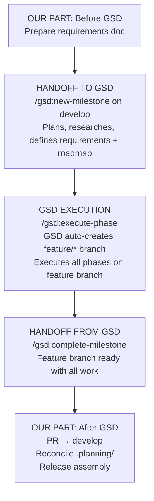
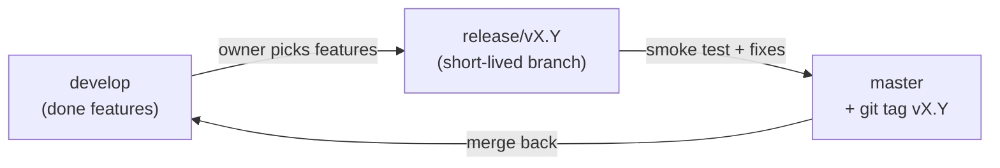
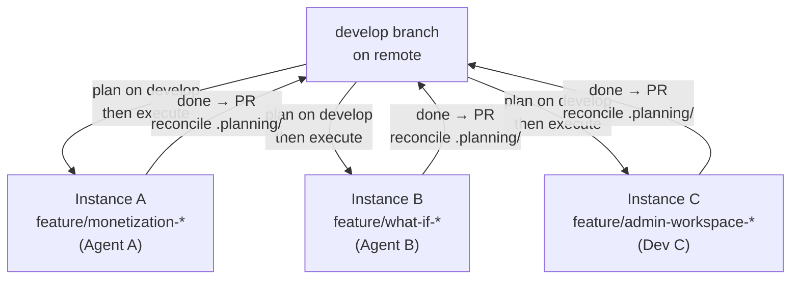

# Feature Development Workflow

> **Core Rule:** Plan by feature, release by decision.
> A version number is assigned when you choose what to ship — not when you start planning.

This document defines what **we** are responsible for when developing Spectra features. GSD handles the internal development lifecycle — this document does not describe how GSD works internally to avoid redundancy and staleness.

For git tag conventions and patch workflow, see [VERSIONING.md](./VERSIONING.md).

---

## The Model



| Responsibility | What happens |
|----------------|--------------|
| **Ours: Before GSD** | Write requirements document in `requirements/` |
| **GSD: Planning** | `/gsd:new-milestone` on `develop` — research, requirements, roadmap. All planning artifacts committed to `develop`. |
| **GSD: Execution** | `/gsd:execute-phase` — GSD auto-creates `feature/*` branch on first execution. All code + phase artifacts committed to feature branch. |
| **GSD: Completion** | `/gsd:complete-milestone` — milestone archived on feature branch |
| **Ours: After GSD** | PR to `develop`, `.planning/` reconciliation, release assembly to `master` |

---

## GSD Lifecycle: When Things Happen

Understanding **when** GSD creates branches is critical for this workflow:

| GSD Command | Branch | What's committed |
|-------------|--------|-----------------|
| `/gsd:new-milestone` | `develop` (current branch) | PROJECT.md, STATE.md, REQUIREMENTS.md, ROADMAP.md, research/ |
| `/gsd:plan-phase N` | `develop` (current branch) | PLAN.md for the phase |
| `/gsd:execute-phase N` | `feature/*` (auto-created at first execution) | Code changes, phase artifacts |
| `/gsd:complete-milestone` | `feature/*` | MILESTONES.md update, archive. Offers merge options — we choose "Keep branches" and PR manually. |

**Key:** The `feature/*` branch is auto-created by GSD at the **first `/gsd:execute-phase`**, not during planning. All planning happens on `develop`.

---

## Feature Sizing

| Size | Criteria | Approach |
|------|----------|----------|
| **Large** | Multi-week, spans backend + frontend + admin | GSD milestone on `feature/*` branch |
| **Medium** | Few days, 1–2 areas | GSD milestone on `feature/*` branch |
| **Small** | Hours, isolated fix or tweak | `/gsd:quick` on `develop` or `hotfix/*` |

If it needs more than 2 phases, it's a GSD milestone.

---

## GSD Config

```json
{
  "git": {
    "branching_strategy": "milestone",
    "milestone_branch_template": "feature/{milestone}-{slug}"
  }
}
```

This tells GSD to auto-create a `feature/*` branch when the first phase is executed. The branch name is derived from the milestone name and slug (e.g., `feature/monetization-billing`).

---

## Before GSD (Our Part)

### Write the Requirements Document

Create a requirements document in `requirements/` describing what the feature should do. This is what GSD will reference when creating the milestone.

Example: `requirements/monetization-requirement.md`

---

## Handoff to GSD

Start the milestone on `develop`, pointing GSD to the requirements document:

```bash
git checkout develop
git pull origin develop

/gsd:new-milestone <feature-name>
# Reference the requirements doc when prompted
```

GSD will run the planning cycle on `develop`:
1. Research (optional) — writes to `.planning/research/`
2. Requirements — writes `.planning/REQUIREMENTS.md`
3. Roadmap — writes `.planning/ROADMAP.md`
4. Updates `.planning/PROJECT.md` and `.planning/STATE.md`

All planning artifacts are committed to `develop`.

Then plan phases (still on `develop`):

```bash
/gsd:plan-phase N
```

Then execute (GSD auto-creates the feature branch here):

```bash
/gsd:execute-phase N
# GSD creates feature/* branch from develop on first execution
# All subsequent phases execute on the feature branch
```

---

## Handoff from GSD

GSD signals completion via `/gsd:complete-milestone`. During this step, GSD will offer merge options:

1. **Squash merge** — collapse all commits into one on the base branch
2. **Merge with history** — preserves commits with `--no-ff`
3. **Delete without merging** — remove branch
4. **Keep branches** — leave for manual handling

**Our choice: "Keep branches"** — we handle the merge ourselves via PR to `develop`. This gives us a review gate before code lands on the integration branch.

After `complete-milestone`:
- All phases are executed and verified
- The feature branch contains all code + `.planning/` artifacts
- The milestone is archived within GSD
- The feature branch is still checked out (not merged)

---

## After GSD (Our Part)

### 1. PR Feature Branch → develop

```bash
# Push feature branch to remote (if not already)
git push origin feature/<name>

# Open PR from feature/* into develop
# Review, approve, merge
```

### 2. Reconcile .planning/ Files

When the feature branch merges into `develop`, `.planning/` files will have diverged. Code conflicts are minimal due to GSD's atomic commit strategy, but planning state needs reconciliation.

**Files that will conflict (and how to resolve):**

| File | Conflict Cause | Resolution |
|------|---------------|------------|
| **STATE.md** | Feature branch tracked its own progress | Accept feature branch version (latest state) |
| **ROADMAP.md** | Feature branch has its own phases | Merge phase lists; completed feature phases are now history |
| **REQUIREMENTS.md** | Feature branch has its own requirements | Mark completed requirements as done; keep any pending from develop |
| **PROJECT.md** | Feature branch updated "Current Milestone" | Update to reflect current state post-merge (validated reqs, decisions) |
| **MILESTONES.md** | Feature branch appended its milestone | Accept append (add-only, no conflicts if both append) |

**General rule:** Review each conflict, pick the version that reflects reality post-merge, and ensure PROJECT.md is up to date.

> **Note:** This process will be refined through practice during the first few feature merges.

---

## Release Assembly (Our Part — Outside GSD)

GSD's responsibility ends when the feature branch is complete. Release assembly is entirely our process.



**Steps:**

1. Owner reviews completed features on `develop`
2. Cut release branch:
   ```bash
   git checkout develop
   git checkout -b release/vX.Y
   ```
3. Smoke test. Fix integration issues only — no new features on this branch
4. Merge to master and tag:
   ```bash
   git checkout master
   git merge release/vX.Y --no-ff
   git tag -a vX.Y -m "Release vX.Y: [feature list]"
   git push origin master
   git push origin vX.Y
   ```
5. Merge back to develop and clean up:
   ```bash
   git checkout develop
   git merge release/vX.Y
   git push origin develop
   git branch -d release/vX.Y
   ```
6. Trigger Dokploy redeployment (see VERSIONING.md)

---

## Parallel Development

Each developer or coding agent works on a **separate instance** (different machine or environment). Each runs GSD independently for their assigned feature.



**Rules:**
- Each instance runs a completely independent GSD process
- Planning (`new-milestone`, `plan-phase`) happens on `develop` — coordinate to avoid simultaneous planning commits
- Execution happens on isolated `feature/*` branches — no interference
- Never merge from another feature branch into yours (except declared dependencies)
- Rebase onto `develop` regularly to stay current
- `.planning/` conflicts are resolved manually during PR to `develop`

**Planning coordination:** Since planning commits go to `develop`, parallel milestones should be planned sequentially (one at a time) before execution begins. Once execution starts and each feature is on its own branch, parallel work proceeds without coordination.

---

## Non-Negotiable Rules

1. **Never assign a version number before the feature is done.** Version = release decision, not plan decision.
2. **One feature, one GSD milestone, one branch.** Do not bundle unrelated features together.
3. **Always write a requirements document before starting a milestone.** This is GSD's input.
4. **Release decisions are made by the project owner only** — not inferred from what's done.
5. **Never commit directly to `master`.** All work flows: feature branch → develop → release → master.
6. **GSD scope ends at `/gsd:complete-milestone`.** Release assembly is our process.
7. **Reconcile `.planning/` files after every feature PR merge.** Resolve conflicts manually — pick the version that reflects reality post-merge.
