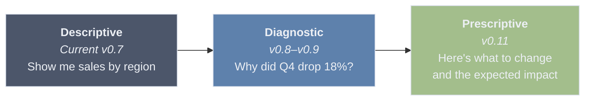
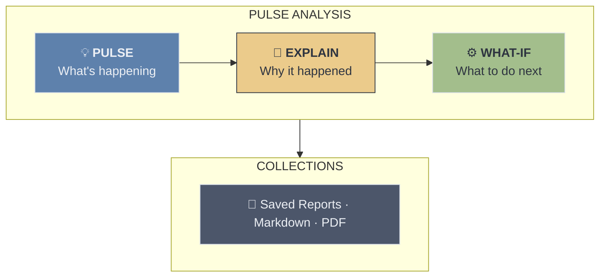
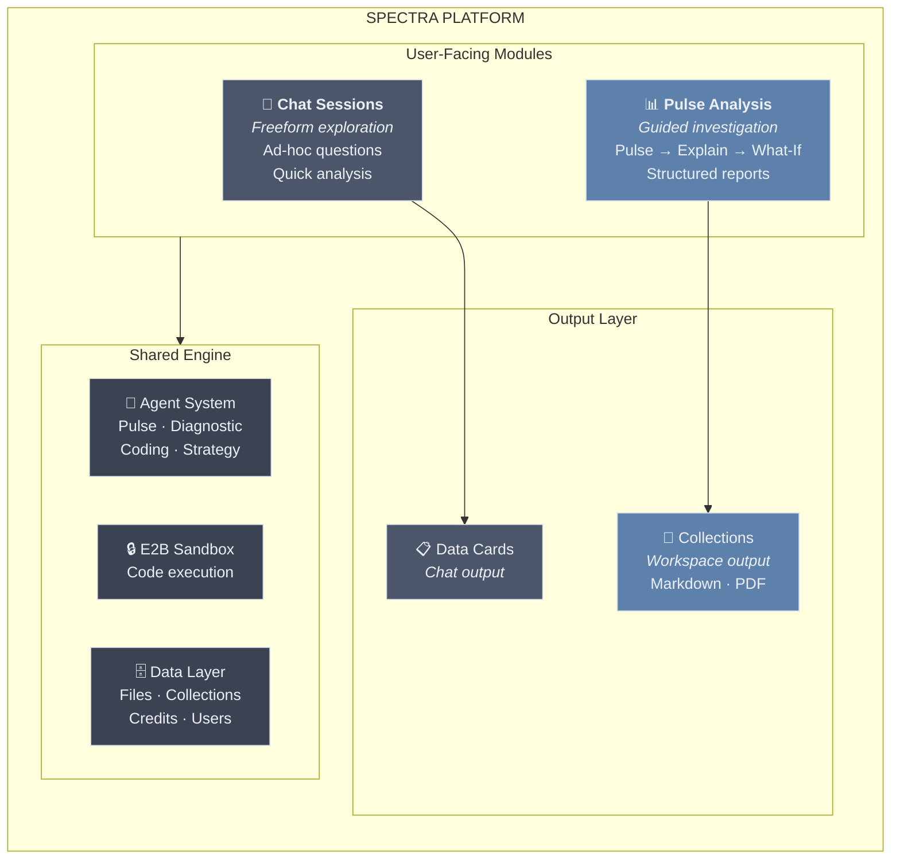
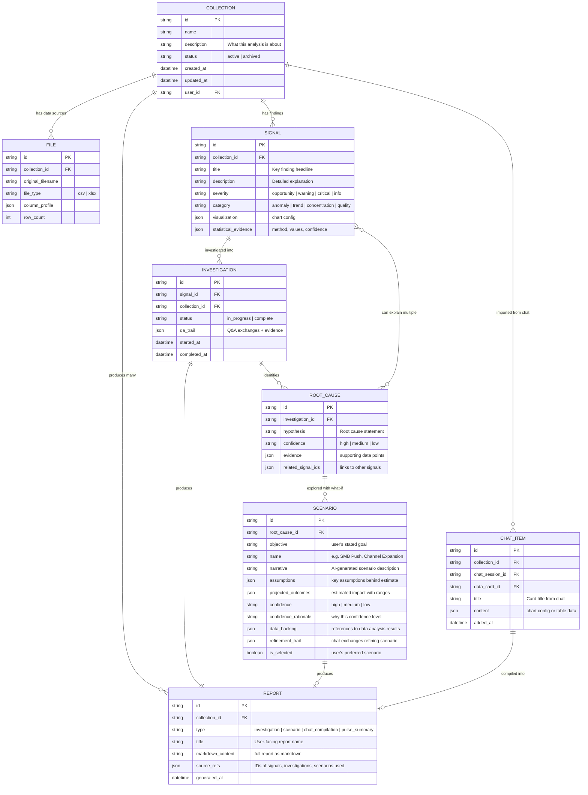
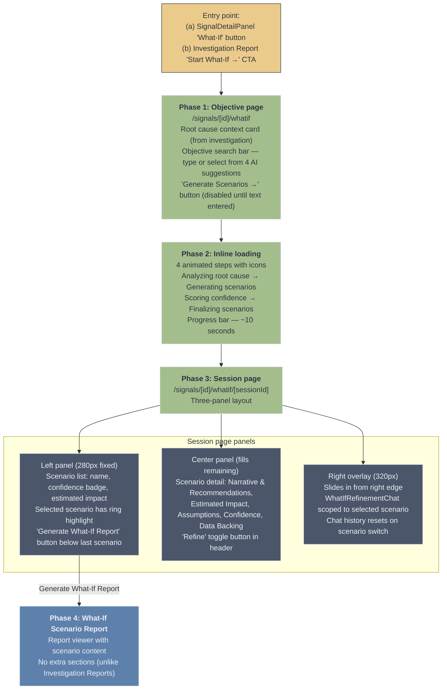

# Spectra Pulse — Product Requirements (v1 — ARCHIVED)

> **ARCHIVED 2026-03-14.** Superseded by [Spectra-Pulse-Requirement-v2.md](./Spectra-Pulse-Requirement-v2.md).
> Changes in v2: Reporting moved to v0.8 (already shipped); v0.9 (Collections/Chat bridge) dropped; Guided Investigation (Explain) dropped; What-If accessible directly from Signal (no investigation prerequisite); milestone sequence renumbered.

> Extracted from brainstorm-idea-1.md. Product requirements only — excludes milestone strategy, competitive landscape, and future exploration sections.

---

## 1. Decisions Log

> ### Decisions Log (2026-03-01)
>
> 1. **Naming:** "Spectra Pulse" confirmed. Individual findings = "Signals". ✓
> 2. **Step 3 (What-If Scenarios) UX:** Revised (2026-03-02). Original "Model & Simulate" approach (tornado charts, lever sliders, Monte Carlo) was too naive — assumed data could be auto-modeled. Replaced with AI-agent-driven What-If Scenarios: objective-first, AI generates narrative scenarios backed by data analysis in E2B, user refines via scoped chat, multi-scenario comparison. Full predictive ML model concept moved to Appendix as future separate module. **Action: Update mockup Screen 4 to reflect new flow.**
> 3. **Data model:** Revised. Collection = workspace (data + process + output). 1 Collection → many Reports. Supports investigation reports, predictive analysis reports, and chat-originated data cards. User can replay findings with different outcomes.
> 4. **Milestone sequence:** Confirmed: v0.8 (Pulse) → v0.9 (Collections) → v0.10 (Explain) → v0.11 (What-If Scenarios) → v0.12 (Admin Workspace Management). ✓
> 5. **PDF generation:** Skip unless explicitly requested. ✓
> 6. **Monitoring module:** Deferred to post-v0.12 backlog. Confirmed. ✓
> 7. **Admin Portal:** Added. Tier-based access gating (free_trial=1 collection, free=no access, standard=5, premium=unlimited). Granular credit costs per Workspace activity. Admin monitoring dashboard for Workspace usage and per-user activity tracking.
> 8. **Persistent AI Memory:** Future exploration (post v0.12). OpenClaw's memory system documented as reference architecture. Not in scope for milestones 0.8–0.12 but to be considered when core Workspace is mature.

---

## 2. The Problem

Spectra today is a **reactive analysis tool** — users upload data, ask questions, get answers. To become a true **business optimization platform** and differentiate from tools like Julius.ai, Spectra needs to move up the analytics maturity curve:



**Key differentiator:** Spectra becomes an analyst that works for you — it proactively scans data, surfaces opportunities and risks, explains root causes, and helps model next steps. The user's job shifts from "figure out what to ask" to "review and decide."

---

## 3. Naming: "Spectra Pulse" — CONFIRMED

> **Decision (2026-03-01):** "Spectra Pulse" is confirmed as the detection stage name. Individual findings are **"Signals"** — positive signals (opportunities) and warning signals (risks).

The detection feature needs a name that's **positive and opportunity-focused**, not fear-based. "Risk Radar" implies something is wrong. We want users to think: "Let me see what Spectra found" — with excitement, not dread.

| Candidate | Vibe | Why it works / doesn't |
|-----------|------|------------------------|
| ~~Risk Radar~~ | Negative, defensive | Implies problems. Users avoid tools that make them anxious. |
| **Spectra Pulse** ✓ | Alive, vital, ongoing | "Take the pulse of your data." Neutral — surfaces both opportunities and concerns. Medical analogy (health check) feels natural. |
| ~~Spectra Scan~~ | Technical, clinical | Works but feels like a virus scan. Less personality. |
| ~~Spectra Lens~~ | Discovery, focus | Good but passive. A lens just looks; a pulse is alive. |
| Signal | Alert, intelligence | Good for a sub-feature (individual findings) but not the whole stage. |

Throughout this document, the detection stage is referred to as **Pulse**. Individual findings are **Signals**.

---

## 4. Product Architecture: Two Modules, One Platform

### Module 1: Chat Sessions (existing — the base tool)

The current chat-with-your-data flow. Stays as-is. Becomes the most primitive feature of Spectra — freeform exploration, quick questions, ad-hoc analysis. Think of it as the "calculator" — always available, always useful, but not the main event.

### Module 2: Pulse Analysis (new — the differentiator)

A completely separate module with its own entry point, its own flow, and its own output format. This is where Spectra becomes a business tool, not just a data tool. Core focus: **Detect → Explain → What-If** (three stages within one workspace).



### Module 3: Monitoring (DEFERRED — post v0.12 backlog)

Recurring automated analysis when data is regularly updated. Concept and details retained in Appendix for future reference. Not in scope for v0.8–v0.12.

### Platform Architecture



**Both modules share** the same data layer, same agents, same E2B engine — but have completely different UX paradigms:

| | Chat Sessions | Pulse Analysis |
|---|---|---|
| **Purpose** | Exploration | Deliverables |
| **Interaction** | Freeform typing | Guided steps + Q&A |
| **Output** | Data Cards in conversation | Structured reports (Markdown) |
| **Saved as** | Chat history | Collections (downloadable as PDF/MD) |
| **User mindset** | "Let me check something" | "I need to produce a report" |

---

## 5. Data Model: Collections as Workspace — REVISED

> **Decision (2026-03-01):** A Collection is the **workspace** — it contains the data, the process, and the output. It is where the user interacts with their data. One Collection can produce **many different outcomes/reports** depending on:
>
> a) **Investigation reports** — findings narrowed to specific root causes
> b) **What-If scenario reports** — scenario exploration based on different objectives/assumptions
> c) **Chat-originated items** — data cards added from existing Chat sessions into the Collection
>
> At any time, the user can return to a Collection and "play around" with the same finding but produce very different reports/outputs. The Collection is persistent and replayable.



**Key relationships:**
- **1 Collection : many Files** — a collection can analyze multiple data sources together
- **1 Collection : many Signals** — Pulse generates multiple findings per collection
- **1 Signal : many Investigations** — a user can investigate the same signal multiple times, exploring different angles, and arrive at different conclusions each time
- **1 Investigation : many Root Causes** — an investigation can produce multiple hypotheses
- **Many Root Causes : many Signals** — a single root cause can explain multiple signals (e.g., "APAC pricing change" explains both "revenue drop" and "customer churn spike")
- **1 Root Cause : many Scenarios** — each root cause can have multiple what-if scenarios, each with its own objective, narrative, and data backing
- **1 Collection : many Reports** — different outcomes from the same data: investigation reports, scenario reports, pulse summaries, or compilations of chat-originated items
- **Chat → Collection bridge** — users can add data cards from Chat sessions into a Collection, bringing freeform exploration into the structured workspace

---

## 6. The User Journey (end to end)

> **Note (v0.7.12):** The flow below reflects the implemented v0.7.12 mockup (pulse-mockup/). It supersedes the original brainstorm flow. The mockup is the source of truth for v0.8 and beyond.

```mermaid
graph TD
    Start["👤 User enters Pulse Analysis<br/>Sidebar: 'Pulse Analysis' → /workspace<br/>Landing page title: 'Collections'"] --> Create["📁 Create new Collection<br/>'Create Collection' dialog<br/>Name field only"]
    Create --> Files["📂 Collection Detail — Files tab<br/>Upload files or select from uploaded<br/>Click file → DataSummaryPanel (column profile)<br/>Check files → sticky action bar appears"]
    Files --> Pulse["💡 <b>PULSE</b><br/>Click 'Run Detection (5 credits)'<br/>Full-page DetectionLoading state<br/>Animated steps — replaces entire page content"]

    Pulse --> Overview["Collection Detail — Overview tab<br/>Stat cards · Signal preview grid (up to 4)<br/>Activity feed · Run Detection banner"]
    Overview --> SignalsTab["Collection Detail — Signals tab<br/>All Signal cards (non-interactive)<br/>'Open Signals View' button"]
    SignalsTab --> DetectionResults["🔍 Detection Results page<br/>/workspace/collections/[id]/signals<br/>Breadcrumb: Collections / [Name] / Detection Results<br/>Two-column: SignalListPanel + SignalDetailPanel<br/>Auto-selects highest severity signal"]

    DetectionResults --> Investigation["🧠 <b>EXPLAIN</b><br/>Click 'Investigate (3 credits)'<br/>Navigates to Guided Investigation page<br/>/signals/[id]/investigate"]
    Investigation --> QnA["Q&A thread — structured exchanges<br/>Spectra asks questions with discrete choices<br/>+ free-text option per exchange<br/>Answered choices visually locked"]
    QnA --> Closing["After ≥3 exchanges answered:<br/>Closing question appears<br/>'Proceed with report' or 'Discuss something'"]
    Closing -->|"Proceed"| Checkpoint["InvestigationCheckpoint<br/>'Generate Report' button<br/>2-second loading → report viewer"]
    Closing -->|"Discuss something"| MoreQA["Free-text input → appends discussion exchange<br/>New follow-up question added<br/>Closing question resets — another round possible"]
    MoreQA --> Closing

    Checkpoint --> InvReport["📄 Investigation Report viewer<br/>Related Signals section<br/>'Explore What-If Scenarios' CTA"]

    DetectionResults --> WhatIfEntry["⚙️ <b>WHAT-IF</b> (from SignalDetailPanel)<br/>Enabled only after complete investigation exists<br/>Click 'What-If (5 credits)'"]
    InvReport --> WhatIfEntry2["⚙️ OR from report viewer:<br/>'Start What-If →' CTA"]

    WhatIfEntry --> WhatIfObj["What-If Objective page<br/>/signals/[id]/whatif<br/>Root cause context card<br/>Objective search bar + AI suggestions dropdown"]
    WhatIfEntry2 --> WhatIfObj
    WhatIfObj --> WhatIfLoad["Inline loading — 4 animated steps<br/>Analyzing root cause → Generating scenarios<br/>Scoring confidence → Finalizing scenarios<br/>~10 seconds → redirects to session"]
    WhatIfLoad --> Session["What-If Session page<br/>/signals/[id]/whatif/[sessionId]<br/>Three-panel: scenario list (left) +<br/>scenario detail (center) + sliding Refine panel (right)"]
    Session --> WhatIfReport["'Generate What-If Report' button<br/>→ report viewer"]

    WhatIfReport --> Save["💾 <b>AUTO-SAVED TO COLLECTION</b><br/>Reports appear in collection's Reports tab<br/>Download as Markdown (functional)<br/>Download as PDF (present, disabled)"]
    Checkpoint --> Save

    style Start fill:#4C566A,stroke:#D8DEE9,color:#ECEFF4
    style Create fill:#4C566A,stroke:#D8DEE9,color:#ECEFF4
    style Files fill:#4C566A,stroke:#D8DEE9,color:#ECEFF4
    style Pulse fill:#5E81AC,stroke:#D8DEE9,color:#ECEFF4
    style Overview fill:#4C566A,stroke:#D8DEE9,color:#ECEFF4
    style SignalsTab fill:#4C566A,stroke:#D8DEE9,color:#ECEFF4
    style DetectionResults fill:#5E81AC,stroke:#D8DEE9,color:#ECEFF4
    style Investigation fill:#EBCB8B,stroke:#2E3440,color:#2E3440
    style QnA fill:#EBCB8B,stroke:#2E3440,color:#2E3440
    style Closing fill:#EBCB8B,stroke:#2E3440,color:#2E3440
    style Checkpoint fill:#EBCB8B,stroke:#2E3440,color:#2E3440
    style MoreQA fill:#EBCB8B,stroke:#2E3440,color:#2E3440
    style InvReport fill:#4C566A,stroke:#D8DEE9,color:#ECEFF4
    style WhatIfEntry fill:#A3BE8C,stroke:#D8DEE9,color:#2E3440
    style WhatIfEntry2 fill:#A3BE8C,stroke:#D8DEE9,color:#2E3440
    style WhatIfObj fill:#A3BE8C,stroke:#D8DEE9,color:#2E3440
    style WhatIfLoad fill:#A3BE8C,stroke:#D8DEE9,color:#2E3440
    style Session fill:#A3BE8C,stroke:#D8DEE9,color:#2E3440
    style WhatIfReport fill:#A3BE8C,stroke:#D8DEE9,color:#2E3440
    style Save fill:#5E81AC,stroke:#D8DEE9,color:#ECEFF4
```



**Step 1: Start an Analysis — Deliverable: SIGNALS**
- User enters Pulse Analysis via sidebar nav (label: "Pulse Analysis", route: /workspace). The landing page title is "Collections".
- User creates a new Collection via the "Create Collection" button, which opens a dialog with a name field.
- Collection detail page has 4 tabs: Overview, Files, Signals, Reports.
- Files tab: FileUploadZone (drag/drop or click to upload) plus FileTable with row checkboxes. Clicking a file row opens a DataSummaryPanel (slide-out sheet showing column profile). Selecting files via checkboxes activates a sticky action bar at the bottom showing selected count and "Run Detection (5 credits)" button.
- Clicking "Run Detection" replaces the entire page content with a full-page DetectionLoading state (animated steps: Profiling data, Detecting anomalies, Analyzing trends, Generating signals). This is not an inline spinner — it takes over the full page.
- After detection completes: Overview tab shows stat cards (files, signals, reports, credits used), a Run Detection banner, a 2-column grid of up to 4 Signal cards (non-interactive preview, links to Detection Results page), a compact file table, and an activity feed. The Signals tab shows all Signal cards plus an "Open Signals View" button.
- Sidebar also includes Chat, Files, API, Settings, Admin Panel. Only /workspace, /chat, and /admin are live routes — others are # placeholders. Sidebar collapses/expands with a toggle button on desktop. Credit balance shown in the header as a Zap-icon pill.

**Step 2: Guided Investigation (the Q&A flow) — Deliverable: INVESTIGATION REPORT**
- From the Detection Results page (/workspace/collections/[id]/signals): user sees SignalListPanel (left, scrollable, sorted by severity — critical first, then warning, then info) and SignalDetailPanel (right). The highest severity signal is auto-selected on load.
- Severity color scheme: critical = red, warning = amber, info = blue. Note: there is no "opportunity" severity in the mockup UI — severity values are critical, warning, and info only.
- SignalDetailPanel sections (in order): title + severity/category badges, Visualization card (Recharts chart driven by signal.chartType), Analysis (description text), Statistical Evidence (2x2 metric grid), Investigation section.
- Investigation section: "Investigate (3 credits)" button (always enabled). "What-If (5 credits)" button visible but disabled until at least one complete investigation exists for this signal (shows "(requires investigation)" label when disabled). Below the buttons: list of past investigation reports (date, report title, Complete badge).
- Clicking "Investigate" navigates to the dedicated Guided Investigation page (/signals/[signalId]/investigate).
- Guided Investigation page layout: sticky header (Back to Signals button, "Guided Investigation" label, "3 credits" badge, signal title on right). Signal context block at top (muted card showing signal title and truncated description). Q&A thread below.
- Q&A thread: each exchange shows Spectra's question plus multiple-choice buttons (discrete options). User selects a choice OR provides free-text via a textarea. Answered choices are visually locked (cannot be re-selected).
- After ≥3 exchanges are answered and no active (unanswered) exchange remains, a closing question appears: "Is there anything else you'd like to discuss about this signal before I generate the report?" with two choice buttons: "No, that covers it — proceed with report" and "Yes, I'd like to discuss something".
- "Discuss something" path: a free-text textarea appears. User types and submits. This appends a new discussion exchange to the thread AND a follow-up question. The closing question resets to hidden, allowing another round of discussion before proceeding.
- "Proceed with report" path: InvestigationCheckpoint component shown with "Generate Report" button. Clicking triggers a 2-second loading state, then navigates to the report viewer.
- **Output:** Investigation Report (not a root cause card). There is no separate root cause card displayed — the investigation ends directly in report generation.
- The report viewer shows (for Investigation Reports only): a "Related Signals — Same Root Cause" section (one gray card per related signal with "View Signal" link), then an "Explore What-If Scenarios" CTA (violet card with "Start What-If →" button).
- Note: user document upload during investigation is deferred to a later version.
- Gap noted: COLL-01 — see Known Gaps section below.

**Step 3: What-If Scenarios — Deliverable: WHAT-IF SCENARIO REPORT**

> **Revised (2026-03-02):** Original "Model & Simulate" approach (tornado charts, lever sliders, Monte Carlo) was replaced. The old approach was naive — it assumed the user's data could be auto-modeled with meaningful input-output relationships, and that users would know which "levers" to adjust. The revised approach uses Spectra's AI agent to generate data-backed narrative scenarios that users can evaluate and refine. Full predictive ML model concept is documented in Appendix as a future separate module.

What-If scenario exploration is triggered from two entry points: (a) the SignalDetailPanel "What-If" button (enabled only after at least one complete investigation exists for the signal), or (b) the "Start What-If →" CTA in an Investigation Report viewer. The flow has four phases:



**Phase 1: Objective page (/signals/[id]/whatif)**
- Sticky header: "Back to Signals" button, "What-If Scenarios" label, "5 credits" badge, signal title on right.
- Root cause context card (muted background): investigation report title, confidence badge, brief root cause description.
- Objective section: "Define your objective" heading + subtext. Action search bar with Search icon, text input, and "Generate Scenarios →" button (disabled until text is non-empty). On focus: suggestions dropdown shows 4 AI-suggested objectives (selected via onMouseDown to avoid blur/click race condition).
- Clicking "Generate Scenarios" costs 5 credits and transitions to the loading state.

**Phase 2: Scenario generation (inline loading)**
- Inline loading state replaces main page content but keeps the sticky header visible.
- 4 animated steps with step icons and spinner/checkmark states: Analyzing root cause, Generating scenarios, Scoring confidence, Finalizing scenarios.
- Progress bar below steps. Estimated time shown. Navigates to the session page after ~10 seconds.

**Phase 3: Session page (/signals/[id]/whatif/[sessionId])**
- Three-panel layout. Objective shown in page header (signal title + objective text on right side).
- Scenario list panel (280px, left): vertical list of scenario buttons. Each entry shows scenario name, confidence badge (High = emerald, Medium = amber, Low = muted), estimated impact. Selected scenario has ring highlight. Below the last scenario: a separator and "Generate What-If Report" primary button.
- Scenario detail panel (fills remaining width, center): header with selected scenario name, confidence badge, and "Refine" toggle button. Scrollable content with 5 cards: Narrative & Recommendations, Estimated Impact (highlighted primary-color box with projected outcome), Assumptions (checklist), Confidence (badge + rationale text), Data Backing.
- Refine panel (320px, right overlay): slides in from the right edge via CSS translate when "Refine" is clicked, overlaying the detail panel. Header: "Refine Scenario" label + X close button. Contains WhatIfRefinementChat scoped to the selected scenario. Chat history resets when switching scenarios (component remount via key prop).
- Deferred: WHAT-05 (Add Scenario button) and WHAT-06 (side-by-side comparison view) are intentionally not in the mockup. The "Compare & Decide" phase from the original requirements is replaced by the scenario list + "Generate Report" action. See Known Gaps section.

**Phase 4: What-If Scenario Report**
- "Generate What-If Report" button in the scenario list panel routes to the report viewer.
- What-If Scenario Reports do not have the Related Signals or What-If CTA sections that Investigation Reports have.

**Step 4: Auto-saved to Collections**
- All progress is automatically saved to the Collection throughout the process. No explicit save button needed.
- Reports (Investigation Reports and What-If Scenario Reports) appear in the collection's Reports tab as rows with type badge, title, source line, generated date, and "View Report" button.
- Report viewer: sticky header with Back button (to collection detail), report title, type badge (Investigation Report = blue, What-If Scenario Report = violet), "Download as Markdown" button (functional), "Download as PDF" button (present but disabled — planned for v0.9).
- Report content rendered as HTML from markdown (handles h1/h2/h3, bold, italic, hr, tables, ul, blockquotes, paragraphs) in a white paper area (max-w-3xl, white bg, gray-900 text) centered on a muted background.

---

### Known Gaps (Mockup vs. Full Spec)

These features are described in the full product spec but are not implemented in the v0.7.12 mockup. They are planned for future milestones.

**COLL-01: Collection archiving UI**
- Status: Active/Archived status badge is shown on collection detail and list pages, but archive/unarchive action buttons are not implemented in the mockup.
- The v0.9 requirements describe archive/unarchive actions on both the collection list and detail pages.
- Planned for v0.9.

**COLL-02: Collection limit usage display**
- Status: The v0.9 requirements describe an "X of Y active collections" usage counter and tier upgrade prompts in the collection list or detail header. Neither is present in the mockup's CollectionList or collection detail header.
- Planned for v0.9.

---

## 7. Admin Portal: Pulse Analysis Management

The Pulse Analysis is a premium, token-heavy feature. The Admin Portal needs controls for **access gating**, **cost management**, and **activity monitoring**. This builds on the existing tier system (`user_classes.yaml`) and credit infrastructure.

### 1. Tier-Based Access & Collection Limits

The Pulse Analysis is not available to all tiers by default. Each tier gets a configurable access level and collection limit.

| Tier | Workspace Access | Max Active Collections | Rationale |
|------|:---:|:---:|---|
| `free_trial` | Yes | 1 | Let them experience it once — this is the "wow" moment that converts |
| `free` | No | 0 | Free tier is chat-only. Workspace is the upgrade incentive |
| `standard` | Yes | 5 | Enough for regular use |
| `premium` | Yes | Unlimited | Power users, no friction |
| `internal` | Yes | Unlimited | Internal/admin testing |

**Key design decisions:**
- **"Active" vs. "Archived":** Limit applies to active Collections only. Users can archive completed Collections to free up slots. Archived Collections are read-only (view reports, download) but cannot run new Pulse/Investigate/What-If operations.
- **Collection limit is configurable per tier** — stored in `user_classes.yaml` alongside existing credits/reset fields. Admin can adjust without code change (but requires redeploy, same as current tier config).
- **Upgrade prompt:** When a user hits their collection limit, show a clear message: "You've reached the limit for your plan. Archive a Collection or upgrade to [next tier]."

**Proposed `user_classes.yaml` extension:**

```yaml
free_trial:
  display_name: "Free Trial"
  credits: 100
  reset_policy: none
  workspace_access: true
  max_active_collections: 1

free:
  display_name: "Free"
  credits: 10
  reset_policy: weekly
  workspace_access: false
  max_active_collections: 0

standard:
  display_name: "Standard"
  credits: 100
  reset_policy: weekly
  workspace_access: true
  max_active_collections: 5

premium:
  display_name: "Premium"
  credits: 500
  reset_policy: monthly
  workspace_access: true
  max_active_collections: -1  # unlimited

internal:
  display_name: "Internal"
  credits: 0
  reset_policy: unlimited
  workspace_access: true
  max_active_collections: -1  # unlimited
```

### 2. Granular Credit Costs per Workspace Activity

The existing system has a single `default_credit_cost` (1.0 per message). Pulse Analysis activities are **significantly more token-intensive** than a single chat message — a Pulse run may execute 5-10 statistical analyses, and an Investigation may involve multiple agent exchanges. Costs must be granular and configurable.

**Proposed credit cost structure:**

| Activity | Default Cost | What It Covers | Why This Cost |
|----------|:---:|---|---|
| **Pulse: Run Detection** | 5.0 | Data profiling + all statistical analyses + Signal generation | Multiple analysis passes, potentially 5-10 methods run in E2B |
| **Explain: Start Investigation** | 3.0 | First exchange of guided Q&A (ANOVA ranking, initial hypothesis) | Agent reasoning + statistical method execution |
| **Explain: Per Q&A Exchange** | 1.0 | Each subsequent exchange in the investigation | Similar to a chat message but with statistical backing |
| **What-If: Generate Scenarios** | 5.0 | AI agent analyzes data + generates 2-3 scenario narratives | Multiple E2B analysis runs + LLM reasoning for narrative generation |
| **What-If: Refine Scenario** | 1.0 | Each follow-up exchange in the refinement chat | Similar to investigation exchange — agent analysis + response |
| **What-If: Add Scenario** | 2.0 | User requests additional scenario beyond initial set | New E2B analysis run + narrative generation |
| **Report: Compile & Generate** | 1.0 | Markdown compilation from analysis journey | Template-based, minimal LLM usage |
| **Report: PDF Export** | 0.5 | PDF rendering from markdown | Server-side rendering, no LLM |

**Implementation approach:**
- Store as **`platform_settings`** entries (same pattern as `default_credit_cost`) — runtime configurable via Admin Portal without redeploy
- Setting keys: `workspace_credit_cost_pulse`, `workspace_credit_cost_investigate_start`, `workspace_credit_cost_investigate_exchange`, etc.
- Admin UI: dedicated "Workspace Credit Costs" section in Settings page with all costs editable
- Pre-check: before each activity, verify user has sufficient credits. Show cost estimate before running ("This will use ~5 credits. You have 23 remaining.")

**Credit transparency for users:**
- Show credit cost estimate before each action (e.g., "Run Detection (5 credits)")
- Show running total in Collection header: "Credits used in this Collection: 14"
- Credit deduction follows existing pattern: deduct before execution, refund on failure

### 3. Admin Monitoring & Analytics

Admins need visibility into how the Pulse Analysis is being used — both for business insights (is the feature driving engagement?) and operational concerns (who's consuming the most resources?).

**3a. Workspace Activity Dashboard (new Admin page)**

| Metric | Description | Visualization |
|--------|-------------|---------------|
| **Total Collections created** | Count over time (daily/weekly/monthly) | Line chart with trend |
| **Active vs. Archived Collections** | Current snapshot | Donut chart |
| **Pulse runs per day** | Detection activity volume | Bar chart |
| **Investigations started** | Explain step adoption | Bar chart |
| **What-If scenarios generated** | What-If step adoption | Bar chart |
| **Reports generated** | Output/deliverable production | Bar chart |
| **Funnel: Pulse → Explain → What-If** | Stage adoption drop-off | Funnel chart |
| **Workspace credits consumed** | Total workspace-related credit usage over time | Line chart, broken down by activity type |
| **Avg. credits per Collection** | Average total cost of a Collection lifecycle | KPI card |

**3b. Per-User Workspace Activity**

Extend the existing Admin user detail page (which already has activity/sessions tabs) with a **Workspace tab**:

- List of user's Collections (name, status, created date, signal count, report count, total credits used)
- Workspace credit consumption breakdown (Pulse vs. Explain vs. What-If vs. Reports)
- Activity timeline: when they last used the Workspace, frequency
- Collection limit usage: "3 of 5 active collections"

**3c. Workspace Activity Log**

Extend the existing `credit_transactions` table or create a parallel `workspace_activity_log`:

| Field | Type | Description |
|-------|------|-------------|
| `id` | UUID | Primary key |
| `user_id` | FK | Who performed the action |
| `collection_id` | FK | Which Collection |
| `activity_type` | enum | `pulse_run`, `investigation_start`, `investigation_exchange`, `whatif_generate`, `whatif_refine`, `whatif_add_scenario`, `report_compile`, `report_export` |
| `credit_cost` | decimal | Credits charged for this activity |
| `duration_ms` | int | How long the activity took (E2B execution time) |
| `metadata` | JSON | Activity-specific data (signal count, method used, etc.) |
| `created_at` | datetime | Timestamp |

This enables:
- Filtering activity by user, collection, activity type, date range
- Identifying heavy users or unusual patterns
- Understanding which Workspace features are most/least used
- Correlating credit consumption with actual value delivered

**3d. Alerts & Operational Monitoring**

- **High-cost Collection alert:** Flag Collections that have consumed > X credits (configurable threshold)
- **Failed Pulse runs:** Track and surface Pulse runs that failed or returned no signals (detection quality monitoring)
- **Workspace adoption rate:** % of eligible users (by tier) who have created at least one Collection

