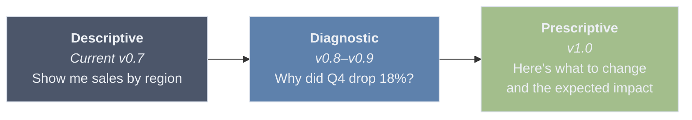
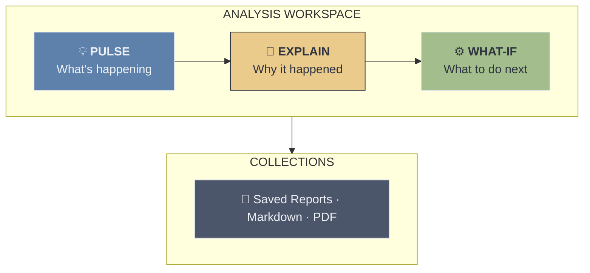
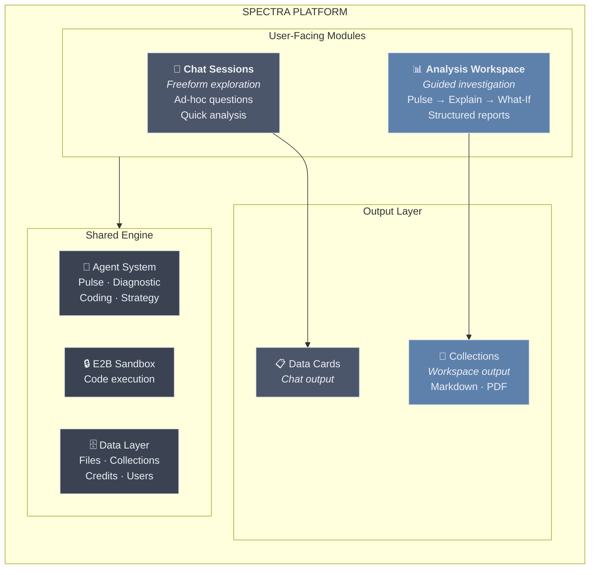
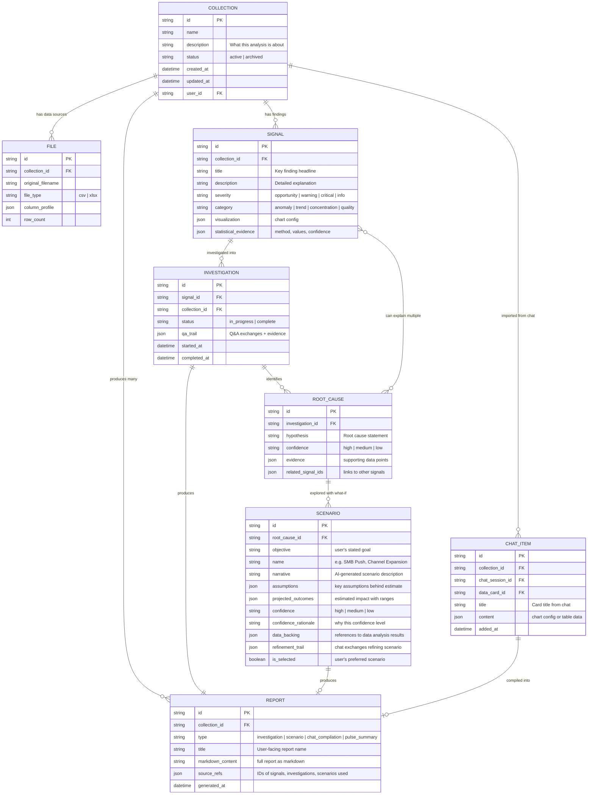
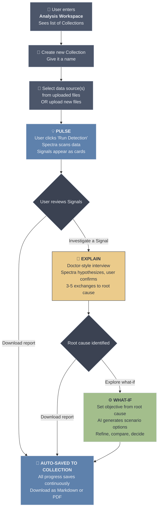
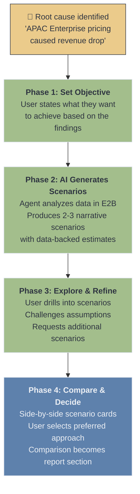

# Spectra Pulse — Product Requirements

> Extracted from brainstorm-idea-1.md. Product requirements only — excludes milestone strategy, competitive landscape, and future exploration sections.

---

## 1. Decisions Log

> ### Decisions Log (2026-03-01)
>
> 1. **Naming:** "Spectra Pulse" confirmed. Individual findings = "Signals". ✓
> 2. **Step 3 (What-If Scenarios) UX:** Revised (2026-03-02). Original "Model & Simulate" approach (tornado charts, lever sliders, Monte Carlo) was too naive — assumed data could be auto-modeled. Replaced with AI-agent-driven What-If Scenarios: objective-first, AI generates narrative scenarios backed by data analysis in E2B, user refines via scoped chat, multi-scenario comparison. Full predictive ML model concept moved to Appendix as future separate module. **Action: Update mockup Screen 4 to reflect new flow.**
> 3. **Data model:** Revised. Collection = workspace (data + process + output). 1 Collection → many Reports. Supports investigation reports, predictive analysis reports, and chat-originated data cards. User can replay findings with different outcomes.
> 4. **Milestone sequence:** Confirmed: v0.8 (Pulse) → v0.9 (Collections) → v0.10 (Explain) → v1.0 (What-If Scenarios) → v0.11 (Admin Workspace Management). ✓
> 5. **PDF generation:** Skip unless explicitly requested. ✓
> 6. **Monitoring module:** Deferred to post-v1.0 backlog. Confirmed. ✓
> 7. **Admin Portal:** Added. Tier-based access gating (free_trial=1 collection, free=no access, standard=5, premium=unlimited). Granular credit costs per Workspace activity. Admin monitoring dashboard for Workspace usage and per-user activity tracking.
> 8. **Persistent AI Memory:** Future exploration (post v0.11). OpenClaw's memory system documented as reference architecture. Not in scope for milestones 0.8–0.11 but to be considered when core Workspace is mature.

---

## 2. The Problem

Spectra today is a **reactive analysis tool** — users upload data, ask questions, get answers. To become a true **business optimization platform** and differentiate from tools like Julius.ai, Spectra needs to move up the analytics maturity curve:



**Key differentiator:** Spectra becomes an analyst that works for you — it proactively scans data, surfaces opportunities and risks, explains root causes, and helps model next steps. The user's job shifts from "figure out what to ask" to "review and decide."

---

## 3. Naming: "Spectra Pulse" — CONFIRMED

> **Decision (2026-03-01):** "Spectra Pulse" is confirmed as the detection stage name. Individual findings are **"Signals"** — positive signals (opportunities) and warning signals (risks).

The detection feature needs a name that's **positive and opportunity-focused**, not fear-based. "Risk Radar" implies something is wrong. We want users to think: "Let me see what Spectra found" — with excitement, not dread.

| Candidate | Vibe | Why it works / doesn't |
|-----------|------|------------------------|
| ~~Risk Radar~~ | Negative, defensive | Implies problems. Users avoid tools that make them anxious. |
| **Spectra Pulse** ✓ | Alive, vital, ongoing | "Take the pulse of your data." Neutral — surfaces both opportunities and concerns. Medical analogy (health check) feels natural. |
| ~~Spectra Scan~~ | Technical, clinical | Works but feels like a virus scan. Less personality. |
| ~~Spectra Lens~~ | Discovery, focus | Good but passive. A lens just looks; a pulse is alive. |
| Signal | Alert, intelligence | Good for a sub-feature (individual findings) but not the whole stage. |

Throughout this document, the detection stage is referred to as **Pulse**. Individual findings are **Signals**.

---

## 4. Product Architecture: Two Modules, One Platform

### Module 1: Chat Sessions (existing — the base tool)

The current chat-with-your-data flow. Stays as-is. Becomes the most primitive feature of Spectra — freeform exploration, quick questions, ad-hoc analysis. Think of it as the "calculator" — always available, always useful, but not the main event.

### Module 2: Analysis Workspace (new — the differentiator)

A completely separate module with its own entry point, its own flow, and its own output format. This is where Spectra becomes a business tool, not just a data tool. Core focus: **Detect → Explain → What-If** (three stages within one workspace).



### Module 3: Monitoring (DEFERRED — post v1.0 backlog)

Recurring automated analysis when data is regularly updated. Concept and details retained in Appendix for future reference. Not in scope for v0.8–v1.0.

### Platform Architecture



**Both modules share** the same data layer, same agents, same E2B engine — but have completely different UX paradigms:

| | Chat Sessions | Analysis Workspace |
|---|---|---|
| **Purpose** | Exploration | Deliverables |
| **Interaction** | Freeform typing | Guided steps + Q&A |
| **Output** | Data Cards in conversation | Structured reports (Markdown) |
| **Saved as** | Chat history | Collections (downloadable as PDF/MD) |
| **User mindset** | "Let me check something" | "I need to produce a report" |

---

## 5. Data Model: Collections as Workspace — REVISED

> **Decision (2026-03-01):** A Collection is the **workspace** — it contains the data, the process, and the output. It is where the user interacts with their data. One Collection can produce **many different outcomes/reports** depending on:
>
> a) **Investigation reports** — findings narrowed to specific root causes
> b) **What-If scenario reports** — scenario exploration based on different objectives/assumptions
> c) **Chat-originated items** — data cards added from existing Chat sessions into the Collection
>
> At any time, the user can return to a Collection and "play around" with the same finding but produce very different reports/outputs. The Collection is persistent and replayable.



**Key relationships:**
- **1 Collection : many Files** — a collection can analyze multiple data sources together
- **1 Collection : many Signals** — Pulse generates multiple findings per collection
- **1 Signal : many Investigations** — a user can investigate the same signal multiple times, exploring different angles, and arrive at different conclusions each time
- **1 Investigation : many Root Causes** — an investigation can produce multiple hypotheses
- **Many Root Causes : many Signals** — a single root cause can explain multiple signals (e.g., "APAC pricing change" explains both "revenue drop" and "customer churn spike")
- **1 Root Cause : many Scenarios** — each root cause can have multiple what-if scenarios, each with its own objective, narrative, and data backing
- **1 Collection : many Reports** — different outcomes from the same data: investigation reports, scenario reports, pulse summaries, or compilations of chat-originated items
- **Chat → Collection bridge** — users can add data cards from Chat sessions into a Collection, bringing freeform exploration into the structured workspace

---

## 6. The User Journey (end to end)



**Step 1: Start an Analysis — Deliverable: SIGNALS**
- User enters Analysis Workspace and sees list of existing Collections
- User creates new Collection and provides a name
- Picks data source(s) from their uploaded files OR uploads new files
- User clicks "Run Detection" and Spectra auto-runs Pulse
- Screen shows Signals as cards: "Here's what we found"
- List of Signals shown as cards on the left panel. When user selects a Signal, the main interface shows details: title (key finding), description, and visualization
- No configuration, no setup. Select data → see Signals.

**Step 2: Guided Investigation (the Q&A flow) — Deliverable: ROOT CAUSE HYPOTHESIS**
- User opens the Collection and sees Signals generated from Pulse
- User taps a Signal: "Revenue declined 18% in Q4"
- User initiates investigation by clicking "Investigate"
- Spectra asks structured questions with discrete choices, plus an option for custom free-text answers
- These questions are designed to narrow down to the root cause. It starts with Spectra's own hypotheses, and lets the user confirm or challenge them
- Imagine a doctor interview — the doctor is trying to understand the root cause of the patient's symptoms
- 3-5 exchanges, progressively narrowing to root cause
- Spectra continues asking until it has enough information for a diagnosis
- In the process, Spectra might ask user for additional information or clarification
- User can upload additional resources (documents: pdf, pptx, docs or images) for the diagnosis. NOTE: this is for later version.
- **Output:** Comprehensive analysis with root cause hypothesis. One root cause may explain multiple Signals.

**Step 3: What-If Scenarios — Deliverable: SCENARIO COMPARISON & RECOMMENDATION**

> **Revised (2026-03-02):** Original "Model & Simulate" approach (tornado charts, lever sliders, Monte Carlo) was replaced. The old approach was naive — it assumed the user's data could be auto-modeled with meaningful input-output relationships, and that users would know which "levers" to adjust. The revised approach uses Spectra's AI agent to generate data-backed narrative scenarios that users can evaluate, refine, and compare. Full predictive ML model concept is documented in Appendix as a future separate module.

After root cause identification, Spectra offers What-If scenario exploration. The flow has four phases:



**Phase 1: Set Objective (What do you want to achieve?)**
- Triggered after Investigation. Spectra presents the root cause context and asks the user to state their objective.
- Presented as a selection with free-text option — not a chat, not a form. One question:
  - *"Revenue declined 18% due to APAC Enterprise pricing pressure. What would you like to explore?"*
  - "How do I recover the lost revenue?"
  - "Which segments should I double down on?"
  - "What's my realistic Q1 outlook?"
  - [Type your own objective]
- The objective anchors everything that follows. Without it, the AI has no direction.

**Phase 2: AI Generates Scenarios (Here are your options)**
- The AI agent takes the objective + root cause + data and does the analytical work:
  1. Runs targeted analysis in E2B (groupbys, historical trends, segment performance, period comparisons)
  2. Identifies what the data can actually support as scenarios
  3. Generates 2-3 **narrative scenarios** simultaneously, each saved as a named entity
- Each scenario is a **story with numbers**, not a spreadsheet:
  - Scenario name (e.g., "Shift Focus to Domestic SMB")
  - Narrative explanation of the approach
  - Estimated impact with range (e.g., "$420K–$580K over Q1")
  - Key requirements/assumptions (e.g., "Requires ~28 additional SMB deals vs. Q4 average of 22/month")
  - Confidence level with rationale (e.g., "Medium — based on Q3-Q4 trend continuation")
  - Data backing — exactly what calculations produced these numbers
- **No pre-built simulation engine.** The AI agent writes Python, runs it in E2B, interprets results, and presents them as scenarios. This uses Spectra's existing architecture — no new infrastructure.
- **Loading state:** While AI generates scenarios, user sees a progress indicator. Generation may take 15-30 seconds as multiple analyses run.

**Phase 3: Explore & Refine (Dig deeper, challenge assumptions)**
- User picks a scenario they're interested in and can ask follow-up questions via a **scoped chat** (not freeform — stays on-topic with these scenarios):
  - "What if we combine Scenario A and B?"
  - "The SMB growth was seasonal — Q4 always spikes. Don't extrapolate that."
  - "What about exiting APAC entirely?"
- AI runs additional analysis in E2B to back up every response — no hallucinated numbers.
- User can request **additional scenarios** — AI generates new ones alongside the existing set.
- Each refinement is saved to the scenario's `refinement_trail`.
- The user's domain knowledge fills causal gaps — same principle as the Investigation step.

**Phase 4: Compare & Decide (Which approach wins?)**
- All scenarios displayed as **clean comparison cards** — not a table-heavy spreadsheet:
  - Scenario name + one-line summary
  - Estimated impact range
  - Confidence level
  - Time to impact
- User selects their preferred scenario → the comparison itself becomes a **report section**:
  - Objective stated, scenarios evaluated, selected approach with rationale
  - This is what gets shared with the VP — ready to read without reformatting.
- User can revisit and re-run scenarios later with updated data.

**Step 4: Save to Collections**
- All progress is automatically saved to the Collection throughout the process
- Spectra compiles the entire journey — Signals, investigation steps, charts, scenario results — into a structured markdown document
- Export as PDF or Markdown as download options
- Lives in Collections, organized by date/topic

---

## 7. Admin Portal: Analysis Workspace Management

The Analysis Workspace is a premium, token-heavy feature. The Admin Portal needs controls for **access gating**, **cost management**, and **activity monitoring**. This builds on the existing tier system (`user_classes.yaml`) and credit infrastructure.

### 1. Tier-Based Access & Collection Limits

The Analysis Workspace is not available to all tiers by default. Each tier gets a configurable access level and collection limit.

| Tier | Workspace Access | Max Active Collections | Rationale |
|------|:---:|:---:|---|
| `free_trial` | Yes | 1 | Let them experience it once — this is the "wow" moment that converts |
| `free` | No | 0 | Free tier is chat-only. Workspace is the upgrade incentive |
| `standard` | Yes | 5 | Enough for regular use |
| `premium` | Yes | Unlimited | Power users, no friction |
| `internal` | Yes | Unlimited | Internal/admin testing |

**Key design decisions:**
- **"Active" vs. "Archived":** Limit applies to active Collections only. Users can archive completed Collections to free up slots. Archived Collections are read-only (view reports, download) but cannot run new Pulse/Investigate/What-If operations.
- **Collection limit is configurable per tier** — stored in `user_classes.yaml` alongside existing credits/reset fields. Admin can adjust without code change (but requires redeploy, same as current tier config).
- **Upgrade prompt:** When a user hits their collection limit, show a clear message: "You've reached the limit for your plan. Archive a Collection or upgrade to [next tier]."

**Proposed `user_classes.yaml` extension:**

```yaml
free_trial:
  display_name: "Free Trial"
  credits: 100
  reset_policy: none
  workspace_access: true
  max_active_collections: 1

free:
  display_name: "Free"
  credits: 10
  reset_policy: weekly
  workspace_access: false
  max_active_collections: 0

standard:
  display_name: "Standard"
  credits: 100
  reset_policy: weekly
  workspace_access: true
  max_active_collections: 5

premium:
  display_name: "Premium"
  credits: 500
  reset_policy: monthly
  workspace_access: true
  max_active_collections: -1  # unlimited

internal:
  display_name: "Internal"
  credits: 0
  reset_policy: unlimited
  workspace_access: true
  max_active_collections: -1  # unlimited
```

### 2. Granular Credit Costs per Workspace Activity

The existing system has a single `default_credit_cost` (1.0 per message). Analysis Workspace activities are **significantly more token-intensive** than a single chat message — a Pulse run may execute 5-10 statistical analyses, and an Investigation may involve multiple agent exchanges. Costs must be granular and configurable.

**Proposed credit cost structure:**

| Activity | Default Cost | What It Covers | Why This Cost |
|----------|:---:|---|---|
| **Pulse: Run Detection** | 5.0 | Data profiling + all statistical analyses + Signal generation | Multiple analysis passes, potentially 5-10 methods run in E2B |
| **Explain: Start Investigation** | 3.0 | First exchange of guided Q&A (ANOVA ranking, initial hypothesis) | Agent reasoning + statistical method execution |
| **Explain: Per Q&A Exchange** | 1.0 | Each subsequent exchange in the investigation | Similar to a chat message but with statistical backing |
| **What-If: Generate Scenarios** | 5.0 | AI agent analyzes data + generates 2-3 scenario narratives | Multiple E2B analysis runs + LLM reasoning for narrative generation |
| **What-If: Refine Scenario** | 1.0 | Each follow-up exchange in the refinement chat | Similar to investigation exchange — agent analysis + response |
| **What-If: Add Scenario** | 2.0 | User requests additional scenario beyond initial set | New E2B analysis run + narrative generation |
| **Report: Compile & Generate** | 1.0 | Markdown compilation from analysis journey | Template-based, minimal LLM usage |
| **Report: PDF Export** | 0.5 | PDF rendering from markdown | Server-side rendering, no LLM |

**Implementation approach:**
- Store as **`platform_settings`** entries (same pattern as `default_credit_cost`) — runtime configurable via Admin Portal without redeploy
- Setting keys: `workspace_credit_cost_pulse`, `workspace_credit_cost_investigate_start`, `workspace_credit_cost_investigate_exchange`, etc.
- Admin UI: dedicated "Workspace Credit Costs" section in Settings page with all costs editable
- Pre-check: before each activity, verify user has sufficient credits. Show cost estimate before running ("This will use ~5 credits. You have 23 remaining.")

**Credit transparency for users:**
- Show credit cost estimate before each action (e.g., "Run Detection (5 credits)")
- Show running total in Collection header: "Credits used in this Collection: 14"
- Credit deduction follows existing pattern: deduct before execution, refund on failure

### 3. Admin Monitoring & Analytics

Admins need visibility into how the Analysis Workspace is being used — both for business insights (is the feature driving engagement?) and operational concerns (who's consuming the most resources?).

**3a. Workspace Activity Dashboard (new Admin page)**

| Metric | Description | Visualization |
|--------|-------------|---------------|
| **Total Collections created** | Count over time (daily/weekly/monthly) | Line chart with trend |
| **Active vs. Archived Collections** | Current snapshot | Donut chart |
| **Pulse runs per day** | Detection activity volume | Bar chart |
| **Investigations started** | Explain step adoption | Bar chart |
| **What-If scenarios generated** | What-If step adoption | Bar chart |
| **Reports generated** | Output/deliverable production | Bar chart |
| **Funnel: Pulse → Explain → What-If** | Stage adoption drop-off | Funnel chart |
| **Workspace credits consumed** | Total workspace-related credit usage over time | Line chart, broken down by activity type |
| **Avg. credits per Collection** | Average total cost of a Collection lifecycle | KPI card |

**3b. Per-User Workspace Activity**

Extend the existing Admin user detail page (which already has activity/sessions tabs) with a **Workspace tab**:

- List of user's Collections (name, status, created date, signal count, report count, total credits used)
- Workspace credit consumption breakdown (Pulse vs. Explain vs. What-If vs. Reports)
- Activity timeline: when they last used the Workspace, frequency
- Collection limit usage: "3 of 5 active collections"

**3c. Workspace Activity Log**

Extend the existing `credit_transactions` table or create a parallel `workspace_activity_log`:

| Field | Type | Description |
|-------|------|-------------|
| `id` | UUID | Primary key |
| `user_id` | FK | Who performed the action |
| `collection_id` | FK | Which Collection |
| `activity_type` | enum | `pulse_run`, `investigation_start`, `investigation_exchange`, `whatif_generate`, `whatif_refine`, `whatif_add_scenario`, `report_compile`, `report_export` |
| `credit_cost` | decimal | Credits charged for this activity |
| `duration_ms` | int | How long the activity took (E2B execution time) |
| `metadata` | JSON | Activity-specific data (signal count, method used, etc.) |
| `created_at` | datetime | Timestamp |

This enables:
- Filtering activity by user, collection, activity type, date range
- Identifying heavy users or unusual patterns
- Understanding which Workspace features are most/least used
- Correlating credit consumption with actual value delivered

**3d. Alerts & Operational Monitoring**

- **High-cost Collection alert:** Flag Collections that have consumed > X credits (configurable threshold)
- **Failed Pulse runs:** Track and surface Pulse runs that failed or returned no signals (detection quality monitoring)
- **Workspace adoption rate:** % of eligible users (by tier) who have created at least one Collection

