# Spectra Product Expansion — Business Optimization Capabilities

> ### Decisions Log (2026-03-01)
>
> 1. **Naming:** "Spectra Pulse" confirmed. Individual findings = "Signals". ✓
> 2. **Step 3 (Model) UX:** Needs visual mockups before engineering — cannot proceed without wireframes for sensitivity overview → lever playground → scenario comparison flow. **Action: Create UI/UX mockups for all 3 stages before development.**
> 3. **Data model:** Revised. Collection = workspace (data + process + output). 1 Collection → many Reports. Supports investigation reports, predictive analysis reports, and chat-originated data cards. User can replay findings with different outcomes.
> 4. **Milestone sequence:** Confirmed: v0.8 (Pulse) → v0.9 (Collections) → v0.10 (Explain) → v1.0 (Model). ✓
> 5. **PDF generation:** Skip unless explicitly requested. ✓
> 6. **Monitoring module:** Deferred to post-v1.0 backlog. Confirmed. ✓

## The Problem

Spectra today is a **reactive analysis tool** — users upload data, ask questions, get answers. To become a true **business optimization platform** and differentiate from tools like Julius.ai, Spectra needs to move up the analytics maturity curve:

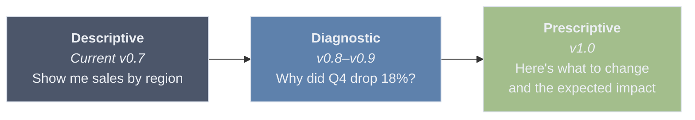

**Key differentiator:** Spectra becomes an analyst that works for you — it proactively scans data, surfaces opportunities and risks, explains root causes, and helps model next steps. The user's job shifts from "figure out what to ask" to "review and decide."

---

## Naming: "Spectra Pulse" — CONFIRMED

> **Decision (2026-03-01):** "Spectra Pulse" is confirmed as the detection stage name. Individual findings are **"Signals"** — positive signals (opportunities) and warning signals (risks).

The detection feature needs a name that's **positive and opportunity-focused**, not fear-based. "Risk Radar" implies something is wrong. We want users to think: "Let me see what Spectra found" — with excitement, not dread.

| Candidate | Vibe | Why it works / doesn't |
|-----------|------|------------------------|
| ~~Risk Radar~~ | Negative, defensive | Implies problems. Users avoid tools that make them anxious. |
| **Spectra Pulse** ✓ | Alive, vital, ongoing | "Take the pulse of your data." Neutral — surfaces both opportunities and concerns. Medical analogy (health check) feels natural. |
| ~~Spectra Scan~~ | Technical, clinical | Works but feels like a virus scan. Less personality. |
| ~~Spectra Lens~~ | Discovery, focus | Good but passive. A lens just looks; a pulse is alive. |
| Signal | Alert, intelligence | Good for a sub-feature (individual findings) but not the whole stage. |

Throughout this document, the detection stage is referred to as **Pulse**. Individual findings are **Signals**.

---

## Product Architecture: Two Modules, One Platform

### Module 1: Chat Sessions (existing — the base tool)

The current chat-with-your-data flow. Stays as-is. Becomes the most primitive feature of Spectra — freeform exploration, quick questions, ad-hoc analysis. Think of it as the "calculator" — always available, always useful, but not the main event.

### Module 2: Analysis Workspace (new — the differentiator)

A completely separate module with its own entry point, its own flow, and its own output format. This is where Spectra becomes a business tool, not just a data tool. Core focus: **Detect → Explain → Model** (three stages within one workspace).

### Module 3: Monitoring (DEFERRED — post v1.0 backlog)

Recurring automated analysis when data is regularly updated. Concept and details retained in [Appendix: Monitoring Module](#appendix-monitoring-module-deferred) for future reference. Not in scope for v0.8–v1.0.

### Platform Architecture

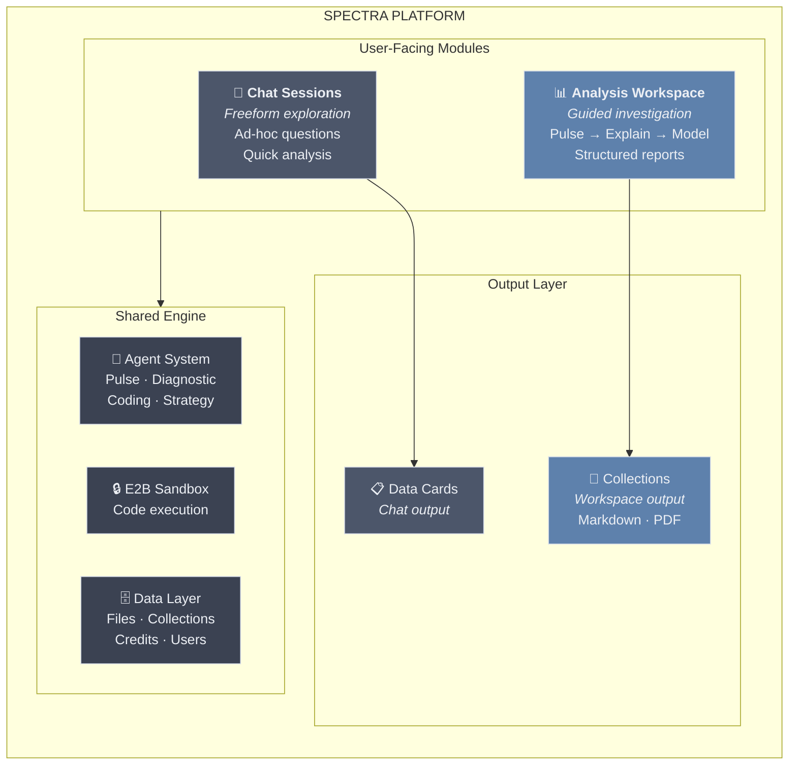

**Both modules share** the same data layer, same agents, same E2B engine — but have completely different UX paradigms:

| | Chat Sessions | Analysis Workspace |
|---|---|---|
| **Purpose** | Exploration | Deliverables |
| **Interaction** | Freeform typing | Guided steps + Q&A |
| **Output** | Data Cards in conversation | Structured reports (Markdown) |
| **Saved as** | Chat history | Collections (downloadable as PDF/MD) |
| **User mindset** | "Let me check something" | "I need to produce a report" |

---

## Data Model: Collections as Workspace — REVISED

> **Decision (2026-03-01):** A Collection is the **workspace** — it contains the data, the process, and the output. It is where the user interacts with their data. One Collection can produce **many different outcomes/reports** depending on:
>
> a) **Investigation reports** — findings narrowed to specific root causes
> b) **Predictive analysis reports** — scenario modeling based on different models/assumptions
> c) **Chat-originated items** — data cards added from existing Chat sessions into the Collection
>
> At any time, the user can return to a Collection and "play around" with the same finding but produce very different reports/outputs. The Collection is persistent and replayable.

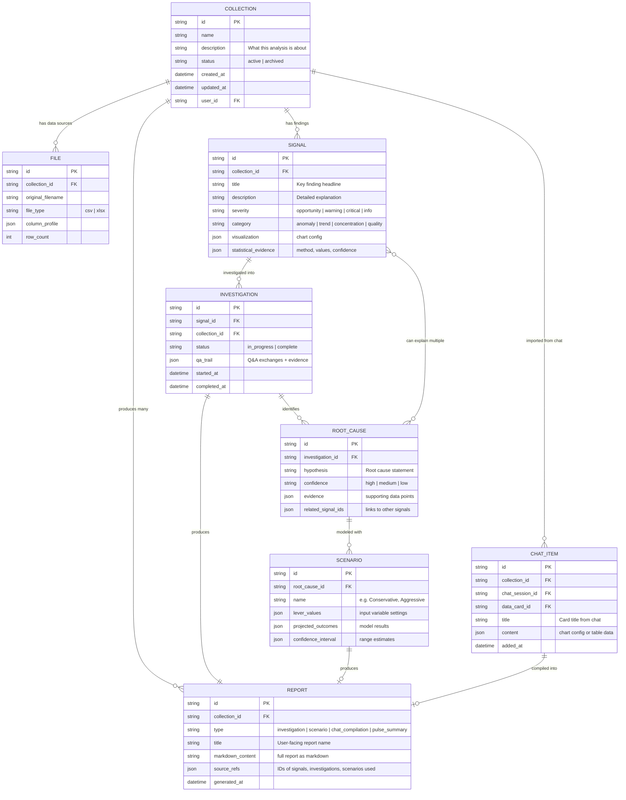

**Key relationships:**
- **1 Collection : many Files** — a collection can analyze multiple data sources together
- **1 Collection : many Signals** — Pulse generates multiple findings per collection
- **1 Signal : many Investigations** — a user can investigate the same signal multiple times, exploring different angles, and arrive at different conclusions each time
- **1 Investigation : many Root Causes** — an investigation can produce multiple hypotheses
- **Many Root Causes : many Signals** — a single root cause can explain multiple signals (e.g., "APAC pricing change" explains both "revenue drop" and "customer churn spike")
- **1 Root Cause : many Scenarios** — each root cause can have multiple what-if simulations
- **1 Collection : many Reports** — different outcomes from the same data: investigation reports, scenario reports, pulse summaries, or compilations of chat-originated items
- **Chat → Collection bridge** — users can add data cards from Chat sessions into a Collection, bringing freeform exploration into the structured workspace

---

## Business Executive Assessment

**"Would I actually use this, or is it just a demo?"**

Perspective: department head, has data in Excel, reports to a VP.

### Pulse (Detect) — SOLVES A REAL PROBLEM

The most dangerous issues are the ones I *didn't think to check*. But equally — the biggest opportunities are the ones hiding in plain sight. If Spectra says "3 things you should know about" after I upload my monthly data — that's genuinely valuable. **Finding a hidden growth opportunity is just as powerful as catching a risk early.**

### Insight Engine (Explain) — YES, BUT ONLY IF GUIDED

When my boss asks "why did margins drop?", I spend hours slicing data in Excel. If Spectra walks me through it — like a doctor interview, starting with hypotheses and letting me confirm or challenge them — that saves real time. **A raw diagnostic dump would be useless. A guided conversation that arrives at an answer is gold.**

### Optimization Studio (Model) — CAUTIOUS YES

I'd use scenario modeling ("what if we raise prices 5%?") weekly. But I'd be skeptical of model recommendations unless I understand how it got there. **Start with simulation (let me play with inputs and see outputs), not prescription (Spectra tells me what to do).** Trust needs to be earned over time.

### Collections (saved reports) — THE SLEEPER FEATURE

Half my job is producing reports for stakeholders. Today I copy-paste from tools into PowerPoint. That workflow is broken. If every analysis becomes a polished report I can download — **that's not a feature, that's the reason I'd pay monthly.** This is what makes Spectra sticky.

**Bottom line:** The guided flow (not chat) is the right call. Chat is for exploration. But when I need to produce a deliverable — a risk assessment, a root cause report, an optimization plan — I need a structured process with a structured output.

---

## Apple PM Assessment

**"What's the simplest path from data to decision?"**

Design philosophy: hide complexity, reveal it progressively, make the default path feel inevitable.

### Core UX Principles

**1. Progressive disclosure, not feature overload**
- User starts at Pulse. They *can* go to Explain. They *can* go to Model.
- But if all they need is "see the signals" — they stop at step 1 and download the report.
- No one is forced through all three stages.
- Think: Apple Health shows "cardio fitness declining" → tap → contributing factors → tap → recommendations. Each layer is optional.

**2. The Q&A flow IS the product**
- Not a chatbot conversation. Structured, guided, with discrete choices + custom input option.
- Like a doctor interview: Spectra starts with its own hypotheses, the user confirms or challenges.
- 3-5 exchanges, progressively narrowing to root cause.

**3. Collections is the output, not the analysis**
- Users don't come to Spectra for charts. They come for decisions and reports.
- Collections makes Spectra the system of record for data-driven decisions.
- All progress auto-saves. The report compiles automatically from the analysis journey.

**4. Simulation over prescription**
- Don't tell users what to do. Give them levers to pull and show them projected outcomes.
- Simple interface: sliders/inputs for key variables.
- Side-by-side: "Current trajectory" vs "Your scenario."
- No ML jargon. No "model training." User adjusts business levers, sees projected results.

### The User Journey (end to end)

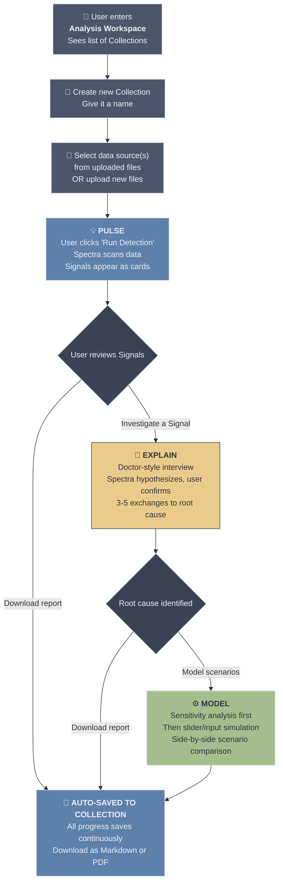

**Step 1: Start an Analysis — Deliverable: SIGNALS**
- User enters Analysis Workspace and sees list of existing Collections
- User creates new Collection and provides a name
- Picks data source(s) from their uploaded files OR uploads new files
- User clicks "Run Detection" and Spectra auto-runs Pulse
- Screen shows Signals as cards: "Here's what we found"
- List of Signals shown as cards on the left panel. When user selects a Signal, the main interface shows details: title (key finding), description, and visualization
- No configuration, no setup. Select data → see Signals.

**Step 2: Guided Investigation (the Q&A flow) — Deliverable: ROOT CAUSE HYPOTHESIS**
- User opens the Collection and sees Signals generated from Pulse
- User taps a Signal: "Revenue declined 18% in Q4"
- User initiates investigation by clicking "Investigate"
- Spectra asks structured questions with discrete choices, plus an option for custom free-text answers
- These questions are designed to narrow down to the root cause. It starts with Spectra's own hypotheses, and lets the user confirm or challenge them
- Imagine a doctor interview — the doctor is trying to understand the root cause of the patient's symptoms
- 3-5 exchanges, progressively narrowing to root cause
- Spectra continues asking until it has enough information for a diagnosis
- In the process, Spectra might ask user for additional information or clarification
- User can upload additional resources (documents: pdf, pptx, docs or images) for the diagnosis. NOTE: this is for later version.
- **Output:** Comprehensive analysis with root cause hypothesis. One root cause may explain multiple Signals.

**Step 3: Model & Simulate — Deliverable: SCENARIO SIMULATION**

> **Note (2026-03-01):** This step needs visual UI/UX mockups before engineering can begin. The sensitivity overview → lever playground → scenario comparison flow must be wireframed and reviewed.

After root cause identification, Spectra offers modeling. The UX has three sub-steps:

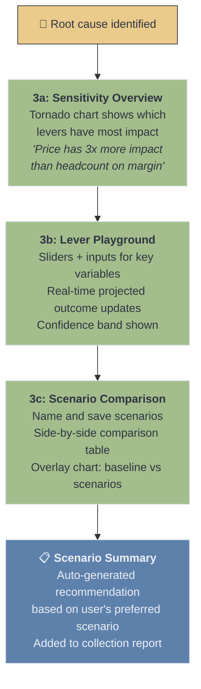

**3a: Sensitivity Overview (What levers matter?)**
- Before showing sliders, Spectra shows a **tornado chart** — which variables have the most impact on the target KPI when changed by ±10%
- This prevents users from wasting time on levers that don't matter
- User understands the landscape before playing with numbers
- Example: "Price has 3x more impact than headcount on operating margin"

**3b: Lever Playground (What if I change X?)**
- Sliders and number inputs for the top variables identified in sensitivity analysis
- As user adjusts a slider, the projected outcome updates in real-time
- **Always shows a confidence band**, not just a point estimate ("Revenue: $1.0M–$1.3M" not just "$1.15M")
- A small text disclaimer: "Based on historical relationships in your data. Does not account for external factors."
- User can set a **target goal** ("I want to reach $1.2M revenue") and Spectra reverse-solves: "You'd need to reduce price by ~8% to hit that target"

**3c: Scenario Comparison (Which option is best?)**
- User names and saves different lever configurations as scenarios (e.g., "Conservative", "Moderate", "Aggressive")
- **Comparison table:** Each column is a scenario, each row is an outcome metric
- **Overlay chart:** All scenarios plotted on the same timeline/axis, color-coded
- User selects their preferred scenario → Spectra auto-generates a recommendation summary added to the collection report

**Step 4: Save to Collections**
- All progress is automatically saved to the Collection throughout the process
- Spectra compiles the entire journey — Signals, investigation steps, charts, scenario results — into a structured markdown document
- Export as PDF or Markdown as download options
- Lives in Collections, organized by date/topic

---

## Statistical Methods by Stage

Each stage of the Analysis Workspace uses different statistical techniques. The methods are ordered from simplest (always run) to advanced (run when data supports it). All execution happens in the existing E2B sandbox using Python (pandas, scipy, scikit-learn, statsmodels).

### Stage 1: PULSE — Signal Identification

The goal is to answer: **"What should you pay attention to?"** without the user asking. This runs when user clicks "Run Detection."

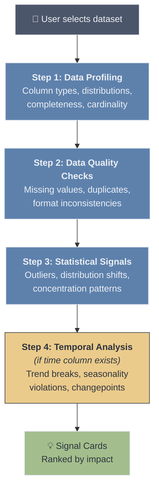

| Method | What It Catches | When To Use | Python Library |
|--------|----------------|-------------|----------------|
| **Descriptive profiling** | Column types, null rates, unique counts, basic stats (mean, median, std) | Always — first pass on every dataset | `pandas.describe()`, `pandas.dtypes` |
| **Missing value pattern analysis** | Systematic gaps (e.g., entire column null after a date, correlated missingness) | Always | `pandas.isnull()`, `missingno` |
| **Duplicate detection** | Exact and near-duplicate rows | Always | `pandas.duplicated()` |
| **Z-score outlier detection** | Individual values that deviate >2-3 standard deviations from the column mean | Numeric columns with roughly normal distribution | `scipy.stats.zscore` |
| **IQR (Interquartile Range)** | Robust outlier detection that works on skewed distributions (values below Q1-1.5*IQR or above Q3+1.5*IQR) | Numeric columns — more robust than Z-score for non-normal data | `pandas` quartile math |
| **Isolation Forest** | Multi-dimensional outliers that look normal on individual columns but are unusual in combination | When dataset has 3+ numeric columns | `sklearn.ensemble.IsolationForest` |
| **Herfindahl-Hirschman Index (HHI)** | Concentration patterns — e.g., "80% of revenue comes from 2 clients" (opportunity or risk depending on context) | Categorical columns with associated numeric values | Manual calculation on `pandas.groupby` |
| **Distribution shape analysis** | Skewness, kurtosis, bimodality — flags when a column's distribution is unusual or has shifted | Numeric columns with >50 rows | `scipy.stats.skew`, `scipy.stats.kurtosis` |
| **Changepoint detection (PELT)** | Abrupt shifts in a time series — e.g., "revenue mean shifted down starting October" | Time-series data with >30 data points | `ruptures` (PELT algorithm) |
| **STL decomposition** | Seasonal pattern violations — this month doesn't match expected seasonality | Time-series with known periodicity (monthly, weekly) | `statsmodels.tsa.seasonal.STL` |
| **Linear trend break** | Identifies when a KPI that was growing starts declining (or vice versa) | Time-ordered numeric data | `scipy.stats.linregress` on rolling windows |
| **Grubbs' test** | Statistically rigorous single-outlier test with p-value | Small datasets (<30 rows) where Z-score is unreliable | `scipy.stats` or manual implementation |

**Signal classification (not just severity — also opportunity vs. concern):**
- **Opportunity:** Growth trends, underexploited segments, concentration in high-performing areas, positive changepoints
- **Warning:** Declining trends, revenue concentration in few clients, seasonal violations, moderate outliers
- **Critical:** Major data quality issues, extreme outliers, sharp negative changepoints, >20% missing values
- **Info:** Minor distribution characteristics, near-duplicates, general data health observations

**When data has no notable signals:**
Report a "health summary" — "Your data looks healthy. Here's what we checked: [list]. No significant signals found." This avoids an empty screen.

---

### Stage 2: EXPLAIN — Root Cause & Diagnostic Investigation

The goal is to answer: **"Why did this happen?"** through a guided Q&A flow (doctor-interview style). Each method produces evidence that narrows toward the root cause.

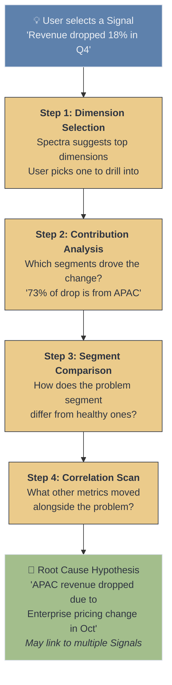

| Method | What It Answers | How It's Used in the Q&A Flow | Python Library |
|--------|----------------|------------------------------|----------------|
| **Contribution analysis (additive decomposition)** | "Which segments drove the overall change?" — decomposes a KPI change into per-segment contributions | Step 1: After user picks a dimension, show which segment values contributed most to the change (e.g., "APAC contributed -73% of the total decline") | `pandas.groupby` + difference math |
| **Welch's t-test** | "Is the difference between two groups statistically significant?" — compares means of two segments | Step 2: When comparing problem segment vs. rest — "APAC avg deal size ($42K) is significantly lower than other regions ($61K), p < 0.01" | `scipy.stats.ttest_ind` |
| **Chi-squared test** | "Is the distribution of categories different between two groups?" — tests independence of categorical variables | Step 2: When comparing categorical breakdowns — "Product mix in APAC is significantly different from global (p < 0.05)" | `scipy.stats.chi2_contingency` |
| **Pearson / Spearman correlation** | "What other metrics moved with the problem metric?" — finds co-movement | Step 3: Scan all numeric columns for correlation with the problem metric — "Customer satisfaction (r = 0.82) and deal close rate (r = 0.71) also declined" | `pandas.corr()`, `scipy.stats.spearmanr` |
| **Decision tree (single, shallow)** | "What combination of factors best predicts the problem?" — identifies the most discriminating splits | Step 3: Train a depth-2 decision tree to classify "problem rows" vs. "normal rows" — "Region=APAC AND Product=Enterprise predicts 89% of the drop" | `sklearn.tree.DecisionTreeClassifier` (max_depth=2) |
| **Period-over-period comparison** | "What changed between this period and last?" — structured diff by dimension | Step 1: When time data exists — compare current period vs. previous period across all dimensions, rank by absolute change | `pandas.groupby` + `merge` |
| **Variance decomposition (ANOVA)** | "Which dimension explains the most variance in the target metric?" — ranks dimensions by explanatory power | Pre-step: Automatically rank which dimensions to suggest first (the one that explains the most variance gets offered as the top choice) | `scipy.stats.f_oneway` or `statsmodels.stats.anova` |
| **Pareto analysis (80/20)** | "Which few segments account for most of the problem?" — identifies the vital few | Step 2: After contribution analysis — "2 of 8 regions account for 85% of the decline" | `pandas` cumulative sum math |

**How methods map to Q&A exchanges:**

| Exchange | What Spectra Asks | Statistical Method Behind It |
|----------|-------------------|------------------------------|
| 1 | "Which dimension matters most?" [options ranked by ANOVA F-statistic] | Variance decomposition ranks dimensions |
| 2 | "The decline is concentrated in [segment]. Dig deeper?" | Contribution analysis + Pareto |
| 3 | "Here's how [problem segment] differs from others." | Welch's t-test + Chi-squared |
| 4 | "These metrics also moved: [list]. Any of these relevant?" | Correlation scan |
| 5 | "Summary: [root cause hypothesis with confidence]" | Decision tree summary + all above |

---

### Stage 3: MODEL — Simulation & What-If Scenarios

The goal is to answer: **"What happens if we change X?"** through a sensitivity overview, lever playground, and scenario comparison.

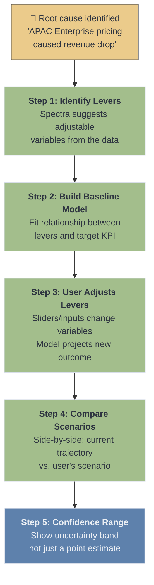

| Method | What It Does | When To Use | Python Library |
|--------|-------------|-------------|----------------|
| **Linear regression** | Models the relationship between input variables and target KPI. User adjusts inputs → model projects new target value. | Default for all simulation — simple, interpretable, fast. "If you reduce price by 10%, projected volume increases by X based on historical relationship." | `sklearn.linear_model.LinearRegression`, `statsmodels.OLS` |
| **Elasticity estimation** | Calculates % change in outcome per % change in input (price elasticity, demand elasticity). More intuitive than raw regression coefficients. | When user adjusts price, volume, or spend levers — "Price elasticity is -1.3, meaning a 10% price cut → ~13% volume increase" | Derived from log-log regression |
| **Time-series extrapolation (Holt-Winters)** | Projects the "current trajectory" baseline — what happens if nothing changes. Accounts for trend and seasonality. | Always as the baseline comparison — "Without intervention, revenue is projected to be $X in Q2" | `statsmodels.tsa.holtwinters.ExponentialSmoothing` |
| **Monte Carlo simulation** | Generates confidence intervals by running thousands of scenarios with random variation. Shows best/worst/expected outcomes instead of a single point estimate. | After linear regression to show uncertainty — "Expected outcome: $1.1M (90% CI: $0.9M–$1.3M)" | `numpy.random` + model re-sampling |
| **Sensitivity analysis (tornado chart)** | Shows which input variable has the most impact on the outcome when changed by ±10%. Displayed as a horizontal bar chart (tornado). | Before simulation — helps user know which lever to pull first — "Price has 3x more impact than headcount on margin" | Systematic perturbation of regression inputs |
| **Scenario comparison matrix** | Side-by-side table of multiple scenarios with different input combinations. Each column is a scenario, each row is an outcome metric. | When user wants to compare 2-3 scenarios — "Conservative vs. Moderate vs. Aggressive pricing strategy" | `pandas.DataFrame` presentation |
| **Breakeven analysis** | Calculates the input value needed to hit a specific target — "What price point gets us back to $1M revenue?" | When user has a specific goal — reverse-solve the regression | Algebraic inversion of regression equation |

**Important design principles for Model stage:**

1. **Always show confidence intervals, never just point estimates.** A single number ("revenue will be $1.1M") creates false precision. A range ("$0.9M–$1.3M with 90% confidence") is honest and builds trust.

2. **Start with linear regression, not complex ML.** Users need to understand *why* the model predicts what it does. A linear model is explainable: "For every $1 price reduction, we expect 150 more units sold." A neural network is a black box.

3. **Show the model's limitations explicitly.** "This projection assumes the historical relationship between price and volume continues. It does not account for competitor actions, market shifts, or capacity constraints." Transparency builds trust.

4. **Sensitivity analysis before simulation.** Before letting users play with sliders, show them which levers actually matter. This prevents wasted time adjusting variables that have minimal impact.

---

### Method Availability by Data Shape

Not all methods work on all datasets. The Pulse Agent must detect data shape first and only apply applicable methods.

| Data Characteristic | Methods Enabled | Methods Disabled |
|---|---|---|
| **< 30 rows** | Grubbs' test, basic stats, IQR | Isolation Forest, STL, PELT, Monte Carlo (insufficient data) |
| **No time column** | All cross-sectional methods | Changepoint, STL, trend break, Holt-Winters, period-over-period |
| **No categorical columns** | Z-score, IQR, correlation, regression | Contribution analysis, Chi-squared, ANOVA, HHI |
| **Single numeric column** | Z-score, IQR, Grubbs', distribution analysis | Isolation Forest, correlation, regression, decision tree |
| **All categorical (no numeric)** | Duplicate detection, missing value patterns, Chi-squared | All numeric methods, regression, simulation |
| **Wide data (50+ columns)** | All methods, but need column selection/ranking first | Running everything on all columns (too slow, too noisy) |

### Library Requirements (E2B Sandbox)

These Python packages need to be available in the E2B sandbox environment:

| Package | Used For | Already in Spectra? |
|---------|---------|-------------------|
| `pandas` | Data manipulation, groupby, profiling | Yes |
| `numpy` | Numerical operations, Monte Carlo | Yes |
| `scipy` | Statistical tests (t-test, chi-squared, z-score, correlation) | Yes |
| `scikit-learn` | Isolation Forest, Decision Tree, Linear Regression | Yes |
| `statsmodels` | OLS regression, ANOVA, Holt-Winters, STL decomposition | Needs verification |
| `ruptures` | Changepoint detection (PELT algorithm) | Needs installation |
| `missingno` | Missing value pattern visualization | Optional (can use pandas) |

---

## Critical Challenges & Honest Assessment

Before committing to build, these questions need answers. Some may change the scope or sequencing.

### Challenge 1: v0.8 scope is too large

The original v0.8 included: Analysis Workspace + Pulse + guided Q&A (basic) + Collections + PDF/MD export. That's:

- A new frontend module with its own routing and layout
- A new Pulse Agent with statistical analysis logic
- A new card type (Signal cards with severity levels)
- A guided Q&A flow (even "basic" is complex UX design)
- A Collections data model + list UI
- PDF generation pipeline

**This is realistically 2 milestones of work.** Cramming it into one creates pressure to cut corners on the parts that matter most (detection accuracy, Q&A flow design, report quality).

### Challenge 2: The Q&A flow design has unsolved UX questions

We describe "structured Q&A with discrete choices" — but:

- **How does Spectra know what choices to offer?** It depends entirely on the data's columns and dimensions. A sales dataset with Region/Product/Channel is clean. A flat transaction log with 50 columns is not.
- **What if the data doesn't have clear categorical dimensions?** A dataset of sensor readings or financial transactions may not have natural "drill into Region" options.
- **What if there are no notable signals?** The entire flow assumes something is found. If the data is clean, the Pulse step shows a health summary — but then the Explain step has nothing to investigate. That's fine (not every dataset needs investigation).
- **How many exchanges is actually right?** We say "3-5 max" but this is a guess. Too few = shallow, too many = frustrating. This needs prototyping and user testing.

**These aren't blockers — but they must be designed before building, not discovered during development.**

### Challenge 3: Detection accuracy makes or breaks everything

If Pulse has too many false positives ("flagging" normal variance as signals), users will stop trusting it within the first session. If it misses real patterns, it's useless. The bar for proactive analysis is higher than reactive — because the user didn't ask for it, so it had better be right.

**This means the Pulse Agent needs careful tuning with real-world data before we ship it publicly.** Synthetic test data proves the pipeline works; it doesn't prove the detection is useful.

### Challenge 4: Competitive positioning is aspirational, not current

We scored Spectra at 4/4 on the capability matrix — but that's the **target after v1.0**, not reality today. Tellius has been building their Agent Mode with a large team and enterprise customers for years. We shouldn't imply we'll match Tellius feature-for-feature.

**Spectra's real advantage isn't capability parity — it's accessibility:**

| What Tellius does better | What Spectra does better |
|---|---|
| Deeper anomaly detection (enterprise-grade ML) | Zero setup (upload a file vs. connect a data warehouse) |
| More sophisticated what-if modeling | Guided journey UX (not BI-platform-shaped) |
| Enterprise data governance and security | Deliverable-focused output (reports, not dashboards) |
| Real-time streaming data support | Price accessibility (individual analyst vs. $495/mo team) |
| Years of production hardening | Speed to first insight (minutes, not days of setup) |

**We win on accessibility and UX, not on depth. The positioning should reflect that honestly.** "The fastest path from Excel to business insight" is a stronger message than "we do everything Tellius does."

### Challenge 5: Report quality is a trust signal

If the generated report looks like a developer's markdown dump, users won't share it with their VP. Reports need structure — proper headings, clean chart rendering, executive summary at the top. Markdown-first with good PDF export.

**Ugly reports undermine the entire value proposition of Collections.** Better to ship fewer export formats that look great than many that look mediocre.

### Challenge 6: Edge cases will define whether this feels magical or broken

The happy path (sales data with clear dimensions, obvious patterns, clean structure) is easy to demo. But real users will upload:
- Messy data with inconsistent formatting
- Files with only 20 rows (too few for meaningful statistics)
- Non-numeric data (text logs, categorical-only datasets)
- Data without a time dimension (no trend analysis possible)
- Multi-sheet Excel files with different structures per sheet

Each edge case needs a graceful degradation path, not a crash or misleading result.

---

## Revised Milestone Sequence — CONFIRMED

> **Decision (2026-03-01):** Milestone sequence confirmed: v0.8 (Pulse) → v0.9 (Collections) → v0.10 (Explain) → v1.0 (Model). Monitoring deferred to post-v1.0 backlog — confirmed.

Based on the challenges above, the scope focuses on three stages (Pulse → Explain → Model) with Collections as the output layer throughout. Monitoring is deferred to post-v1.0 backlog.

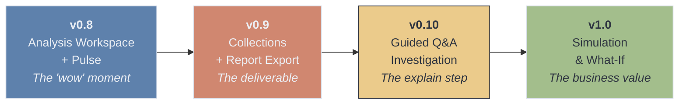

| Milestone | Scope | Proves | Ship Criteria |
|-----------|-------|--------|---------------|
| **v0.8** | Analysis Workspace shell + Pulse (Detect only). User creates Collection, selects data → sees Signals as cards with charts. No investigation, no Collections export yet. | The "wow" moment works. Proactive detection surfaces useful signals. Users understand findings without explanation. | Upload 5 different real-world datasets → Pulse flags useful signals in at least 4 of them with < 20% false positive rate. |
| **v0.9** | Collections module + report export (Markdown + PDF). Auto-save all analysis progress. Collections list view with search/filter. Download reports. | The deliverable loop works. Reports look polished enough to share with a stakeholder. | Generate 3 sample reports → a non-user rates them "would share with my boss" or higher. |
| **v0.10** | Guided Q&A investigation (the Explain step). Tap a Signal → doctor-style interview → root cause hypothesis. Root causes can link to multiple Signals. | The guided flow is better than freeform chat for investigation. Users reach root cause faster than with Chat. | 5 test scenarios with known root causes → guided flow identifies the correct driver in at least 4. |
| **v1.0** | Optimization Studio — sensitivity analysis, lever playground with sliders, scenario comparison, breakeven analysis. | Users trust and use the simulation. What-if feels intuitive, not intimidating. | 3 test scenarios → user can set up and run a meaningful simulation in < 2 minutes without help. |

### Scope per Milestone

**v0.8: Analysis Workspace + Pulse**

| Include | Exclude |
|---------|---------|
| Analysis Workspace as new frontend module with own nav | Guided Q&A / investigation (v0.10) |
| Collection create/list/open (project-like container) | Report export / download (v0.9) |
| Data source picker (select from uploaded files + upload new) | Simulation / what-if (v1.0) |
| Pulse Agent — signal detection on "Run Detection" click | Monitoring / recurring (backlog) |
| Signal cards with classification (opportunity/warning/critical/info) | |
| Supporting charts on Signal cards | |
| "Healthy data" state (when no notable signals found) | |

**v0.9: Collections + Report Export**

| Include | Exclude |
|---------|---------|
| Auto-save all analysis progress to Collection | Guided Q&A (v0.10) |
| Report compilation (Signals → structured markdown) | PPT/slides export (backlog) |
| Markdown download | Shareable links (backlog) |
| PDF download with polished layout | Team views (backlog) |
| Collections list view with search and filter | Monitoring (backlog) |
| Save analysis from Chat as report (bridge feature) | |

---

## Competitive Landscape

### The Four-Step Flow: Who Does What?

The proposed Spectra flow is: **Detect signals → Guided root cause investigation → Scenario simulation → Report generation.** No single product fully delivers all four today.

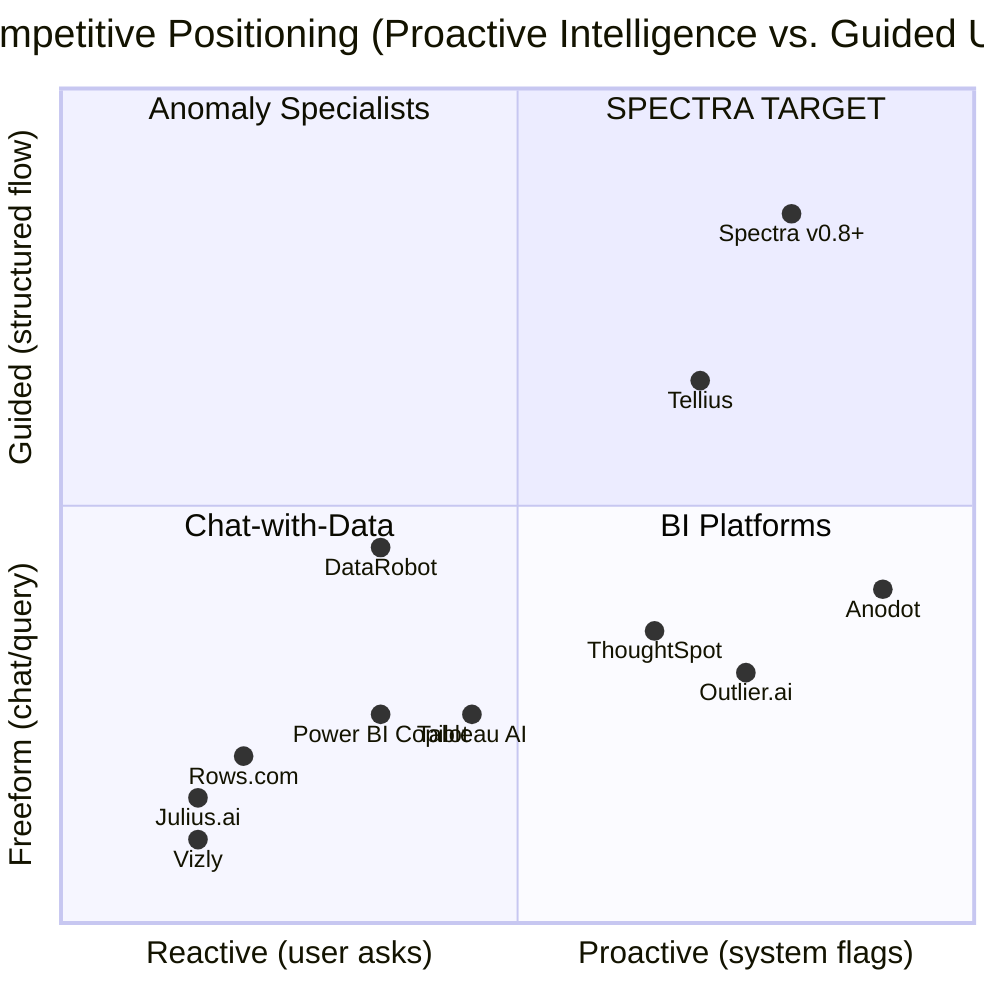

### Head-to-Head: Full Flow Coverage

| Capability | Tellius | ThoughtSpot | Anodot | DataRobot | Looker | Julius.ai | **Spectra (target)** |
|---|:---:|:---:|:---:|:---:|:---:|:---:|:---:|
| 1. Proactive Signal Detection | Yes | Yes | Yes (best) | Limited | Yes | No | **Yes** |
| 2. Guided Root Cause Investigation | Yes (Agent) | Partial | Partial | No | No | No | **Yes** |
| 3. Scenario / What-If Simulation | Yes | No | Limited | Yes (best) | No | No | **Yes** |
| 4. Polished Report Generation | Partial | No | No | Partial | Yes (slides) | No | **Yes** |
| **Coverage Score** | **3.5/4** | **1.5/4** | **1.5/4** | **2/4** | **1.5/4** | **0/4** | **4/4** |

> **Honest note on the 4/4 score:** This is the *target after v1.0*, not current reality. Tellius has years of production hardening with enterprise customers. Our advantage isn't matching them feature-for-feature — it's being radically more accessible. See [Honest Competitive Position](#honest-competitive-position) below.

### Category 1: AI Data Analysis (Chat-with-Data) — Direct Competitors

| Product | What It Does | Proactive Detection | Guided Flow | What-If | Reports | Pricing |
|---------|-------------|:---:|:---:|:---:|:---:|---------|
| **Julius.ai** | NL data analysis + charts from uploaded files | No | No | No | Limited | Free / $20/mo Pro |
| **Rows.com** | AI-powered spreadsheet with NL analyst | Basic | No | Yes (NL) | No | Free / paid tiers |
| **Akkio** | No-code predictive model building | No | No | Limited | Limited | $49/mo+ |
| **Obviously AI** | Automated ML with wizard flow | No | No | Yes | Partial | $75-145/mo |
| **Polymer Search** | Auto-analyze spreadsheets → dashboards | Basic | No | No | Limited | Free / $10/mo |
| **Vizly** | Chat-with-data + Python/R under the hood | No | No | No | Limited | Free / paid |
| **DataChat** | Conversational analytics with full reproducibility | No | Partial | No | Limited | Enterprise |

**Spectra's position vs. this category:** These are all reactive, chat-first tools. None proactively scan data or guide users through structured investigation. The Analysis Workspace immediately differentiates Spectra from the entire category.

### Category 2: Business Intelligence with AI — Enterprise Players

| Product | Proactive Detection | Guided Investigation | What-If | Report Export | Pricing |
|---------|:---:|:---:|:---:|:---:|---------|
| **ThoughtSpot** | Yes (SpotIQ + anomaly alerts) | Partial (auto root cause) | No | Limited | $25/user/mo |
| **Power BI Copilot** | Limited (time-series only) | No | Limited (manual) | Yes (best: PDF/PPT/Excel) | $14/user/mo + Fabric |
| **Tableau AI** | Partial (Pulse KPI monitoring) | No | Limited (parameters) | Yes (PDF/PPT) | $42-75/user/mo |
| **Looker** (Google) | Yes (Gemini-powered) | No | No | Yes (AI-gen slides) | Enterprise custom |
| **Sigma Computing** | Yes (outlier detection + alerts) | No | No | Limited | Enterprise custom |

**Spectra's position vs. this category:** These are massive platforms that require significant setup, data engineering, and per-seat enterprise licensing. They're adding AI features incrementally but not rethinking the workflow. Spectra can be faster to value (upload a file → instant findings) at a fraction of the cost.

### Category 3: Anomaly Detection Specialists

| Product | What It Does | Root Cause | Simulation | Reports | Pricing |
|---------|-------------|:---:|:---:|:---:|---------|
| **Anodot** | Autonomous ML-based business monitoring across 100% of data | Partial (pointers) | Limited (cloud cost sim) | No | Enterprise custom |
| **Outlier.ai** | Multi-dimensional anomaly scanning for executives | No | No | Limited | Enterprise custom |
| **Sisu Data** *(acquired by Snowflake, discontinued)* | Automated root cause analysis testing millions of hypotheses | Yes (best-in-class) | No | Limited | N/A |

**Key insight:** Sisu Data was the closest to what we're building for the "Explain" step — automated root cause identification. It was acquired by Snowflake in 2023 and discontinued as standalone. That capability gap is now unfilled in the market.

### Category 4: Prescriptive Analytics / Optimization

| Product | Detection | Guided Flow | What-If | Reports | Pricing |
|---------|:---:|:---:|:---:|:---:|---------|
| **Tellius** | Yes (contextual alerts) | Yes (Agent Mode Kaiya) | Yes (budget sim) | Partial (narratives) | $495/mo (5 users) |
| **Pecan AI** | Limited (data quality) | No | Limited | Limited | $950/mo+ |
| **DataRobot** | Limited (model monitoring) | No | Yes (Tableau extension) | Partial | Enterprise ($100K+/yr) |
| **H2O.ai** | Yes (deep learning) | No | No | Limited | $6,900/yr+ |

**Tellius is the closest competitor** to the full Spectra vision. Their Agent Mode (Kaiya) combines anomaly detection + root cause + what-if modeling + AI narratives. However:
- At $495/mo for 5 users, it targets mid-market/enterprise
- Report output is narratives, not polished downloadable deliverables
- Requires data warehouse connections — not file-upload-first like Spectra
- Their UX is BI-platform-style, not guided-journey-style

### The Market Gap

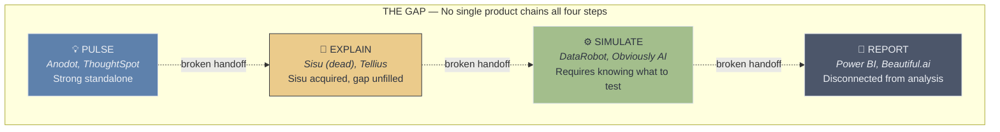

- **Detection specialists** (Anodot, Outlier.ai) stop at alerting — they tell you something is happening but leave investigation to you
- **Investigation tools** (Sisu Data) have been acquired and discontinued — the capability is being absorbed into data warehouse platforms, not served standalone
- **Simulation platforms** (DataRobot, Obviously AI) require users to already know what to simulate — there's no automatic path from "here's a signal" to "here's a simulation"
- **Report tools** (Beautiful.ai, Narrative Science) are completely disconnected from the analysis — you do analysis in one tool, then manually create reports in another
- **BI platforms** (ThoughtSpot, Tableau, Power BI) are adding AI incrementally but not rethinking the end-to-end workflow

**A platform that connects all four steps into a single guided flow — accessible to non-technical business users — would occupy a genuinely uncontested position.**

### Honest Competitive Position

Spectra's real advantage isn't capability depth — it's **accessibility and UX paradigm.** We should be honest about where we win and where we don't:

| Where competitors are stronger | Where Spectra wins |
|---|---|
| Deeper anomaly detection (Anodot's enterprise ML) | Zero setup — upload a file vs. connect a data warehouse |
| More sophisticated modeling (DataRobot's AutoML) | Guided journey UX — not BI-platform-shaped |
| Enterprise governance and security (ThoughtSpot, Tableau) | Deliverable-focused output — reports, not dashboards |
| Real-time streaming data (Anodot, Sigma) | Price — individual analyst vs. $495/mo+ team licenses |
| Years of production hardening (Tellius) | Speed to first insight — minutes, not days of setup |
| Massive ecosystems and integrations | Simplicity — no training required, no IT involvement |

**Our positioning should be:** *"The fastest path from Excel to business insight."*

Not: *"We do everything Tellius does."* — because we don't, and won't for a long time. We win by being the tool a business analyst can use today, alone, without asking IT for help, and produce a report their VP actually reads.

---

## Practicality Notes

**What makes this buildable now:**
- Backend reuses existing E2B sandbox, agent system, and credit system — no new external services
- Pulse is a new agent + statistical Python code running in the same sandbox
- Collections is a new DB table + report compilation logic + PDF generation (libraries like WeasyPrint or reportlab)
- The Analysis Workspace frontend is a new Next.js route/module — separate from chat but in the same app

**What makes this testable fast:**
- Create synthetic test datasets with known patterns and known root causes
- Upload → does Spectra find the planted signals? → does the Q&A flow reach the right answer?
- Each milestone has explicit ship criteria (defined in the milestone table above)
- Test with real-world datasets (Superstore, Kaggle sales data) not just synthetic ones

**Risks to watch:**
- Detection accuracy is the #1 risk — false positives kill trust faster than missing patterns
- The Q&A flow needs UX prototyping before engineering — wireframe and test with users first
- Report quality (markdown structure, chart rendering) is a trust signal — ugly reports = no sharing = no value
- Simulation model accuracy (v1.0) is the hardest challenge — start with simple projections
- Edge cases (messy data, small datasets, no time dimension) need graceful degradation, not errors
- Credit cost of proactive analysis needs clear communication to users upfront

---

## Appendix: Monitoring Module (DEFERRED)

> **Status: Backlog — post v1.0.** Retained here for future reference. Not in scope for current milestones.

### The Concept

When a user completes an analysis and saves it to Collections, they can mark it as "recurring." This tells Spectra: "Run this same analysis again whenever I give you new data with the same structure." The output is a comparison report (what changed since last time) with flagged signals, delivered via email and saved to Collections.

### Data Ingestion Options

| Tier | Method | User Effort | Engineering Effort | Target User |
|------|--------|-------------|-------------------|-------------|
| **1** | Manual re-upload | Low (upload + one click) | Low (structure matching + diff) | Individual analyst |
| **2** | Email forwarding | Very low (forward email) | Medium (email ingestion pipeline) | Analyst who gets reports via email |
| **3** | API push | None (automated) | Low (already built in v0.7) | Teams with technical capability |
| **4** | Cloud storage watch | None (automated) | High (OAuth, polling, webhooks) | Enterprise teams |

**Recommended approach when we build this:** Start with Tier 1 (manual re-upload + structure matching). Tier 3 is free (already exists via REST API). Tier 2 and 4 are future expansions based on demand.

### Why "Recurring Analysis" Before "Automated Pipeline"

Most target users don't have automated data pipelines today. They export from ERP/CRM manually each month. For them, **manual re-upload + intelligent "compare to last time" is the right v1.** The automated pipeline should come when enterprise customers request it.

### What the Comparison Report Would Contain

- **Period-over-period diff:** "Revenue: $1.2M → $1.05M (-12.5%)"
- **New signals:** Patterns not present last time
- **Resolved signals:** Previous patterns that have improved
- **Trend direction:** Is each metric improving or worsening?
- **Flagged thresholds:** Any user-defined thresholds breached
