# Spectra Product Expansion — Business Optimization Capabilities

> ### Decisions Log (2026-03-01)
>
> 1. **Naming:** "Spectra Pulse" confirmed. Individual findings = "Signals". ✓
> 2. **Step 3 (What-If Scenarios) UX:** Revised (2026-03-02). Original "Model & Simulate" approach (tornado charts, lever sliders, Monte Carlo) was too naive — assumed data could be auto-modeled. Replaced with AI-agent-driven What-If Scenarios: objective-first, AI generates narrative scenarios backed by data analysis in E2B, user refines via scoped chat, multi-scenario comparison. Full predictive ML model concept moved to Appendix as future separate module. **Action: Update mockup Screen 4 to reflect new flow.**
> 3. **Data model:** Revised. Collection = workspace (data + process + output). 1 Collection → many Reports. Supports investigation reports, predictive analysis reports, and chat-originated data cards. User can replay findings with different outcomes.
> 4. **Milestone sequence:** Confirmed: v0.8 (Pulse) → v0.9 (Collections) → v0.10 (Explain) → v1.0 (What-If Scenarios) → v0.11 (Admin Workspace Management). ✓
> 5. **PDF generation:** Skip unless explicitly requested. ✓
> 6. **Monitoring module:** Deferred to post-v1.0 backlog. Confirmed. ✓
> 7. **Admin Portal:** Added. Tier-based access gating (free_trial=1 collection, free=no access, standard=5, premium=unlimited). Granular credit costs per Workspace activity. Admin monitoring dashboard for Workspace usage and per-user activity tracking.
> 8. **Persistent AI Memory:** Future exploration (post v0.11). OpenClaw's memory system documented as reference architecture. Not in scope for milestones 0.8–0.11 but to be considered when core Workspace is mature.

## The Problem

Spectra today is a **reactive analysis tool** — users upload data, ask questions, get answers. To become a true **business optimization platform** and differentiate from tools like Julius.ai, Spectra needs to move up the analytics maturity curve:

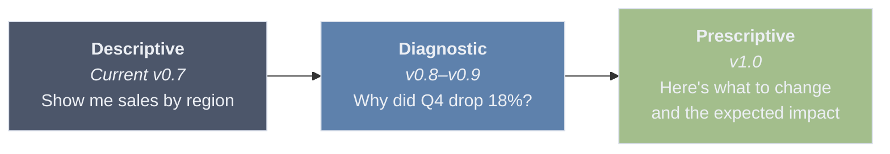

**Key differentiator:** Spectra becomes an analyst that works for you — it proactively scans data, surfaces opportunities and risks, explains root causes, and helps model next steps. The user's job shifts from "figure out what to ask" to "review and decide."

---

## Naming: "Spectra Pulse" — CONFIRMED

> **Decision (2026-03-01):** "Spectra Pulse" is confirmed as the detection stage name. Individual findings are **"Signals"** — positive signals (opportunities) and warning signals (risks).

The detection feature needs a name that's **positive and opportunity-focused**, not fear-based. "Risk Radar" implies something is wrong. We want users to think: "Let me see what Spectra found" — with excitement, not dread.

| Candidate | Vibe | Why it works / doesn't |
|-----------|------|------------------------|
| ~~Risk Radar~~ | Negative, defensive | Implies problems. Users avoid tools that make them anxious. |
| **Spectra Pulse** ✓ | Alive, vital, ongoing | "Take the pulse of your data." Neutral — surfaces both opportunities and concerns. Medical analogy (health check) feels natural. |
| ~~Spectra Scan~~ | Technical, clinical | Works but feels like a virus scan. Less personality. |
| ~~Spectra Lens~~ | Discovery, focus | Good but passive. A lens just looks; a pulse is alive. |
| Signal | Alert, intelligence | Good for a sub-feature (individual findings) but not the whole stage. |

Throughout this document, the detection stage is referred to as **Pulse**. Individual findings are **Signals**.

---

## Product Architecture: Two Modules, One Platform

### Module 1: Chat Sessions (existing — the base tool)

The current chat-with-your-data flow. Stays as-is. Becomes the most primitive feature of Spectra — freeform exploration, quick questions, ad-hoc analysis. Think of it as the "calculator" — always available, always useful, but not the main event.

### Module 2: Analysis Workspace (new — the differentiator)

A completely separate module with its own entry point, its own flow, and its own output format. This is where Spectra becomes a business tool, not just a data tool. Core focus: **Detect → Explain → What-If** (three stages within one workspace).

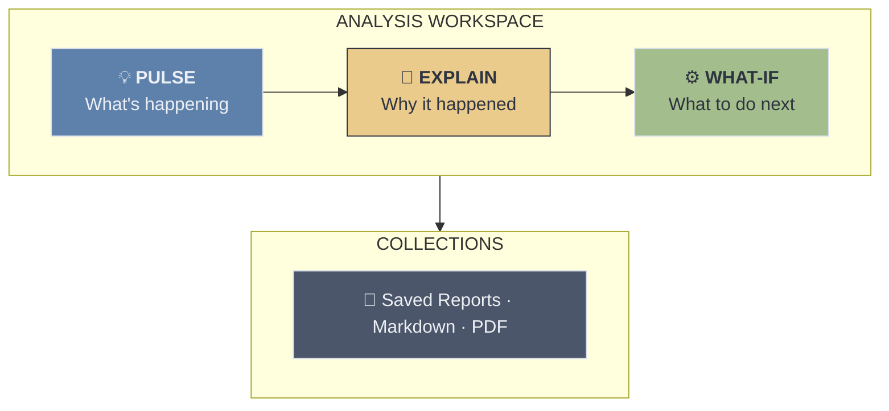

### Module 3: Monitoring (DEFERRED — post v1.0 backlog)

Recurring automated analysis when data is regularly updated. Concept and details retained in [Appendix: Monitoring Module](#appendix-monitoring-module-deferred) for future reference. Not in scope for v0.8–v1.0.

### Platform Architecture

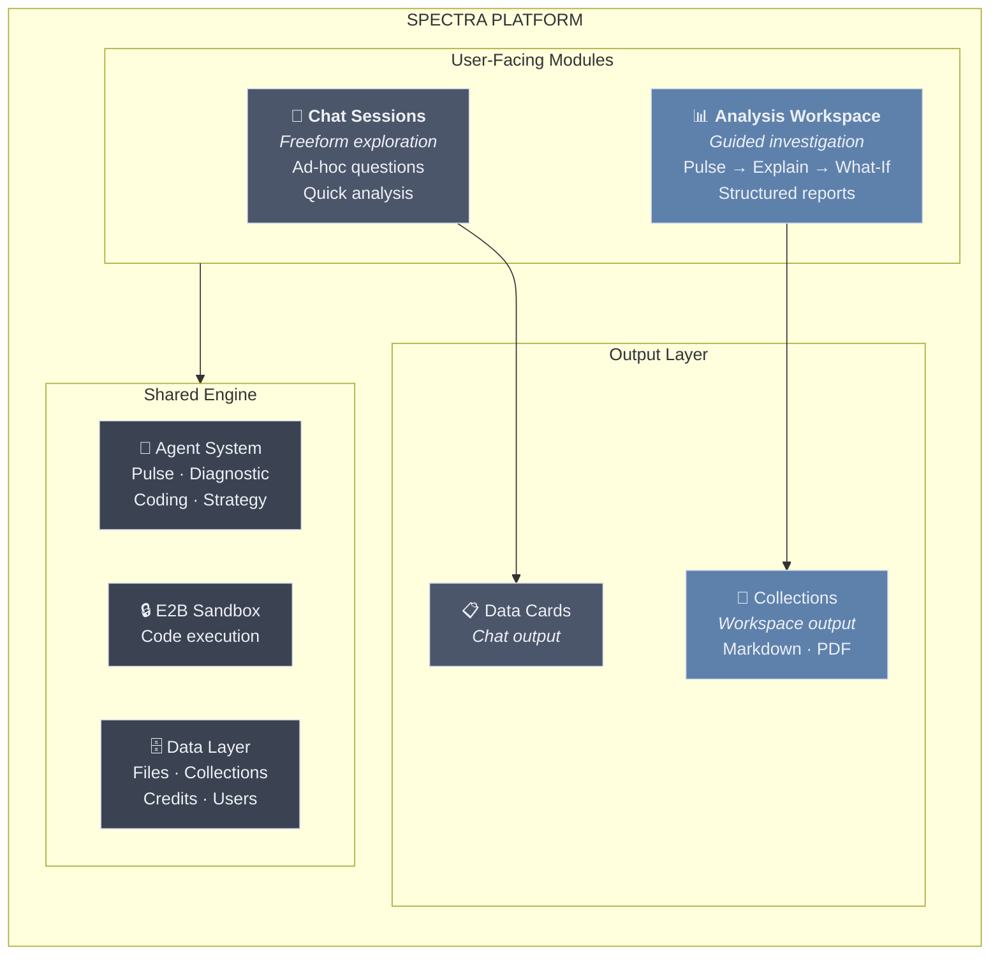

**Both modules share** the same data layer, same agents, same E2B engine — but have completely different UX paradigms:

| | Chat Sessions | Analysis Workspace |
|---|---|---|
| **Purpose** | Exploration | Deliverables |
| **Interaction** | Freeform typing | Guided steps + Q&A |
| **Output** | Data Cards in conversation | Structured reports (Markdown) |
| **Saved as** | Chat history | Collections (downloadable as PDF/MD) |
| **User mindset** | "Let me check something" | "I need to produce a report" |

---

## Data Model: Collections as Workspace — REVISED

> **Decision (2026-03-01):** A Collection is the **workspace** — it contains the data, the process, and the output. It is where the user interacts with their data. One Collection can produce **many different outcomes/reports** depending on:
>
> a) **Investigation reports** — findings narrowed to specific root causes
> b) **What-If scenario reports** — scenario exploration based on different objectives/assumptions
> c) **Chat-originated items** — data cards added from existing Chat sessions into the Collection
>
> At any time, the user can return to a Collection and "play around" with the same finding but produce very different reports/outputs. The Collection is persistent and replayable.

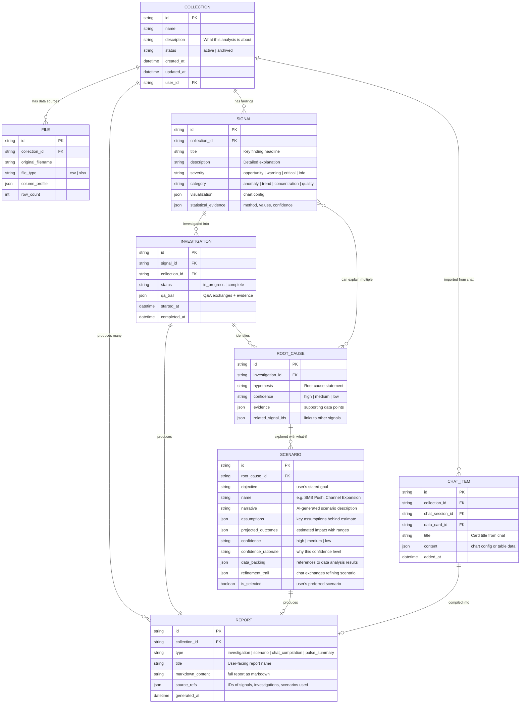

**Key relationships:**
- **1 Collection : many Files** — a collection can analyze multiple data sources together
- **1 Collection : many Signals** — Pulse generates multiple findings per collection
- **1 Signal : many Investigations** — a user can investigate the same signal multiple times, exploring different angles, and arrive at different conclusions each time
- **1 Investigation : many Root Causes** — an investigation can produce multiple hypotheses
- **Many Root Causes : many Signals** — a single root cause can explain multiple signals (e.g., "APAC pricing change" explains both "revenue drop" and "customer churn spike")
- **1 Root Cause : many Scenarios** — each root cause can have multiple what-if scenarios, each with its own objective, narrative, and data backing
- **1 Collection : many Reports** — different outcomes from the same data: investigation reports, scenario reports, pulse summaries, or compilations of chat-originated items
- **Chat → Collection bridge** — users can add data cards from Chat sessions into a Collection, bringing freeform exploration into the structured workspace

---

## Business Executive Assessment

**"Would I actually use this, or is it just a demo?"**

Perspective: department head, has data in Excel, reports to a VP.

### Pulse (Detect) — SOLVES A REAL PROBLEM

The most dangerous issues are the ones I *didn't think to check*. But equally — the biggest opportunities are the ones hiding in plain sight. If Spectra says "3 things you should know about" after I upload my monthly data — that's genuinely valuable. **Finding a hidden growth opportunity is just as powerful as catching a risk early.**

### Insight Engine (Explain) — YES, BUT ONLY IF GUIDED

When my boss asks "why did margins drop?", I spend hours slicing data in Excel. If Spectra walks me through it — like a doctor interview, starting with hypotheses and letting me confirm or challenge them — that saves real time. **A raw diagnostic dump would be useless. A guided conversation that arrives at an answer is gold.**

### What-If Scenarios — CAUTIOUS YES

I'd use scenario exploration ("what if we focus on SMB instead of Enterprise?") weekly. But I'd be skeptical unless I understand how it got there. **The AI needs to show its reasoning — what data backed the estimate, what assumptions were made, and what the confidence level is.** If it just says "$420K" with no explanation, I won't trust it. If it says "$420K–$580K based on your Q3-Q4 SMB trend of +12% MoM, assuming seasonal adjustment" — now I can evaluate whether the reasoning holds. Trust comes from transparency, not precision.

### Collections (saved reports) — THE SLEEPER FEATURE

Half my job is producing reports for stakeholders. Today I copy-paste from tools into PowerPoint. That workflow is broken. If every analysis becomes a polished report I can download — **that's not a feature, that's the reason I'd pay monthly.** This is what makes Spectra sticky.

**Bottom line:** The guided flow (not chat) is the right call. Chat is for exploration. But when I need to produce a deliverable — a risk assessment, a root cause report, an optimization plan — I need a structured process with a structured output.

---

## Apple PM Assessment

**"What's the simplest path from data to decision?"**

Design philosophy: hide complexity, reveal it progressively, make the default path feel inevitable.

### Core UX Principles

**1. Progressive disclosure, not feature overload**
- User starts at Pulse. They *can* go to Explain. They *can* go to What-If.
- But if all they need is "see the signals" — they stop at step 1 and download the report.
- No one is forced through all three stages.
- Think: Apple Health shows "cardio fitness declining" → tap → contributing factors → tap → recommendations. Each layer is optional.

**2. The Q&A flow IS the product**
- Not a chatbot conversation. Structured, guided, with discrete choices + custom input option.
- Like a doctor interview: Spectra starts with its own hypotheses, the user confirms or challenges.
- 3-5 exchanges, progressively narrowing to root cause.

**3. Collections is the output, not the analysis**
- Users don't come to Spectra for charts. They come for decisions and reports.
- Collections makes Spectra the system of record for data-driven decisions.
- All progress auto-saves. The report compiles automatically from the analysis journey.

**4. AI-guided scenarios, not raw simulation**
- Don't tell users what to do. Don't give them raw sliders either — most users don't know which lever to pull.
- Instead: AI proposes 2-3 data-backed scenarios as narratives. User refines, compares, decides.
- Each scenario shows its reasoning: what data backs the estimate, what assumptions were made, confidence level.
- No ML jargon. No "model training." The AI does the analytical work; the user evaluates the options.

### The User Journey (end to end)

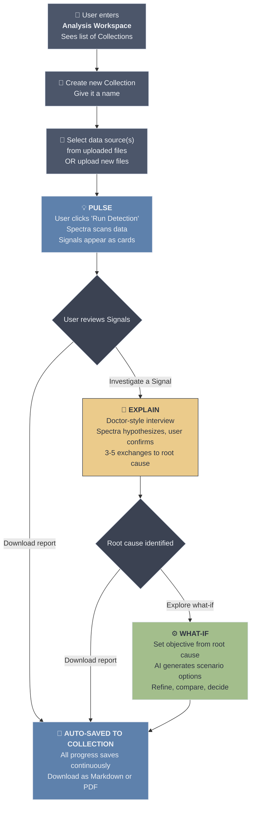

**Step 1: Start an Analysis — Deliverable: SIGNALS**
- User enters Analysis Workspace and sees list of existing Collections
- User creates new Collection and provides a name
- Picks data source(s) from their uploaded files OR uploads new files
- User clicks "Run Detection" and Spectra auto-runs Pulse
- Screen shows Signals as cards: "Here's what we found"
- List of Signals shown as cards on the left panel. When user selects a Signal, the main interface shows details: title (key finding), description, and visualization
- No configuration, no setup. Select data → see Signals.

**Step 2: Guided Investigation (the Q&A flow) — Deliverable: ROOT CAUSE HYPOTHESIS**
- User opens the Collection and sees Signals generated from Pulse
- User taps a Signal: "Revenue declined 18% in Q4"
- User initiates investigation by clicking "Investigate"
- Spectra asks structured questions with discrete choices, plus an option for custom free-text answers
- These questions are designed to narrow down to the root cause. It starts with Spectra's own hypotheses, and lets the user confirm or challenge them
- Imagine a doctor interview — the doctor is trying to understand the root cause of the patient's symptoms
- 3-5 exchanges, progressively narrowing to root cause
- Spectra continues asking until it has enough information for a diagnosis
- In the process, Spectra might ask user for additional information or clarification
- User can upload additional resources (documents: pdf, pptx, docs or images) for the diagnosis. NOTE: this is for later version.
- **Output:** Comprehensive analysis with root cause hypothesis. One root cause may explain multiple Signals.

**Step 3: What-If Scenarios — Deliverable: SCENARIO COMPARISON & RECOMMENDATION**

> **Revised (2026-03-02):** Original "Model & Simulate" approach (tornado charts, lever sliders, Monte Carlo) was replaced. The old approach was naive — it assumed the user's data could be auto-modeled with meaningful input-output relationships, and that users would know which "levers" to adjust. The revised approach uses Spectra's AI agent to generate data-backed narrative scenarios that users can evaluate, refine, and compare. Full predictive ML model concept is documented in [Appendix: Predictive ML Model Platform](#appendix-predictive-ml-model-platform-future-module) as a future separate module.

After root cause identification, Spectra offers What-If scenario exploration. The flow has four phases:

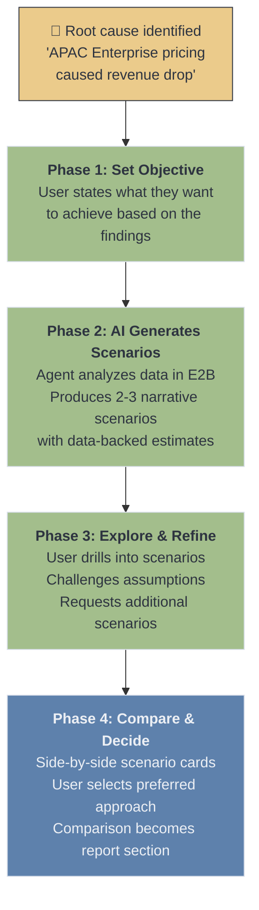

**Phase 1: Set Objective (What do you want to achieve?)**
- Triggered after Investigation. Spectra presents the root cause context and asks the user to state their objective.
- Presented as a selection with free-text option — not a chat, not a form. One question:
  - *"Revenue declined 18% due to APAC Enterprise pricing pressure. What would you like to explore?"*
  - "How do I recover the lost revenue?"
  - "Which segments should I double down on?"
  - "What's my realistic Q1 outlook?"
  - [Type your own objective]
- The objective anchors everything that follows. Without it, the AI has no direction.

**Phase 2: AI Generates Scenarios (Here are your options)**
- The AI agent takes the objective + root cause + data and does the analytical work:
  1. Runs targeted analysis in E2B (groupbys, historical trends, segment performance, period comparisons)
  2. Identifies what the data can actually support as scenarios
  3. Generates 2-3 **narrative scenarios** simultaneously, each saved as a named entity
- Each scenario is a **story with numbers**, not a spreadsheet:
  - Scenario name (e.g., "Shift Focus to Domestic SMB")
  - Narrative explanation of the approach
  - Estimated impact with range (e.g., "$420K–$580K over Q1")
  - Key requirements/assumptions (e.g., "Requires ~28 additional SMB deals vs. Q4 average of 22/month")
  - Confidence level with rationale (e.g., "Medium — based on Q3-Q4 trend continuation")
  - Data backing — exactly what calculations produced these numbers
- **No pre-built simulation engine.** The AI agent writes Python, runs it in E2B, interprets results, and presents them as scenarios. This uses Spectra's existing architecture — no new infrastructure.
- **Loading state:** While AI generates scenarios, user sees a progress indicator. Generation may take 15-30 seconds as multiple analyses run.

**Phase 3: Explore & Refine (Dig deeper, challenge assumptions)**
- User picks a scenario they're interested in and can ask follow-up questions via a **scoped chat** (not freeform — stays on-topic with these scenarios):
  - "What if we combine Scenario A and B?"
  - "The SMB growth was seasonal — Q4 always spikes. Don't extrapolate that."
  - "What about exiting APAC entirely?"
- AI runs additional analysis in E2B to back up every response — no hallucinated numbers.
- User can request **additional scenarios** — AI generates new ones alongside the existing set.
- Each refinement is saved to the scenario's `refinement_trail`.
- The user's domain knowledge fills causal gaps — same principle as the Investigation step.

**Phase 4: Compare & Decide (Which approach wins?)**
- All scenarios displayed as **clean comparison cards** — not a table-heavy spreadsheet:
  - Scenario name + one-line summary
  - Estimated impact range
  - Confidence level
  - Time to impact
- User selects their preferred scenario → the comparison itself becomes a **report section**:
  - Objective stated, scenarios evaluated, selected approach with rationale
  - This is what gets shared with the VP — ready to read without reformatting.
- User can revisit and re-run scenarios later with updated data.

**Why this works (and why the old approach didn't):**

| Old approach (Model & Simulate) | New approach (What-If Scenarios) |
|---|---|
| Tornado chart — assumes auto-identified "levers" exist | AI tells you what options exist in plain language |
| Sliders with hardcoded ranges — where do these come from? | AI generates scenarios based on what the data actually supports |
| Fixed number of levers — what if data only supports 2? Or 10? | Flexible — AI produces whatever number of scenarios makes sense |
| User drives the simulation manually | AI proposes, user refines — less effort, more insight |
| Technical feel — "sensitivity analysis" | Strategic feel — "here are your options" |
| Requires pre-built simulation engine | Uses existing AI agent + E2B — no new infrastructure |

**Step 4: Save to Collections**
- All progress is automatically saved to the Collection throughout the process
- Spectra compiles the entire journey — Signals, investigation steps, charts, scenario results — into a structured markdown document
- Export as PDF or Markdown as download options
- Lives in Collections, organized by date/topic

---

## Statistical Methods by Stage

Each stage of the Analysis Workspace uses different statistical techniques. The methods are ordered from simplest (always run) to advanced (run when data supports it). All execution happens in the existing E2B sandbox using Python (pandas, scipy, scikit-learn, statsmodels).

### Stage 1: PULSE — Signal Identification

The goal is to answer: **"What should you pay attention to?"** without the user asking. This runs when user clicks "Run Detection."

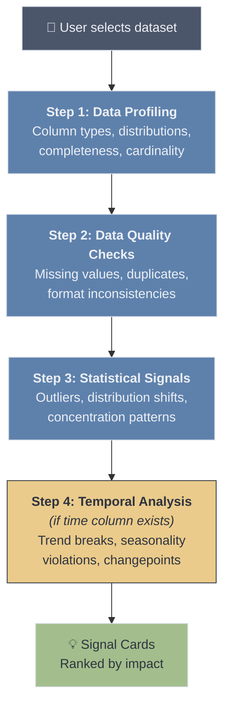

| Method | What It Catches | When To Use | Python Library |
|--------|----------------|-------------|----------------|
| **Descriptive profiling** | Column types, null rates, unique counts, basic stats (mean, median, std) | Always — first pass on every dataset | `pandas.describe()`, `pandas.dtypes` |
| **Missing value pattern analysis** | Systematic gaps (e.g., entire column null after a date, correlated missingness) | Always | `pandas.isnull()`, `missingno` |
| **Duplicate detection** | Exact and near-duplicate rows | Always | `pandas.duplicated()` |
| **Z-score outlier detection** | Individual values that deviate >2-3 standard deviations from the column mean | Numeric columns with roughly normal distribution | `scipy.stats.zscore` |
| **IQR (Interquartile Range)** | Robust outlier detection that works on skewed distributions (values below Q1-1.5*IQR or above Q3+1.5*IQR) | Numeric columns — more robust than Z-score for non-normal data | `pandas` quartile math |
| **Isolation Forest** | Multi-dimensional outliers that look normal on individual columns but are unusual in combination | When dataset has 3+ numeric columns | `sklearn.ensemble.IsolationForest` |
| **Herfindahl-Hirschman Index (HHI)** | Concentration patterns — e.g., "80% of revenue comes from 2 clients" (opportunity or risk depending on context) | Categorical columns with associated numeric values | Manual calculation on `pandas.groupby` |
| **Distribution shape analysis** | Skewness, kurtosis, bimodality — flags when a column's distribution is unusual or has shifted | Numeric columns with >50 rows | `scipy.stats.skew`, `scipy.stats.kurtosis` |
| **Changepoint detection (PELT)** | Abrupt shifts in a time series — e.g., "revenue mean shifted down starting October" | Time-series data with >30 data points | `ruptures` (PELT algorithm) |
| **STL decomposition** | Seasonal pattern violations — this month doesn't match expected seasonality | Time-series with known periodicity (monthly, weekly) | `statsmodels.tsa.seasonal.STL` |
| **Linear trend break** | Identifies when a KPI that was growing starts declining (or vice versa) | Time-ordered numeric data | `scipy.stats.linregress` on rolling windows |
| **Grubbs' test** | Statistically rigorous single-outlier test with p-value | Small datasets (<30 rows) where Z-score is unreliable | `scipy.stats` or manual implementation |

**Signal classification (not just severity — also opportunity vs. concern):**
- **Opportunity:** Growth trends, underexploited segments, concentration in high-performing areas, positive changepoints
- **Warning:** Declining trends, revenue concentration in few clients, seasonal violations, moderate outliers
- **Critical:** Major data quality issues, extreme outliers, sharp negative changepoints, >20% missing values
- **Info:** Minor distribution characteristics, near-duplicates, general data health observations

**When data has no notable signals:**
Report a "health summary" — "Your data looks healthy. Here's what we checked: [list]. No significant signals found." This avoids an empty screen.

---

### Stage 2: EXPLAIN — Root Cause & Diagnostic Investigation

The goal is to answer: **"Why did this happen?"** through a guided Q&A flow (doctor-interview style). Each method produces evidence that narrows toward the root cause.

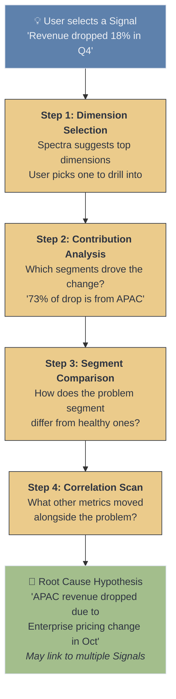

| Method | What It Answers | How It's Used in the Q&A Flow | Python Library |
|--------|----------------|------------------------------|----------------|
| **Contribution analysis (additive decomposition)** | "Which segments drove the overall change?" — decomposes a KPI change into per-segment contributions | Step 1: After user picks a dimension, show which segment values contributed most to the change (e.g., "APAC contributed -73% of the total decline") | `pandas.groupby` + difference math |
| **Welch's t-test** | "Is the difference between two groups statistically significant?" — compares means of two segments | Step 2: When comparing problem segment vs. rest — "APAC avg deal size ($42K) is significantly lower than other regions ($61K), p < 0.01" | `scipy.stats.ttest_ind` |
| **Chi-squared test** | "Is the distribution of categories different between two groups?" — tests independence of categorical variables | Step 2: When comparing categorical breakdowns — "Product mix in APAC is significantly different from global (p < 0.05)" | `scipy.stats.chi2_contingency` |
| **Pearson / Spearman correlation** | "What other metrics moved with the problem metric?" — finds co-movement | Step 3: Scan all numeric columns for correlation with the problem metric — "Customer satisfaction (r = 0.82) and deal close rate (r = 0.71) also declined" | `pandas.corr()`, `scipy.stats.spearmanr` |
| **Decision tree (single, shallow)** | "What combination of factors best predicts the problem?" — identifies the most discriminating splits | Step 3: Train a depth-2 decision tree to classify "problem rows" vs. "normal rows" — "Region=APAC AND Product=Enterprise predicts 89% of the drop" | `sklearn.tree.DecisionTreeClassifier` (max_depth=2) |
| **Period-over-period comparison** | "What changed between this period and last?" — structured diff by dimension | Step 1: When time data exists — compare current period vs. previous period across all dimensions, rank by absolute change | `pandas.groupby` + `merge` |
| **Variance decomposition (ANOVA)** | "Which dimension explains the most variance in the target metric?" — ranks dimensions by explanatory power | Pre-step: Automatically rank which dimensions to suggest first (the one that explains the most variance gets offered as the top choice) | `scipy.stats.f_oneway` or `statsmodels.stats.anova` |
| **Pareto analysis (80/20)** | "Which few segments account for most of the problem?" — identifies the vital few | Step 2: After contribution analysis — "2 of 8 regions account for 85% of the decline" | `pandas` cumulative sum math |

**How methods map to Q&A exchanges:**

| Exchange | What Spectra Asks | Statistical Method Behind It |
|----------|-------------------|------------------------------|
| 1 | "Which dimension matters most?" [options ranked by ANOVA F-statistic] | Variance decomposition ranks dimensions |
| 2 | "The decline is concentrated in [segment]. Dig deeper?" | Contribution analysis + Pareto |
| 3 | "Here's how [problem segment] differs from others." | Welch's t-test + Chi-squared |
| 4 | "These metrics also moved: [list]. Any of these relevant?" | Correlation scan |
| 5 | "Summary: [root cause hypothesis with confidence]" | Decision tree summary + all above |

---

### Stage 3: WHAT-IF — AI-Driven Scenario Exploration

> **Revised (2026-03-02):** The original Stage 3 prescribed specific statistical methods (linear regression, Monte Carlo, tornado charts) as a deterministic simulation engine. This was naive — it assumed the user's dataset had clean input-output relationships that could be modeled. The revised approach delegates analytical decisions to the AI agent, which selects appropriate methods based on the data and objective.

The goal is to answer: **"What are my options, and what's the likely impact of each?"** The AI agent — not a pre-built engine — drives the analysis.

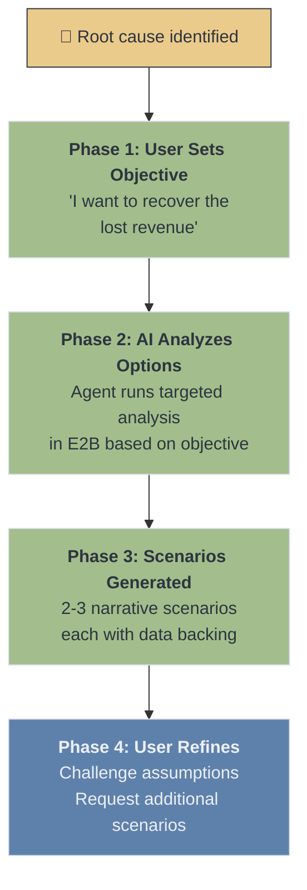

**How the AI agent generates scenarios:**

The agent is not limited to a fixed set of methods. Based on the objective and data shape, it selects from its available toolkit:

| What the Agent Does | Example | Methods It May Use |
|---|---|---|
| **Segment performance analysis** | "Which product categories are growing vs. declining?" | `pandas.groupby`, period-over-period comparison, trend calculation |
| **Historical extrapolation** | "If SMB trend continues, Q1 estimate is $X" | Rolling averages, seasonal adjustment, `statsmodels` Holt-Winters |
| **Contribution modeling** | "Focusing on SMB would contribute $X to total revenue" | Additive decomposition, proportional scaling from historical data |
| **Correlation-based estimation** | "Discount changes historically correlate with volume changes at r=0.82" | `pandas.corr()`, `scipy.stats.spearmanr` |
| **Comparative benchmarking** | "Your Americas channel converts at 38% vs. APAC at 22%" | Cross-segment comparison, `scipy.stats.ttest_ind` |
| **Scenario arithmetic** | "Combining Scenario A + B: overlap is minimal, combined estimate is $X" | Set operations, additive/multiplicative composition |

The key difference from the old approach: **the AI decides which analysis to run based on the specific objective and data, rather than running a fixed pipeline.** This is the same E2B-based architecture used in Pulse and Investigate — no new infrastructure needed.

**Design principles for What-If stage:**

1. **Always show ranges, never point estimates.** "$420K–$580K" not "$500K." Ranges are honest and build trust.

2. **Every number must have data backing.** The scenario must explain *how* the estimate was derived — which data, which calculation, which assumptions. Users (and their VPs) need to evaluate the reasoning, not just the conclusion.

3. **Confidence levels are explicit and plain-language.** "Medium confidence — based on Q3-Q4 trend continuation, but Q1 may have seasonal effects not captured" is better than "p < 0.05."

4. **Scenarios are narratives, not spreadsheets.** The primary output is readable text with supporting numbers. Charts can supplement but the story comes first. This is what gets pasted into reports.

5. **User domain knowledge fills causal gaps.** The AI can identify patterns ("SMB grew 12%") but the user knows context ("Q4 always spikes for SMB — don't extrapolate"). The refinement chat exists specifically for this collaboration.

---

### Method Availability by Data Shape

Not all methods work on all datasets. The Pulse Agent must detect data shape first and only apply applicable methods.

| Data Characteristic | Methods Enabled | Methods Disabled |
|---|---|---|
| **< 30 rows** | Grubbs' test, basic stats, IQR | Isolation Forest, STL, PELT (insufficient data) |
| **No time column** | All cross-sectional methods | Changepoint, STL, trend break, Holt-Winters, period-over-period |
| **No categorical columns** | Z-score, IQR, correlation | Contribution analysis, Chi-squared, ANOVA, HHI |
| **Single numeric column** | Z-score, IQR, Grubbs', distribution analysis | Isolation Forest, correlation, decision tree |
| **All categorical (no numeric)** | Duplicate detection, missing value patterns, Chi-squared | All numeric methods |
| **Wide data (50+ columns)** | All methods, but need column selection/ranking first | Running everything on all columns (too slow, too noisy) |

**Note on What-If stage:** Method availability for What-If Scenarios is not constrained by a fixed pipeline — the AI agent selects appropriate analysis methods based on the user's objective and the data shape. The constraints above apply primarily to Pulse and Investigate stages.

### Library Requirements (E2B Sandbox)

These Python packages need to be available in the E2B sandbox environment:

| Package | Used For | Already in Spectra? |
|---------|---------|-------------------|
| `pandas` | Data manipulation, groupby, profiling | Yes |
| `numpy` | Numerical operations, scenario arithmetic | Yes |
| `scipy` | Statistical tests (t-test, chi-squared, z-score, correlation) | Yes |
| `scikit-learn` | Isolation Forest, Decision Tree | Yes |
| `statsmodels` | ANOVA, Holt-Winters, STL decomposition | Needs verification |
| `ruptures` | Changepoint detection (PELT algorithm) | Needs installation |
| `missingno` | Missing value pattern visualization | Optional (can use pandas) |

---

## Critical Challenges & Honest Assessment

Before committing to build, these questions need answers. Some may change the scope or sequencing.

### Challenge 1: v0.8 scope is too large

The original v0.8 included: Analysis Workspace + Pulse + guided Q&A (basic) + Collections + PDF/MD export. That's:

- A new frontend module with its own routing and layout
- A new Pulse Agent with statistical analysis logic
- A new card type (Signal cards with severity levels)
- A guided Q&A flow (even "basic" is complex UX design)
- A Collections data model + list UI
- PDF generation pipeline

**This is realistically 2 milestones of work.** Cramming it into one creates pressure to cut corners on the parts that matter most (detection accuracy, Q&A flow design, report quality).

### Challenge 2: The Q&A flow design has unsolved UX questions

We describe "structured Q&A with discrete choices" — but:

- **How does Spectra know what choices to offer?** It depends entirely on the data's columns and dimensions. A sales dataset with Region/Product/Channel is clean. A flat transaction log with 50 columns is not.
- **What if the data doesn't have clear categorical dimensions?** A dataset of sensor readings or financial transactions may not have natural "drill into Region" options.
- **What if there are no notable signals?** The entire flow assumes something is found. If the data is clean, the Pulse step shows a health summary — but then the Explain step has nothing to investigate. That's fine (not every dataset needs investigation).
- **How many exchanges is actually right?** We say "3-5 max" but this is a guess. Too few = shallow, too many = frustrating. This needs prototyping and user testing.

**These aren't blockers — but they must be designed before building, not discovered during development.**

### Challenge 3: Detection accuracy makes or breaks everything

If Pulse has too many false positives ("flagging" normal variance as signals), users will stop trusting it within the first session. If it misses real patterns, it's useless. The bar for proactive analysis is higher than reactive — because the user didn't ask for it, so it had better be right.

**This means the Pulse Agent needs careful tuning with real-world data before we ship it publicly.** Synthetic test data proves the pipeline works; it doesn't prove the detection is useful.

### Challenge 4: Competitive positioning is aspirational, not current

We scored Spectra at 4/4 on the capability matrix — but that's the **target after v1.0**, not reality today. Tellius has been building their Agent Mode with a large team and enterprise customers for years. We shouldn't imply we'll match Tellius feature-for-feature.

**Spectra's real advantage isn't capability parity — it's accessibility:**

| What Tellius does better | What Spectra does better |
|---|---|
| Deeper anomaly detection (enterprise-grade ML) | Zero setup (upload a file vs. connect a data warehouse) |
| More sophisticated what-if modeling | Guided journey UX (not BI-platform-shaped) |
| Enterprise data governance and security | Deliverable-focused output (reports, not dashboards) |
| Real-time streaming data support | Price accessibility (individual analyst vs. $495/mo team) |
| Years of production hardening | Speed to first insight (minutes, not days of setup) |

**We win on accessibility and UX, not on depth. The positioning should reflect that honestly.** "The fastest path from Excel to business insight" is a stronger message than "we do everything Tellius does."

### Challenge 5: Report quality is a trust signal

If the generated report looks like a developer's markdown dump, users won't share it with their VP. Reports need structure — proper headings, clean chart rendering, executive summary at the top. Markdown-first with good PDF export.

**Ugly reports undermine the entire value proposition of Collections.** Better to ship fewer export formats that look great than many that look mediocre.

### Challenge 6: Edge cases will define whether this feels magical or broken

The happy path (sales data with clear dimensions, obvious patterns, clean structure) is easy to demo. But real users will upload:
- Messy data with inconsistent formatting
- Files with only 20 rows (too few for meaningful statistics)
- Non-numeric data (text logs, categorical-only datasets)
- Data without a time dimension (no trend analysis possible)
- Multi-sheet Excel files with different structures per sheet

Each edge case needs a graceful degradation path, not a crash or misleading result.

---

## Admin Portal: Analysis Workspace Management

The Analysis Workspace is a premium, token-heavy feature. The Admin Portal needs controls for **access gating**, **cost management**, and **activity monitoring**. This builds on the existing tier system (`user_classes.yaml`) and credit infrastructure.

### 1. Tier-Based Access & Collection Limits

The Analysis Workspace is not available to all tiers by default. Each tier gets a configurable access level and collection limit.

| Tier | Workspace Access | Max Active Collections | Rationale |
|------|:---:|:---:|---|
| `free_trial` | Yes | 1 | Let them experience it once — this is the "wow" moment that converts |
| `free` | No | 0 | Free tier is chat-only. Workspace is the upgrade incentive |
| `standard` | Yes | 5 | Enough for regular use |
| `premium` | Yes | Unlimited | Power users, no friction |
| `internal` | Yes | Unlimited | Internal/admin testing |

**Key design decisions:**
- **"Active" vs. "Archived":** Limit applies to active Collections only. Users can archive completed Collections to free up slots. Archived Collections are read-only (view reports, download) but cannot run new Pulse/Investigate/What-If operations.
- **Collection limit is configurable per tier** — stored in `user_classes.yaml` alongside existing credits/reset fields. Admin can adjust without code change (but requires redeploy, same as current tier config).
- **Upgrade prompt:** When a user hits their collection limit, show a clear message: "You've reached the limit for your plan. Archive a Collection or upgrade to [next tier]."

**Proposed `user_classes.yaml` extension:**

```yaml
free_trial:
  display_name: "Free Trial"
  credits: 100
  reset_policy: none
  workspace_access: true
  max_active_collections: 1

free:
  display_name: "Free"
  credits: 10
  reset_policy: weekly
  workspace_access: false
  max_active_collections: 0

standard:
  display_name: "Standard"
  credits: 100
  reset_policy: weekly
  workspace_access: true
  max_active_collections: 5

premium:
  display_name: "Premium"
  credits: 500
  reset_policy: monthly
  workspace_access: true
  max_active_collections: -1  # unlimited

internal:
  display_name: "Internal"
  credits: 0
  reset_policy: unlimited
  workspace_access: true
  max_active_collections: -1  # unlimited
```

### 2. Granular Credit Costs per Workspace Activity

The existing system has a single `default_credit_cost` (1.0 per message). Analysis Workspace activities are **significantly more token-intensive** than a single chat message — a Pulse run may execute 5-10 statistical analyses, and an Investigation may involve multiple agent exchanges. Costs must be granular and configurable.

**Proposed credit cost structure:**

| Activity | Default Cost | What It Covers | Why This Cost |
|----------|:---:|---|---|
| **Pulse: Run Detection** | 5.0 | Data profiling + all statistical analyses + Signal generation | Multiple analysis passes, potentially 5-10 methods run in E2B |
| **Explain: Start Investigation** | 3.0 | First exchange of guided Q&A (ANOVA ranking, initial hypothesis) | Agent reasoning + statistical method execution |
| **Explain: Per Q&A Exchange** | 1.0 | Each subsequent exchange in the investigation | Similar to a chat message but with statistical backing |
| **What-If: Generate Scenarios** | 5.0 | AI agent analyzes data + generates 2-3 scenario narratives | Multiple E2B analysis runs + LLM reasoning for narrative generation |
| **What-If: Refine Scenario** | 1.0 | Each follow-up exchange in the refinement chat | Similar to investigation exchange — agent analysis + response |
| **What-If: Add Scenario** | 2.0 | User requests additional scenario beyond initial set | New E2B analysis run + narrative generation |
| **Report: Compile & Generate** | 1.0 | Markdown compilation from analysis journey | Template-based, minimal LLM usage |
| **Report: PDF Export** | 0.5 | PDF rendering from markdown | Server-side rendering, no LLM |

**Implementation approach:**
- Store as **`platform_settings`** entries (same pattern as `default_credit_cost`) — runtime configurable via Admin Portal without redeploy
- Setting keys: `workspace_credit_cost_pulse`, `workspace_credit_cost_investigate_start`, `workspace_credit_cost_investigate_exchange`, etc.
- Admin UI: dedicated "Workspace Credit Costs" section in Settings page with all costs editable
- Pre-check: before each activity, verify user has sufficient credits. Show cost estimate before running ("This will use ~5 credits. You have 23 remaining.")

**Credit transparency for users:**
- Show credit cost estimate before each action (e.g., "Run Detection (5 credits)")
- Show running total in Collection header: "Credits used in this Collection: 14"
- Credit deduction follows existing pattern: deduct before execution, refund on failure

### 3. Admin Monitoring & Analytics

Admins need visibility into how the Analysis Workspace is being used — both for business insights (is the feature driving engagement?) and operational concerns (who's consuming the most resources?).

**3a. Workspace Activity Dashboard (new Admin page)**

| Metric | Description | Visualization |
|--------|-------------|---------------|
| **Total Collections created** | Count over time (daily/weekly/monthly) | Line chart with trend |
| **Active vs. Archived Collections** | Current snapshot | Donut chart |
| **Pulse runs per day** | Detection activity volume | Bar chart |
| **Investigations started** | Explain step adoption | Bar chart |
| **What-If scenarios generated** | What-If step adoption | Bar chart |
| **Reports generated** | Output/deliverable production | Bar chart |
| **Funnel: Pulse → Explain → What-If** | Stage adoption drop-off | Funnel chart |
| **Workspace credits consumed** | Total workspace-related credit usage over time | Line chart, broken down by activity type |
| **Avg. credits per Collection** | Average total cost of a Collection lifecycle | KPI card |

**3b. Per-User Workspace Activity**

Extend the existing Admin user detail page (which already has activity/sessions tabs) with a **Workspace tab**:

- List of user's Collections (name, status, created date, signal count, report count, total credits used)
- Workspace credit consumption breakdown (Pulse vs. Explain vs. What-If vs. Reports)
- Activity timeline: when they last used the Workspace, frequency
- Collection limit usage: "3 of 5 active collections"

**3c. Workspace Activity Log**

Extend the existing `credit_transactions` table or create a parallel `workspace_activity_log`:

| Field | Type | Description |
|-------|------|-------------|
| `id` | UUID | Primary key |
| `user_id` | FK | Who performed the action |
| `collection_id` | FK | Which Collection |
| `activity_type` | enum | `pulse_run`, `investigation_start`, `investigation_exchange`, `whatif_generate`, `whatif_refine`, `whatif_add_scenario`, `report_compile`, `report_export` |
| `credit_cost` | decimal | Credits charged for this activity |
| `duration_ms` | int | How long the activity took (E2B execution time) |
| `metadata` | JSON | Activity-specific data (signal count, method used, etc.) |
| `created_at` | datetime | Timestamp |

This enables:
- Filtering activity by user, collection, activity type, date range
- Identifying heavy users or unusual patterns
- Understanding which Workspace features are most/least used
- Correlating credit consumption with actual value delivered

**3d. Alerts & Operational Monitoring**

- **High-cost Collection alert:** Flag Collections that have consumed > X credits (configurable threshold)
- **Failed Pulse runs:** Track and surface Pulse runs that failed or returned no signals (detection quality monitoring)
- **Workspace adoption rate:** % of eligible users (by tier) who have created at least one Collection

---

## Revised Milestone Sequence — CONFIRMED

> **Decision (2026-03-01):** Milestone sequence confirmed: v0.8 (Pulse) → v0.9 (Collections) → v0.10 (Explain) → v1.0 (What-If Scenarios) → v0.11 (Admin Workspace Management). Monitoring deferred to post-v1.0 backlog — confirmed.

Based on the challenges above, the scope focuses on three stages (Pulse → Explain → What-If) with Collections as the output layer throughout. Admin Portal management for the Workspace is a cross-cutting milestone after the core feature is complete. Monitoring is deferred to post-v1.0 backlog.

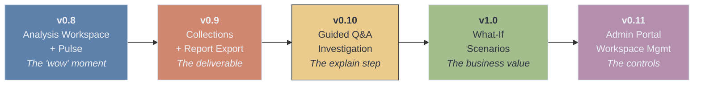

| Milestone | Scope | Proves | Ship Criteria |
|-----------|-------|--------|---------------|
| **v0.8** | Analysis Workspace shell + Pulse (Detect only). User creates Collection, selects data → sees Signals as cards with charts. No investigation, no Collections export yet. | The "wow" moment works. Proactive detection surfaces useful signals. Users understand findings without explanation. | Upload 5 different real-world datasets → Pulse flags useful signals in at least 4 of them with < 20% false positive rate. |
| **v0.9** | Collections module + report export (Markdown + PDF). Auto-save all analysis progress. Collections list view with search/filter. Download reports. | The deliverable loop works. Reports look polished enough to share with a stakeholder. | Generate 3 sample reports → a non-user rates them "would share with my boss" or higher. |
| **v0.10** | Guided Q&A investigation (the Explain step). Tap a Signal → doctor-style interview → root cause hypothesis. Root causes can link to multiple Signals. | The guided flow is better than freeform chat for investigation. Users reach root cause faster than with Chat. | 5 test scenarios with known root causes → guided flow identifies the correct driver in at least 4. |
| **v1.0** | What-If Scenarios — objective-driven scenario generation, AI-produced narrative scenarios with data backing, scoped refinement chat, multi-scenario comparison. | Users trust and use the AI-generated scenarios. What-if feels like strategic consulting, not a spreadsheet exercise. | 3 test objectives → AI generates relevant, data-backed scenarios that a business user rates as "actionable" within 2 minutes. |
| **v0.11** | Admin Portal — tier-based Workspace access gating, collection limits per tier, granular credit cost configuration per activity, Workspace activity dashboard, per-user monitoring. | Admins can control costs, gate access, and monitor adoption. | Admin can: change tier access settings, adjust per-activity credit costs, view Workspace usage dashboard, see per-user activity breakdown. |

### Scope per Milestone

**v0.8: Analysis Workspace + Pulse**

| Include | Exclude |
|---------|---------|
| Analysis Workspace as new frontend module with own nav | Guided Q&A / investigation (v0.10) |
| Collection create/list/open (project-like container) | Report export / download (v0.9) |
| Data source picker (select from uploaded files + upload new) | What-If Scenarios (v1.0) |
| Pulse Agent — signal detection on "Run Detection" click | Monitoring / recurring (backlog) |
| Signal cards with classification (opportunity/warning/critical/info) | |
| Supporting charts on Signal cards | |
| "Healthy data" state (when no notable signals found) | |

**v0.9: Collections + Report Export**

| Include | Exclude |
|---------|---------|
| Auto-save all analysis progress to Collection | Guided Q&A (v0.10) |
| Report compilation (Signals → structured markdown) | PPT/slides export (backlog) |
| Markdown download | Shareable links (backlog) |
| PDF download with polished layout | Team views (backlog) |
| Collections list view with search and filter | Monitoring (backlog) |
| Save analysis from Chat as report (bridge feature) | |

---

## Competitive Landscape

### The Four-Step Flow: Who Does What?

The proposed Spectra flow is: **Detect signals → Guided root cause investigation → What-If scenario exploration → Report generation.** No single product fully delivers all four today.

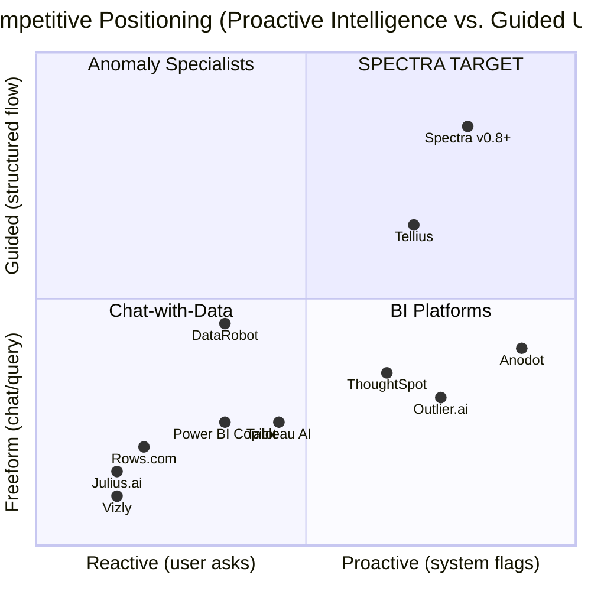

### Head-to-Head: Full Flow Coverage

| Capability | Tellius | ThoughtSpot | Anodot | DataRobot | Looker | Julius.ai | **Spectra (target)** |
|---|:---:|:---:|:---:|:---:|:---:|:---:|:---:|
| 1. Proactive Signal Detection | Yes | Yes | Yes (best) | Limited | Yes | No | **Yes** |
| 2. Guided Root Cause Investigation | Yes (Agent) | Partial | Partial | No | No | No | **Yes** |
| 3. AI-Guided What-If Scenarios | Yes | No | Limited | Yes (best) | No | No | **Yes** |
| 4. Polished Report Generation | Partial | No | No | Partial | Yes (slides) | No | **Yes** |
| **Coverage Score** | **3.5/4** | **1.5/4** | **1.5/4** | **2/4** | **1.5/4** | **0/4** | **4/4** |

> **Honest note on the 4/4 score:** This is the *target after v1.0*, not current reality. Tellius has years of production hardening with enterprise customers. Our advantage isn't matching them feature-for-feature — it's being radically more accessible. See [Honest Competitive Position](#honest-competitive-position) below.

### Category 1: AI Data Analysis (Chat-with-Data) — Direct Competitors

| Product | What It Does | Proactive Detection | Guided Flow | What-If | Reports | Pricing |
|---------|-------------|:---:|:---:|:---:|:---:|---------|
| **Julius.ai** | NL data analysis + charts from uploaded files | No | No | No | Limited | Free / $20/mo Pro |
| **Rows.com** | AI-powered spreadsheet with NL analyst | Basic | No | Yes (NL) | No | Free / paid tiers |
| **Akkio** | No-code predictive model building | No | No | Limited | Limited | $49/mo+ |
| **Obviously AI** | Automated ML with wizard flow | No | No | Yes | Partial | $75-145/mo |
| **Polymer Search** | Auto-analyze spreadsheets → dashboards | Basic | No | No | Limited | Free / $10/mo |
| **Vizly** | Chat-with-data + Python/R under the hood | No | No | No | Limited | Free / paid |
| **DataChat** | Conversational analytics with full reproducibility | No | Partial | No | Limited | Enterprise |

**Spectra's position vs. this category:** These are all reactive, chat-first tools. None proactively scan data or guide users through structured investigation. The Analysis Workspace immediately differentiates Spectra from the entire category.

### Category 2: Business Intelligence with AI — Enterprise Players

| Product | Proactive Detection | Guided Investigation | What-If | Report Export | Pricing |
|---------|:---:|:---:|:---:|:---:|---------|
| **ThoughtSpot** | Yes (SpotIQ + anomaly alerts) | Partial (auto root cause) | No | Limited | $25/user/mo |
| **Power BI Copilot** | Limited (time-series only) | No | Limited (manual) | Yes (best: PDF/PPT/Excel) | $14/user/mo + Fabric |
| **Tableau AI** | Partial (Pulse KPI monitoring) | No | Limited (parameters) | Yes (PDF/PPT) | $42-75/user/mo |
| **Looker** (Google) | Yes (Gemini-powered) | No | No | Yes (AI-gen slides) | Enterprise custom |
| **Sigma Computing** | Yes (outlier detection + alerts) | No | No | Limited | Enterprise custom |

**Spectra's position vs. this category:** These are massive platforms that require significant setup, data engineering, and per-seat enterprise licensing. They're adding AI features incrementally but not rethinking the workflow. Spectra can be faster to value (upload a file → instant findings) at a fraction of the cost.

### Category 3: Anomaly Detection Specialists

| Product | What It Does | Root Cause | Simulation | Reports | Pricing |
|---------|-------------|:---:|:---:|:---:|---------|
| **Anodot** | Autonomous ML-based business monitoring across 100% of data | Partial (pointers) | Limited (cloud cost sim) | No | Enterprise custom |
| **Outlier.ai** | Multi-dimensional anomaly scanning for executives | No | No | Limited | Enterprise custom |
| **Sisu Data** *(acquired by Snowflake, discontinued)* | Automated root cause analysis testing millions of hypotheses | Yes (best-in-class) | No | Limited | N/A |

**Key insight:** Sisu Data was the closest to what we're building for the "Explain" step — automated root cause identification. It was acquired by Snowflake in 2023 and discontinued as standalone. That capability gap is now unfilled in the market.

### Category 4: Prescriptive Analytics / Optimization

| Product | Detection | Guided Flow | What-If | Reports | Pricing |
|---------|:---:|:---:|:---:|:---:|---------|
| **Tellius** | Yes (contextual alerts) | Yes (Agent Mode Kaiya) | Yes (budget sim) | Partial (narratives) | $495/mo (5 users) |
| **Pecan AI** | Limited (data quality) | No | Limited | Limited | $950/mo+ |
| **DataRobot** | Limited (model monitoring) | No | Yes (Tableau extension) | Partial | Enterprise ($100K+/yr) |
| **H2O.ai** | Yes (deep learning) | No | No | Limited | $6,900/yr+ |

**Tellius is the closest competitor** to the full Spectra vision. Their Agent Mode (Kaiya) combines anomaly detection + root cause + what-if modeling + AI narratives. However:
- At $495/mo for 5 users, it targets mid-market/enterprise
- Report output is narratives, not polished downloadable deliverables
- Requires data warehouse connections — not file-upload-first like Spectra
- Their UX is BI-platform-style, not guided-journey-style

### The Market Gap

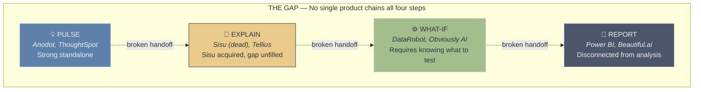

- **Detection specialists** (Anodot, Outlier.ai) stop at alerting — they tell you something is happening but leave investigation to you
- **Investigation tools** (Sisu Data) have been acquired and discontinued — the capability is being absorbed into data warehouse platforms, not served standalone
- **Simulation platforms** (DataRobot, Obviously AI) require users to already know what to simulate — there's no automatic path from "here's a signal" to "here are your options"
- **Report tools** (Beautiful.ai, Narrative Science) are completely disconnected from the analysis — you do analysis in one tool, then manually create reports in another
- **BI platforms** (ThoughtSpot, Tableau, Power BI) are adding AI incrementally but not rethinking the end-to-end workflow

**A platform that connects all four steps into a single guided flow — accessible to non-technical business users — would occupy a genuinely uncontested position.**

### Honest Competitive Position

Spectra's real advantage isn't capability depth — it's **accessibility and UX paradigm.** We should be honest about where we win and where we don't:

| Where competitors are stronger | Where Spectra wins |
|---|---|
| Deeper anomaly detection (Anodot's enterprise ML) | Zero setup — upload a file vs. connect a data warehouse |
| More sophisticated modeling (DataRobot's AutoML) | Guided journey UX — not BI-platform-shaped |
| Enterprise governance and security (ThoughtSpot, Tableau) | Deliverable-focused output — reports, not dashboards |
| Real-time streaming data (Anodot, Sigma) | Price — individual analyst vs. $495/mo+ team licenses |
| Years of production hardening (Tellius) | Speed to first insight — minutes, not days of setup |
| Massive ecosystems and integrations | Simplicity — no training required, no IT involvement |

**Our positioning should be:** *"The fastest path from Excel to business insight."*

Not: *"We do everything Tellius does."* — because we don't, and won't for a long time. We win by being the tool a business analyst can use today, alone, without asking IT for help, and produce a report their VP actually reads.

---

## Why Spectra, Not ChatGPT/Claude?

> **Added (2026-03-02).** This section addresses the existential question: why would a user pay for Spectra when they can upload a CSV to ChatGPT or Claude and ask the same questions?

A user could upload a CSV to Claude, say "Revenue dropped 18%, why?" and get a decent answer. So why Spectra?

### What general AI chat tools do well
- Accept a CSV and run Python on it
- Answer analytical questions with reasonable depth
- Generate charts and summaries

### Where they fundamentally break down

**1. No persistent knowledge across analyses**

Upload a CSV to Claude, get an answer, close the tab. Next week, upload the updated CSV — Claude has no idea you did this before. No history, no comparison, no "last month you found X, this month it's changed to Y."

Spectra's Collection is a **living workspace**. Every Signal, Investigation, and What-If scenario is saved, organized, and connected. When the user returns in Q2, they can see what they projected in Q1 and compare against actuals. That's not a chat feature — that's a **system of record for analytical decisions.**

**2. No structured process = inconsistent quality**

Ask Claude the same question three times, get three different analyses. Different methods, different depth, different focus. Quality depends entirely on how well the user prompts.

Spectra runs the **same rigorous pipeline every time**: Pulse checks every applicable statistical method. Investigation follows a structured narrowing process. What-If scenarios are grounded in actual data calculations, not LLM reasoning about numbers. A business analyst shouldn't need to be a prompt engineer to get reliable analysis.

**3. No multi-scenario management**

In ChatGPT, comparing three What-If scenarios means copy-pasting between messages, tracking which assumptions changed manually. There's no "save this scenario, create another, compare side by side."

Spectra manages **scenarios as first-class objects**: generate multiple simultaneously, save each with assumptions and data backing, compare visually, refine one without losing others, track which was selected and why. This is decision workspace functionality, not chat functionality.

**4. No deliverable output**

Claude gives you a message in a chat thread. To share it with your VP, you copy-paste into a doc, reformat, add context, fix the charts. Every time.

Spectra produces a **structured report** that includes the full journey: what was detected, what was investigated, what scenarios were evaluated, which one was chosen and why. It's a deliverable, not a conversation.

**5. Proactive vs. reactive**

ChatGPT/Claude wait for you to ask. Spectra's Pulse **proactively surfaces what you didn't think to check.** The most dangerous issues — and the biggest opportunities — are the ones you never asked about.

### The positioning table

| | ChatGPT / Claude | Spectra |
|---|---|---|
| **Interaction** | Freeform — quality depends on prompt | Guided — consistent depth every time |
| **Memory** | Stateless — every session starts from zero | Persistent — Collections remember everything |
| **Scenarios** | One at a time, manually tracked | Multiple saved, compared, refined side-by-side |
| **Output** | Chat messages you copy-paste | Structured reports you download and share |
| **Process** | Reactive — answers what you ask | Proactive — surfaces what you didn't think to check |
| **Consistency** | Variable — depends on prompting | Standardized — same statistical rigor every run |

**The one-liner:** ChatGPT is a conversation. Spectra is a workflow that produces a deliverable.

---

## Practicality Notes

**What makes this buildable now:**
- Backend reuses existing E2B sandbox, agent system, and credit system — no new external services
- Pulse is a new agent + statistical Python code running in the same sandbox
- Collections is a new DB table + report compilation logic + PDF generation (libraries like WeasyPrint or reportlab)
- The Analysis Workspace frontend is a new Next.js route/module — separate from chat but in the same app

**What makes this testable fast:**
- Create synthetic test datasets with known patterns and known root causes
- Upload → does Spectra find the planted signals? → does the Q&A flow reach the right answer?
- Each milestone has explicit ship criteria (defined in the milestone table above)
- Test with real-world datasets (Superstore, Kaggle sales data) not just synthetic ones

**Risks to watch:**
- Detection accuracy is the #1 risk — false positives kill trust faster than missing patterns
- The Q&A flow needs UX prototyping before engineering — wireframe and test with users first
- Report quality (markdown structure, chart rendering) is a trust signal — ugly reports = no sharing = no value
- What-If scenario quality (v1.0) depends on AI agent's ability to select relevant analyses and produce honest estimates — needs rigorous testing with real datasets
- Edge cases (messy data, small datasets, no time dimension) need graceful degradation, not errors
- Credit cost of proactive analysis needs clear communication to users upfront

---

## Appendix: Monitoring Module (DEFERRED)

> **Status: Backlog — post v1.0.** Retained here for future reference. Not in scope for current milestones.

### The Concept

When a user completes an analysis and saves it to Collections, they can mark it as "recurring." This tells Spectra: "Run this same analysis again whenever I give you new data with the same structure." The output is a comparison report (what changed since last time) with flagged signals, delivered via email and saved to Collections.

### Data Ingestion Options

| Tier | Method | User Effort | Engineering Effort | Target User |
|------|--------|-------------|-------------------|-------------|
| **1** | Manual re-upload | Low (upload + one click) | Low (structure matching + diff) | Individual analyst |
| **2** | Email forwarding | Very low (forward email) | Medium (email ingestion pipeline) | Analyst who gets reports via email |
| **3** | API push | None (automated) | Low (already built in v0.7) | Teams with technical capability |
| **4** | Cloud storage watch | None (automated) | High (OAuth, polling, webhooks) | Enterprise teams |

**Recommended approach when we build this:** Start with Tier 1 (manual re-upload + structure matching). Tier 3 is free (already exists via REST API). Tier 2 and 4 are future expansions based on demand.

### Why "Recurring Analysis" Before "Automated Pipeline"

Most target users don't have automated data pipelines today. They export from ERP/CRM manually each month. For them, **manual re-upload + intelligent "compare to last time" is the right v1.** The automated pipeline should come when enterprise customers request it.

### What the Comparison Report Would Contain

- **Period-over-period diff:** "Revenue: $1.2M → $1.05M (-12.5%)"
- **New signals:** Patterns not present last time
- **Resolved signals:** Previous patterns that have improved
- **Trend direction:** Is each metric improving or worsening?
- **Flagged thresholds:** Any user-defined thresholds breached

---

## Future Exploration: Persistent AI Memory System (post v0.11)

> **Status: Future consideration.** Not in scope for milestones v0.8–v0.11. Documented here for exploration when the core Analysis Workspace is mature.
>
> **Reference:** [OpenClaw Memory System Deep Dive](https://snowan.gitbook.io/study-notes/ai-blogs/openclaw-memory-system-deep-dive)

### The Opportunity

Today, every Spectra session starts from zero — the AI has no memory of previous interactions, user preferences, or past analyses. As users return to the Analysis Workspace repeatedly, this becomes a friction point. A persistent memory system would give Spectra a "personal" touch:

- **"Last time you analyzed this dataset, you focused on APAC revenue. Want to continue from there?"**
- **"You tend to prefer conservative scenarios — starting with that as default."**
- **"This Signal is similar to one you investigated in Collection X — the root cause was pricing changes."**

This transforms Spectra from a stateless tool into a **personal analyst that learns your patterns and preferences over time.**

### What to Learn from OpenClaw's Approach

OpenClaw uses a three-tier memory architecture that's worth studying:

| Memory Tier | OpenClaw Implementation | Spectra Equivalent |
|-------------|------------------------|-------------------|
| **Ephemeral (daily logs)** | Append-only daily markdown files loaded at session start | Per-session context: recent interactions, current Collection state |
| **Durable (curated knowledge)** | `MEMORY.md` file with important decisions, conventions, and long-term facts | User profile memory: preferences, past root causes, terminology, industry context |
| **Session memory** | Auto-saved conversations with searchable index | Analysis history: past investigations, scenarios, report conclusions |

**Key technical patterns worth exploring:**

1. **Hybrid retrieval (BM25 + vector search)** — combines exact keyword matching (function names, KPI names) with semantic similarity ("revenue decline" ≈ "sales drop"). OpenClaw uses 70% vector / 30% BM25 weighted scoring.

2. **File-first storage** — memories stored as human-readable markdown (not opaque vector DBs). This makes debugging, auditing, and user transparency easier.

3. **SQLite with vector extension** — `sqlite-vec` for in-database cosine similarity queries. No external vector DB dependency (Pinecone, Weaviate). Keeps infrastructure simple.

4. **Delta-based incremental indexing** — only re-embed changed content, not full reindex. SHA-256 hash-based deduplication prevents re-embedding identical content.

5. **Pre-compaction memory flush** — when approaching context window limits, system triggers a save of important insights before context is compressed. Prevents knowledge loss.

6. **Local-first embeddings** — tries local model first, falls back to API (OpenAI/Gemini). Cost-effective at scale.

### What Spectra Would Remember

| Category | Examples | Value |
|----------|---------|-------|
| **Analysis patterns** | "User usually investigates revenue-related Signals first" | Pre-sort Signal cards by relevance to user's focus areas |
| **Domain knowledge** | "User works in retail, fiscal year starts in April" | Better Signal interpretation, smarter Q&A questions |
| **Past findings** | "Previous root cause in similar dataset was seasonal hiring patterns" | Cross-Collection intelligence, faster investigations |
| **Preferences** | "User prefers confidence intervals shown as %, not absolute values" | Personalized output formatting |
| **Terminology** | "User calls 'operating margin' as 'OM', uses 'rev' for revenue" | Better NL understanding, more natural responses |
| **Scenario defaults** | "User typically models Conservative/Moderate/Aggressive at -5%/0%/+10%" | Pre-populate scenario templates |

### Architecture Considerations for Spectra

- **Per-user memory isolation** — each user's memories must be fully isolated (multi-tenant). OpenClaw uses per-agent SQLite stores; Spectra would need per-user partitioning.
- **Privacy and consent** — users must be able to view, edit, and delete what Spectra remembers about them. "Memory settings" page with opt-in/opt-out.
- **Memory scope** — should memories span across Collections? Probably yes for preferences and domain knowledge, probably no for specific findings (to avoid cross-contamination between unrelated analyses).
- **Storage cost** — OpenClaw estimates ~500MB SQLite index for annual heavy use (~1,000 sessions). For multi-tenant SaaS, this needs a shared DB approach, not per-user files.
- **Tier gating** — persistent memory could be a premium-tier feature (another upgrade incentive).

### Why Not Now

1. The core Analysis Workspace (Pulse → Explain → What-If) must prove value first without memory
2. Memory quality depends on having enough interaction history — needs users actively using the Workspace
3. Memory UX design (what to surface, when, how to avoid being "creepy") needs careful thought
4. Technical complexity is non-trivial but well-documented thanks to OpenClaw's open approach

---

## Appendix: Predictive ML Model Platform (Future Module)

> **Status: Future consideration — separate module.** Not part of the Analysis Workspace. Would be a new top-level module alongside Chat and Analysis Workspace. Documented here for reference.
>
> **Added (2026-03-02):** During brainstorming of the What-If Scenarios step, we explored a full predictive ML model workflow (Pecan AI-style). The conclusion was that building/training ML models is a fundamentally different product from the guided What-If scenario exploration in the Analysis Workspace. It deserves its own module with its own UX paradigm.
>
> **References:** [Pecan AI: Build Your First Predictive ML Model](https://help.pecan.ai/en/articles/8665302-build-your-first-predictive-ml-model), [Pecan AI: How to Add Attributes](https://help.pecan.ai/en/articles/8656723-how-to-add-attributes-to-your-model)

### The Concept

A dedicated **Predictive Models** module where users can build, train, and use ML models for prediction. Unlike the What-If Scenarios (which use AI-driven data analysis for directional scenario exploration), this module would produce actual trained models that can make predictions on new data.

### How It Differs from What-If Scenarios

| | What-If Scenarios (Analysis Workspace) | Predictive Models (Future Module) |
|---|---|---|
| **Purpose** | "What are my strategic options?" | "What will happen next?" |
| **Input** | Root cause + objective → AI generates scenarios | Training data + prediction target → trained model |
| **Output** | Narrative scenarios with data-backed estimates | Predictions on new data with confidence scores |
| **Method** | AI agent runs targeted analyses, interprets results | Actual ML model training (regression, classification, time-series) |
| **Time** | Seconds (analysis runs in E2B) | Minutes to hours (model training) |
| **Reuse** | Scenarios are point-in-time | Trained model can predict on new data repeatedly |
| **User skill** | Business analyst | Business analyst with data understanding |

### Proposed Flow (Pecan-inspired)

1. **Objective Chat** — AI asks: "What do you want to predict? Over what timeframe? One-time or recurring?"
2. **Data Assessment** — AI validates if user's data is sufficient for the prediction. Identifies: prediction target (label column), entity ID, required history depth, missing attributes.
3. **Data Preparation** — User links or uploads data. AI validates structure:
   - **Core Set** — historical behavior data (one row per entity with target label)
   - **Attribute Tables** — enrichment data (demographics, product details, etc.) joined to core set
   - **Critical validation:** No label leakage (label column not in attributes), temporal filtering on 1:many joins, columns available at prediction time
4. **Model Training** — Async background process. User is notified when ready. Training runs in E2B sandbox.
5. **Model Validation** — Performance metrics in business language: "This model predicts next quarter's revenue within ±12%. Strongest predictors: seasonality, product mix, discount rate."
6. **Prediction** — User inputs new data or values → model returns predictions with confidence intervals.

### Model Types (ordered by priority)

| Model Type | Example | User Value |
|---|---|---|
| **Time-series forecast** | "Predict next quarter's revenue" | High — most intuitive for business users |
| **Regression** | "What drives deal size?" | Medium — explanatory |
| **Classification** | "Which customers will churn?" | High — actionable |

### Why Not Now

1. **Different UX paradigm.** Building ML models requires understanding training data, feature engineering, and model validation — a significantly different skill set from the guided What-If flow. Mixing them would confuse the Analysis Workspace's simplicity.
2. **Infrastructure complexity.** Model training is async, compute-intensive, and requires model storage/versioning. The current E2B sandbox is designed for short-lived analysis runs, not long-running training jobs.
3. **The Analysis Workspace must prove value first.** If users don't adopt Pulse → Explain → What-If, adding a predictive module won't help.
4. **Competitive positioning.** Spectra wins on accessibility and guided UX. Predictive ML is where DataRobot, Pecan AI, and H2O.ai compete with years of head start. We should only enter this space when we have a clear UX advantage — not just feature parity.
