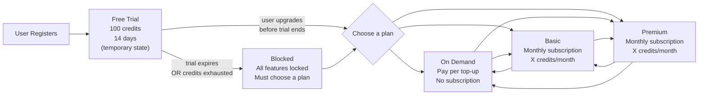
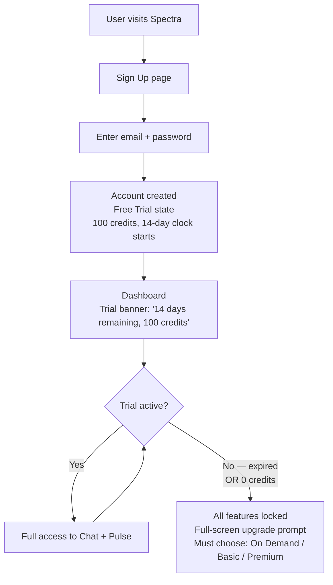
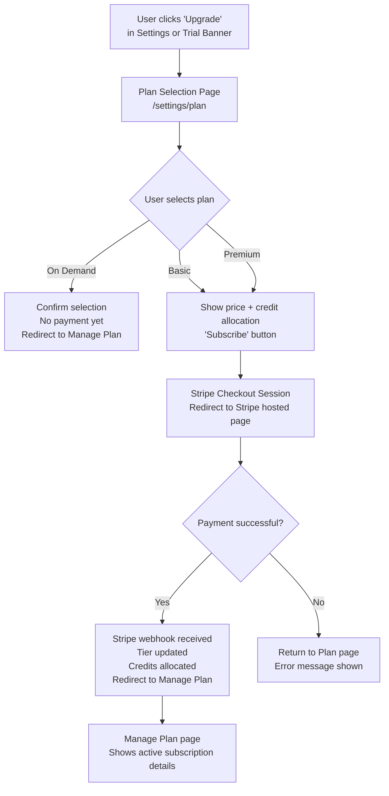
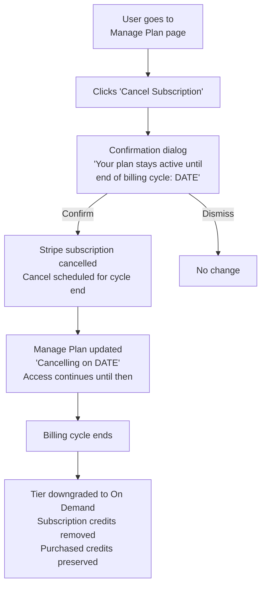
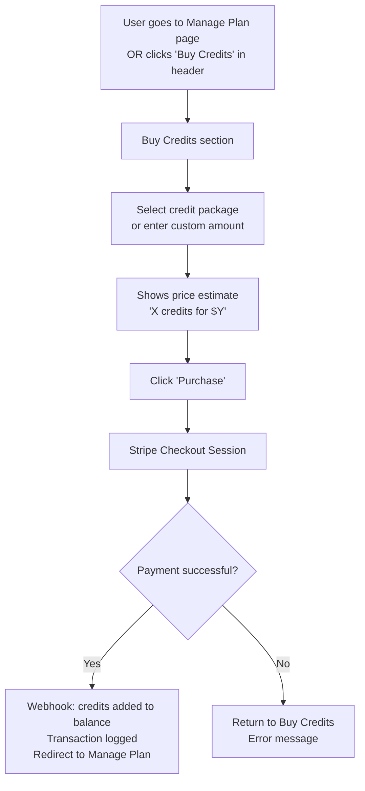
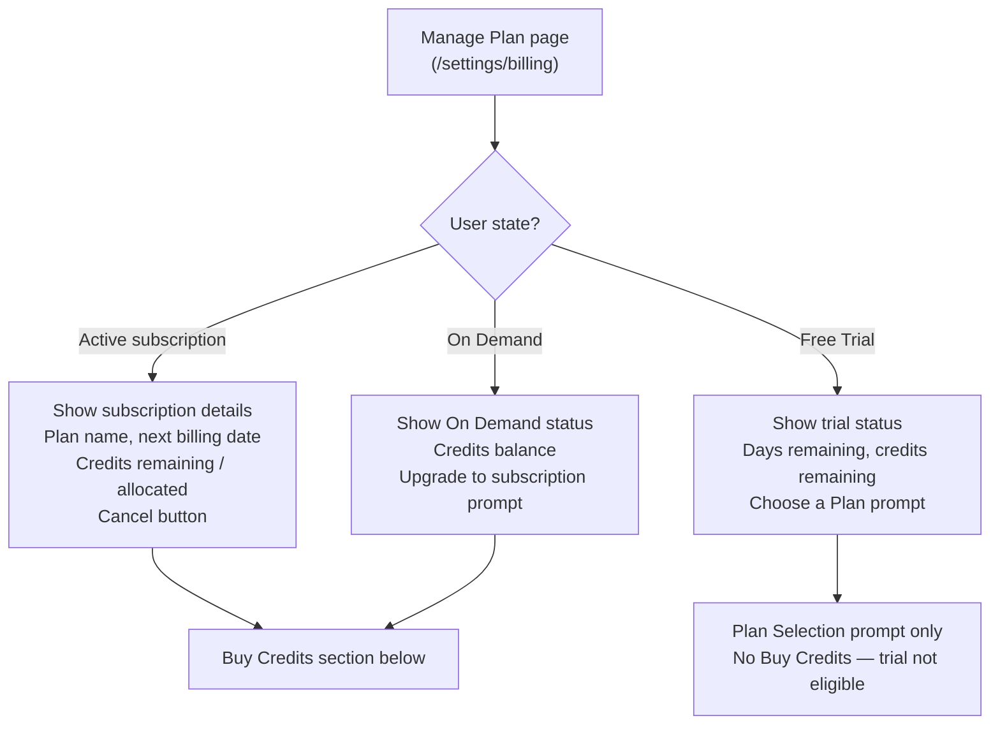
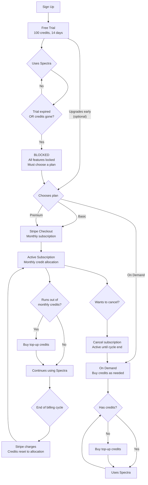

# Spectra Monetization — Milestone Plan

> Source requirements: [monetization-requirement.md](./monetization-requirement.md)

---

## Overview

This document expands the monetization requirements into a comprehensive functional specification with UX flows, backend scope, and gap analysis. Spectra currently has a credit-based metered system with tier allocation and admin management — but no payment gateway, subscription management, or self-service billing UI.

---

## Current State vs Target State

| Area | Current State | Target State |
|------|--------------|--------------|
| **Tiers** | free_trial, free, standard, premium, internal | Free Trial (temporary), On Demand, Basic, Premium, internal |
| **Credit allocation** | Tier-based with weekly/monthly rolling reset | Same + purchasable top-ups |
| **Payment** | None — admin manually assigns tiers | Stripe integration — self-service |
| **Subscription** | None | Monthly subscription for Basic/Premium |
| **Billing UI** | None | Plan page, Manage Plan page, Buy Credits page |
| **Trial expiration** | No expiration mechanism | 14-day expiration — must choose a paid plan |

---

## Tier Structure

Free Trial is a **temporary state** (14 days), not a permanent tier. After the trial ends — whether by time expiration or credit exhaustion — the user is blocked and **must choose a paid plan** to continue using Spectra. There is no ongoing free access.



### Consumer Tiers

| Tier | Credits | Reset | Subscription | Top-Up Eligible | Price |
|------|---------|-------|:---:|:---:|:---:|
| **On Demand** | 0 base | None | No | Yes | $0 + top-up cost |
| **Basic** | Configurable/month | Monthly | Yes | Yes | Configurable |
| **Premium** | Configurable/month | Monthly | Yes | Yes | Configurable |

### Internal Tier (Non-Consumer)

| Property | Value |
|----------|-------|
| Purpose | Spectra team only — product management and testing |
| Credits | Unlimited |
| Not visible | Hidden from Plan Selection page, not available for consumer signup |
| Assigned by | Admin only (manual assignment via Admin Portal) |

### Free Trial (Temporary State)

| Property | Value |
|----------|-------|
| Credits | 100 one-time (no reset) |
| Duration | 14 days from registration |
| Top-Up Eligible | No |
| Ends when | 14 days expire **OR** credits exhausted (whichever comes first) |
| After trial | User is blocked — must select On Demand, Basic, or Premium |

### Tier Transition Rules

| From | To | Trigger | Credit Handling |
|------|----|---------|-----------------|
| Trial → On Demand | User selects On Demand (during or after trial) | Trial credits forfeited; start fresh with top-ups |
| Trial → Basic/Premium | User subscribes (during or after trial) | Trial credits forfeited; subscription allocation begins |
| On Demand → Basic/Premium | User subscribes | Purchased credits preserved + subscription allocation added |
| Basic → Premium | User upgrades | Immediate: remaining credits kept, new allocation prorated |
| Premium → Basic | User downgrades | Takes effect at end of current billing cycle |
| Basic/Premium → On Demand | User cancels subscription | Takes effect at end of billing cycle; purchased credits preserved |

---

## User Experience Flows

### Flow 1: Registration → Free Trial → Must Choose Plan



**Trial Banner:** Persistent banner on dashboard showing days remaining and credit balance. Becomes urgent (amber) at 3 days / 10 credits remaining. Becomes a **full blocking overlay** when trial ends — no access until a plan is selected.

---

### Flow 2: Upgrade Plan



**Plan Selection Page (`/settings/plan`):**

```
┌─────────────────────────────────────────────────────────────┐
│  Choose Your Plan                                           │
│                                                             │
│  ┌──────────────┐  ┌──────────────┐  ┌──────────────┐     │
│  │  On Demand   │  │    Basic     │  │   Premium    │     │
│  │              │  │              │  │              │     │
│  │  $0/month    │  │  $XX/month   │  │  $XX/month   │     │
│  │              │  │              │  │              │     │
│  │  Pay as you  │  │  X credits   │  │  X credits   │     │
│  │  go          │  │  per month   │  │  per month   │     │
│  │              │  │              │  │              │     │
│  │  ○ Top-up    │  │  ○ Top-up    │  │  ○ Top-up    │     │
│  │    only      │  │    eligible  │  │    eligible  │     │
│  │              │  │  ○ Workspace │  │  ○ Workspace │     │
│  │              │  │    access    │  │    access    │     │
│  │              │  │              │  │  ○ Priority  │     │
│  │              │  │              │  │    support   │     │
│  │              │  │              │  │              │     │
│  │ [Select]     │  │ [Subscribe]  │  │ [Subscribe]  │     │
│  └──────────────┘  └──────────────┘  └──────────────┘     │
│                                                             │
│  Currently: Free Trial (8 days remaining)                   │
└─────────────────────────────────────────────────────────────┘
```

---

### Flow 3: Cancel Subscription



---

### Flow 4: Credit Top-Up



**Buy Credits Section:**

```
┌─────────────────────────────────────────────────┐
│  Buy Credits                                    │
│                                                 │
│  ┌───────────┐ ┌───────────┐ ┌───────────┐    │
│  │  50       │ │  200      │ │  500      │    │
│  │  credits  │ │  credits  │ │  credits  │    │
│  │  $X.XX    │ │  $X.XX    │ │  $X.XX    │    │
│  └───────────┘ └───────────┘ └───────────┘    │
│                                                 │
│  Current balance: 23 credits                    │
│                                                 │
│  [Purchase]                                     │
└─────────────────────────────────────────────────┘
```

---

### Flow 5: Manage Plan Page



**Manage Plan Page (`/settings/billing`):**

```
┌─────────────────────────────────────────────────────────────┐
│  Manage Plan                                                │
│                                                             │
│  Current Plan: Basic                                        │
│  Status: Active                                             │
│  Next billing date: April 17, 2026                          │
│  Monthly allocation: 200 credits                            │
│  Credits remaining: 147 / 200                               │
│  Purchased credits: 50                                      │
│                                                             │
│  [Change Plan]              [Cancel Subscription]           │
│                                                             │
│  ─────────────────────────────────────────────────────────  │
│                                                             │
│  Buy Credits                                                │
│  ┌───────────┐ ┌───────────┐ ┌───────────┐                │
│  │  50 cr    │ │  200 cr   │ │  500 cr   │                │
│  │  $X.XX    │ │  $X.XX    │ │  $X.XX    │                │
│  └───────────┘ └───────────┘ └───────────┘                │
│  [Purchase]                                                 │
│                                                             │
│  ─────────────────────────────────────────────────────────  │
│                                                             │
│  Billing History                                            │
│  2026-03-17  Basic Subscription    -$XX.XX                  │
│  2026-03-15  Credit Top-Up (50)    -$X.XX                   │
│  2026-02-17  Basic Subscription    -$XX.XX                  │
└─────────────────────────────────────────────────────────────┘
```

---

## Backend Scope

### Payment Gateway (Stripe)

**New dependencies:** `stripe` Python SDK

**Integration points:**

| Stripe Feature | Usage |
|----------------|-------|
| **Checkout Sessions** | Subscription creation + one-time credit purchases |
| **Customer Portal** | Optional: let Stripe handle billing management |
| **Webhooks** | Payment confirmation, subscription lifecycle events |
| **Products + Prices** | Define subscription plans and credit packages in Stripe dashboard |

**Webhook events to handle:**

| Event | Action |
|-------|--------|
| `checkout.session.completed` | Activate subscription OR add purchased credits |
| `invoice.paid` | Monthly renewal — reset subscription credits |
| `invoice.payment_failed` | Mark subscription at risk, notify user |
| `customer.subscription.updated` | Plan change (upgrade/downgrade) |
| `customer.subscription.deleted` | Downgrade to On Demand at cycle end |

### Data Model — New Tables

| Table | Key Fields | Notes |
|-------|-----------|-------|
| `Subscription` | id, user_id, stripe_subscription_id, stripe_customer_id, plan_tier, status (active/cancelled/past_due), current_period_start, current_period_end, cancel_at_period_end | Tracks active subscription state |
| `PaymentHistory` | id, user_id, stripe_payment_intent_id, amount_cents, currency, type (subscription/top_up), credit_amount, status, created_at | Billing history for UI display |
| `CreditPackage` | id, name, credit_amount, price_cents, stripe_price_id, is_active | Predefined top-up packages |

### API Endpoints — New

| Endpoint | Method | Purpose |
|----------|--------|---------|
| `/api/billing/plans` | GET | List available plans with prices |
| `/api/billing/subscribe` | POST | Create Stripe Checkout Session for subscription |
| `/api/billing/top-up` | POST | Create Stripe Checkout Session for credit purchase |
| `/api/billing/manage` | GET | Current subscription details + billing history |
| `/api/billing/cancel` | POST | Cancel subscription (end of cycle) |
| `/api/billing/change-plan` | POST | Upgrade/downgrade subscription |
| `/api/billing/packages` | GET | List available credit top-up packages |
| `/api/webhooks/stripe` | POST | Stripe webhook receiver |

### Trial Expiration Mechanism

**Not currently implemented.** Requires:
- `trial_expires_at` field on User or UserCredit (set to registration + 14 days)
- Background check: either a scheduled task OR check on each authenticated request
- On expiration: set user to blocked state, show upgrade prompt
- Admin configurable: `trial_duration_days` in platform_settings

### Credit Deduction Priority

When a user has both subscription credits and purchased credits, define deduction order:

```
1. Subscription credits first (they expire at cycle end anyway)
2. Purchased credits second (they don't expire)
```

This maximizes value for the user — purchased credits are preserved longer.

---

## Frontend Scope

### New Pages

| Page | Route | Purpose |
|------|-------|---------|
| Plan Selection | `/settings/plan` | Choose a plan (On Demand, Basic, Premium) |
| Manage Plan | `/settings/billing` | View subscription, buy credits, billing history |

### Modified Components

| Component | Change |
|-----------|--------|
| Settings page | Add "Plan & Billing" section with link to `/settings/billing` |
| Header credit pill | Add "Buy Credits" link when balance is low |
| Trial banner | New component — persistent banner during free trial |
| Upgrade prompt | New component — shown when trial expired or credits exhausted |

### Navigation Updates

Settings sidebar or tabs should include:
- Profile (existing)
- Password (existing)
- Account Info (existing)
- API Keys (existing)
- **Plan & Billing** (new)

---

## Admin Scope

### Platform Settings — New

| Setting | Type | Default | Description |
|---------|------|---------|-------------|
| `trial_duration_days` | int | 14 | Free trial length |
| `stripe_webhook_secret` | string | — | Stripe webhook signing secret |
| `credit_price_per_unit` | float | — | Price per credit for top-ups |
| `subscription_price_basic` | float | — | Monthly price for Basic tier |
| `subscription_price_premium` | float | — | Monthly price for Premium tier |
| `subscription_credits_basic` | int | — | Monthly credits for Basic tier |
| `subscription_credits_premium` | int | — | Monthly credits for Premium tier |

### Admin UI — Billing Visibility

- View user subscription status in user detail page
- View payment history per user
- Manual tier override (existing — but must respect subscription state)

### Admin UI — Customer Service Tools

Admin can perform the following actions on behalf of users (existing admin role, no separate customer service role):

| Capability | Description |
|------------|-------------|
| **Manual subscription override** | Admin can force-set a user's tier regardless of Stripe state (e.g., grant Premium for X days as a courtesy, resolve billing disputes). Override should log reason and admin who applied it. |
| **Cancel subscription on behalf of user** | Admin triggers subscription cancellation from the admin portal. Same behavior as user-initiated cancel: takes effect at end of billing cycle. |
| **Billing event log** | Admin sees full Stripe event history per user — payments, failures, refunds, subscription changes. Sourced from PaymentHistory table + Stripe webhook events. |
| **Refund capability** | Admin can issue full or partial refunds for a specific payment. Triggers Stripe refund API, logs refund in PaymentHistory, and optionally adjusts user credits (e.g., deduct credits that were granted by the refunded payment). |

**Deferred (future feature):** Customer service role with scoped admin access (separate from full admin). For now, all billing management functions are handled by the existing admin role.

---

## End-to-End Flow: Full User Lifecycle



---

## Gaps Identified

These items are **not addressed** in the original `monetization-requirement.md` and must be resolved before implementation:

### Critical Gaps (Must Resolve)

| # | Gap | Impact | Recommendation |
|---|-----|--------|----------------|
| 1 | **No pricing defined** — subscription prices and credit top-up prices are all "configurable" with no defaults | Cannot build Stripe integration without prices | Owner to define default pricing. Store as platform_settings for runtime configurability |
| 2 | **No credit top-up packages defined** — how many credits per package? what price points? | Cannot build Buy Credits UI | Define 3–4 packages (e.g., 50/200/500 credits) with pricing |
| 3 | **Trial expiration mechanism missing** — current system has no expiration logic | Free trial never expires today | Implement `trial_expires_at` + auth middleware check |
| 4 | **Stripe secret keys and environment setup** — no Stripe account or API keys mentioned | Cannot integrate payment | Owner to create Stripe account, provide API keys, configure products/prices in Stripe dashboard |
| 5 | **Tier restructure conflicts with existing tiers** — current `free` tier (10 credits/week, ongoing) must be eliminated. Current `free_trial` becomes the only trial state. `standard`/`premium` need remapping to `basic`/`premium`. `on_demand` tier does not exist yet | Need to reconcile user_classes.yaml with new tier model | Drop `free` tier entirely, keep `free_trial` as temporary trial state, rename `standard` → `basic`, add `on_demand`. Migration plan needed for existing `free` tier users |
| 6 | **Credit deduction priority** — subscription credits vs purchased credits | Users could lose purchased credits unfairly | Define: subscription credits consumed first (they expire), purchased credits last (they don't) |

### Important Gaps (Should Resolve)

| # | Gap | Impact | Recommendation |
|---|-----|--------|----------------|
| 7 | **Upgrade/downgrade proration** — what happens to remaining credits when switching Basic ↔ Premium mid-cycle? | Confusing billing experience | Use Stripe proration (default behavior) — charge/credit the difference |
| 8 | **Failed payment handling** — what happens when monthly charge fails? | Users lose access unexpectedly | Define grace period (e.g., 3 days), retry logic, and downgrade path |
| 9 | **Billing history / receipts** — requirement doesn't mention it | Users need payment records | Add billing history to Manage Plan page (sourced from Stripe) |
| 10 | **Email notifications** — no mention of billing-related emails | Users miss payment events | Use Stripe's built-in email receipts. Add: trial expiring soon, payment failed, subscription cancelled |
| 11 | **Currency** — not specified | Stripe needs to know | Define: USD as default. Single currency for now |

### Nice-to-Have Gaps (Can Defer)

| # | Gap | Impact | Recommendation |
|---|-----|--------|----------------|
| 12 | **Annual billing option** — not mentioned | Lower churn, higher LTV | Defer to post-launch. Add later as a plan variant |
| 13 | **Referral / promo codes** — not mentioned | Growth lever | Defer. Stripe supports coupon codes natively |
| 14 | **Tax handling** — not mentioned | Legal compliance | Use Stripe Tax for automatic tax calculation. Defer detailed tax config |
| 15 | **Refund policy** — not mentioned | Customer support needs | Define basic refund policy. Stripe handles refund mechanics |

---

## Decisions Required

Before implementation, the project owner needs to decide:

1. **Pricing** — What are the exact prices for Basic, Premium, and credit top-up packages?
2. **Credit amounts** — How many credits per month for Basic and Premium?
3. **Top-up packages** — What credit packages to offer (amounts + prices)?
4. **Stripe account** — Create account, configure products/prices, provide API keys
5. **Existing user migration** — Current `free` tier users (10 credits/week) will lose ongoing free access. Migrate to trial state? Force plan selection? Grandfather existing users?
6. **Proration policy** — Use Stripe default proration or custom handling?
7. **Failed payment grace period** — How many days before downgrade?
8. **Currency** — USD only or multi-currency?

---

## Complexity Estimate

| Area | Scope | Effort |
|------|-------|--------|
| Stripe integration (backend) | Webhook handler, checkout sessions, subscription CRUD | L |
| Tier restructure + migration | Reconcile user_classes.yaml, migrate existing users | M |
| Trial expiration | Auth middleware check + background logic | S |
| Credit deduction priority | Modify CreditService to track credit source | M |
| Billing UI (frontend) | Plan page, Manage Plan, Buy Credits, trial banner | L |
| Admin extensions | Billing visibility, customer service tools (override, cancel, refund, event log), new platform settings | M |

**Overall milestone complexity: XL**
