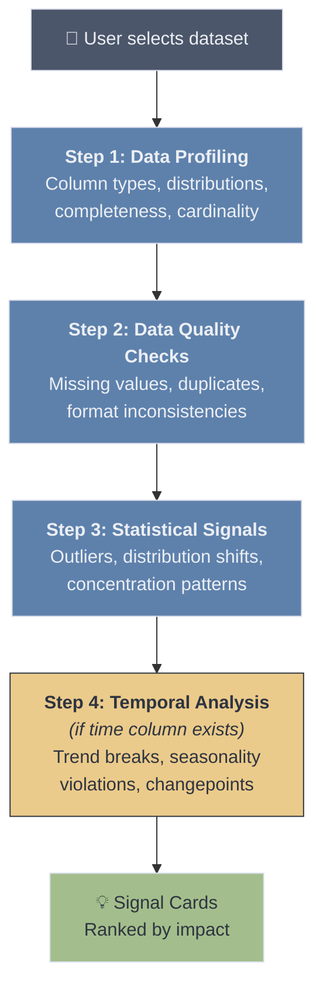
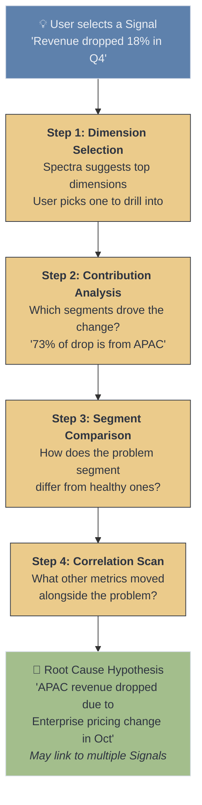
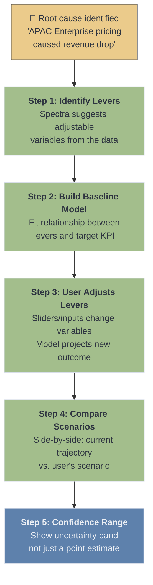

## Statistical Methods by Stage

Each stage of the Analysis Workspace uses different statistical techniques. The methods are ordered from simplest (always run) to advanced (run when data supports it). All execution happens in the existing E2B sandbox using Python (pandas, scipy, scikit-learn, statsmodels).

### Stage 1: PULSE — Signal Identification

The goal is to answer: **"What should you pay attention to?"** without the user asking. This runs when user clicks "Run Detection."

| Method | What It Catches | When To Use | Python Library |
|--------|----------------|-------------|----------------|
| **Descriptive profiling** | Column types, null rates, unique counts, basic stats (mean, median, std) | Always — first pass on every dataset | `pandas.describe()`, `pandas.dtypes` |
| **Missing value pattern analysis** | Systematic gaps (e.g., entire column null after a date, correlated missingness) | Always | `pandas.isnull()`, `missingno` |
| **Duplicate detection** | Exact and near-duplicate rows | Always | `pandas.duplicated()` |
| **Z-score outlier detection** | Individual values that deviate >2-3 standard deviations from the column mean | Numeric columns with roughly normal distribution | `scipy.stats.zscore` |
| **IQR (Interquartile Range)** | Robust outlier detection that works on skewed distributions (values below Q1-1.5*IQR or above Q3+1.5*IQR) | Numeric columns — more robust than Z-score for non-normal data | `pandas` quartile math |
| **Isolation Forest** | Multi-dimensional outliers that look normal on individual columns but are unusual in combination | When dataset has 3+ numeric columns | `sklearn.ensemble.IsolationForest` |
| **Herfindahl-Hirschman Index (HHI)** | Concentration patterns — e.g., "80% of revenue comes from 2 clients" (opportunity or risk depending on context) | Categorical columns with associated numeric values | Manual calculation on `pandas.groupby` |
| **Distribution shape analysis** | Skewness, kurtosis, bimodality — flags when a column's distribution is unusual or has shifted | Numeric columns with >50 rows | `scipy.stats.skew`, `scipy.stats.kurtosis` |
| **Changepoint detection (PELT)** | Abrupt shifts in a time series — e.g., "revenue mean shifted down starting October" | Time-series data with >30 data points | `ruptures` (PELT algorithm) |
| **STL decomposition** | Seasonal pattern violations — this month doesn't match expected seasonality | Time-series with known periodicity (monthly, weekly) | `statsmodels.tsa.seasonal.STL` |
| **Linear trend break** | Identifies when a KPI that was growing starts declining (or vice versa) | Time-ordered numeric data | `scipy.stats.linregress` on rolling windows |
| **Grubbs' test** | Statistically rigorous single-outlier test with p-value | Small datasets (<30 rows) where Z-score is unreliable | `scipy.stats` or manual implementation |

**Signal classification (not just severity — also opportunity vs. concern):**
- **Opportunity:** Growth trends, underexploited segments, concentration in high-performing areas, positive changepoints
- **Warning:** Declining trends, revenue concentration in few clients, seasonal violations, moderate outliers
- **Critical:** Major data quality issues, extreme outliers, sharp negative changepoints, >20% missing values
- **Info:** Minor distribution characteristics, near-duplicates, general data health observations

**When data has no notable signals:**
Report a "health summary" — "Your data looks healthy. Here's what we checked: [list]. No significant signals found." This avoids an empty screen.

---

### Stage 2: EXPLAIN — Root Cause & Diagnostic Investigation

The goal is to answer: **"Why did this happen?"** through a guided Q&A flow (doctor-interview style). Each method produces evidence that narrows toward the root cause.

| Method | What It Answers | How It's Used in the Q&A Flow | Python Library |
|--------|----------------|------------------------------|----------------|
| **Contribution analysis (additive decomposition)** | "Which segments drove the overall change?" — decomposes a KPI change into per-segment contributions | Step 1: After user picks a dimension, show which segment values contributed most to the change (e.g., "APAC contributed -73% of the total decline") | `pandas.groupby` + difference math |
| **Welch's t-test** | "Is the difference between two groups statistically significant?" — compares means of two segments | Step 2: When comparing problem segment vs. rest — "APAC avg deal size ($42K) is significantly lower than other regions ($61K), p < 0.01" | `scipy.stats.ttest_ind` |
| **Chi-squared test** | "Is the distribution of categories different between two groups?" — tests independence of categorical variables | Step 2: When comparing categorical breakdowns — "Product mix in APAC is significantly different from global (p < 0.05)" | `scipy.stats.chi2_contingency` |
| **Pearson / Spearman correlation** | "What other metrics moved with the problem metric?" — finds co-movement | Step 3: Scan all numeric columns for correlation with the problem metric — "Customer satisfaction (r = 0.82) and deal close rate (r = 0.71) also declined" | `pandas.corr()`, `scipy.stats.spearmanr` |
| **Decision tree (single, shallow)** | "What combination of factors best predicts the problem?" — identifies the most discriminating splits | Step 3: Train a depth-2 decision tree to classify "problem rows" vs. "normal rows" — "Region=APAC AND Product=Enterprise predicts 89% of the drop" | `sklearn.tree.DecisionTreeClassifier` (max_depth=2) |
| **Period-over-period comparison** | "What changed between this period and last?" — structured diff by dimension | Step 1: When time data exists — compare current period vs. previous period across all dimensions, rank by absolute change | `pandas.groupby` + `merge` |
| **Variance decomposition (ANOVA)** | "Which dimension explains the most variance in the target metric?" — ranks dimensions by explanatory power | Pre-step: Automatically rank which dimensions to suggest first (the one that explains the most variance gets offered as the top choice) | `scipy.stats.f_oneway` or `statsmodels.stats.anova` |
| **Pareto analysis (80/20)** | "Which few segments account for most of the problem?" — identifies the vital few | Step 2: After contribution analysis — "2 of 8 regions account for 85% of the decline" | `pandas` cumulative sum math |

**How methods map to Q&A exchanges:**

| Exchange | What Spectra Asks | Statistical Method Behind It |
|----------|-------------------|------------------------------|
| 1 | "Which dimension matters most?" [options ranked by ANOVA F-statistic] | Variance decomposition ranks dimensions |
| 2 | "The decline is concentrated in [segment]. Dig deeper?" | Contribution analysis + Pareto |
| 3 | "Here's how [problem segment] differs from others." | Welch's t-test + Chi-squared |
| 4 | "These metrics also moved: [list]. Any of these relevant?" | Correlation scan |
| 5 | "Summary: [root cause hypothesis with confidence]" | Decision tree summary + all above |

---

### Stage 3: MODEL — Simulation & What-If Scenarios

The goal is to answer: **"What happens if we change X?"** through a sensitivity overview, lever playground, and scenario comparison.

| Method | What It Does | When To Use | Python Library |
|--------|-------------|-------------|----------------|
| **Linear regression** | Models the relationship between input variables and target KPI. User adjusts inputs → model projects new target value. | Default for all simulation — simple, interpretable, fast. "If you reduce price by 10%, projected volume increases by X based on historical relationship." | `sklearn.linear_model.LinearRegression`, `statsmodels.OLS` |
| **Elasticity estimation** | Calculates % change in outcome per % change in input (price elasticity, demand elasticity). More intuitive than raw regression coefficients. | When user adjusts price, volume, or spend levers — "Price elasticity is -1.3, meaning a 10% price cut → ~13% volume increase" | Derived from log-log regression |
| **Time-series extrapolation (Holt-Winters)** | Projects the "current trajectory" baseline — what happens if nothing changes. Accounts for trend and seasonality. | Always as the baseline comparison — "Without intervention, revenue is projected to be $X in Q2" | `statsmodels.tsa.holtwinters.ExponentialSmoothing` |
| **Monte Carlo simulation** | Generates confidence intervals by running thousands of scenarios with random variation. Shows best/worst/expected outcomes instead of a single point estimate. | After linear regression to show uncertainty — "Expected outcome: $1.1M (90% CI: $0.9M–$1.3M)" | `numpy.random` + model re-sampling |
| **Sensitivity analysis (tornado chart)** | Shows which input variable has the most impact on the outcome when changed by ±10%. Displayed as a horizontal bar chart (tornado). | Before simulation — helps user know which lever to pull first — "Price has 3x more impact than headcount on margin" | Systematic perturbation of regression inputs |
| **Scenario comparison matrix** | Side-by-side table of multiple scenarios with different input combinations. Each column is a scenario, each row is an outcome metric. | When user wants to compare 2-3 scenarios — "Conservative vs. Moderate vs. Aggressive pricing strategy" | `pandas.DataFrame` presentation |
| **Breakeven analysis** | Calculates the input value needed to hit a specific target — "What price point gets us back to $1M revenue?" | When user has a specific goal — reverse-solve the regression | Algebraic inversion of regression equation |

**Important design principles for Model stage:**

1. **Always show confidence intervals, never just point estimates.** A single number ("revenue will be $1.1M") creates false precision. A range ("$0.9M–$1.3M with 90% confidence") is honest and builds trust.

2. **Start with linear regression, not complex ML.** Users need to understand *why* the model predicts what it does. A linear model is explainable: "For every $1 price reduction, we expect 150 more units sold." A neural network is a black box.

3. **Show the model's limitations explicitly.** "This projection assumes the historical relationship between price and volume continues. It does not account for competitor actions, market shifts, or capacity constraints." Transparency builds trust.

4. **Sensitivity analysis before simulation.** Before letting users play with sliders, show them which levers actually matter. This prevents wasted time adjusting variables that have minimal impact.

---

### Method Availability by Data Shape

Not all methods work on all datasets. The Pulse Agent must detect data shape first and only apply applicable methods.

| Data Characteristic | Methods Enabled | Methods Disabled |
|---|---|---|
| **< 30 rows** | Grubbs' test, basic stats, IQR | Isolation Forest, STL, PELT, Monte Carlo (insufficient data) |
| **No time column** | All cross-sectional methods | Changepoint, STL, trend break, Holt-Winters, period-over-period |
| **No categorical columns** | Z-score, IQR, correlation, regression | Contribution analysis, Chi-squared, ANOVA, HHI |
| **Single numeric column** | Z-score, IQR, Grubbs', distribution analysis | Isolation Forest, correlation, regression, decision tree |
| **All categorical (no numeric)** | Duplicate detection, missing value patterns, Chi-squared | All numeric methods, regression, simulation |
| **Wide data (50+ columns)** | All methods, but need column selection/ranking first | Running everything on all columns (too slow, too noisy) |

### Library Requirements (E2B Sandbox)

These Python packages need to be available in the E2B sandbox environment:

| Package | Used For | Already in Spectra? |
|---------|---------|-------------------|
| `pandas` | Data manipulation, groupby, profiling | Yes |
| `numpy` | Numerical operations, Monte Carlo | Yes |
| `scipy` | Statistical tests (t-test, chi-squared, z-score, correlation) | Yes |
| `scikit-learn` | Isolation Forest, Decision Tree, Linear Regression | Yes |
| `statsmodels` | OLS regression, ANOVA, Holt-Winters, STL decomposition | Needs verification |
| `ruptures` | Changepoint detection (PELT algorithm) | Needs installation |
| `missingno` | Missing value pattern visualization | Optional (can use pandas) |
